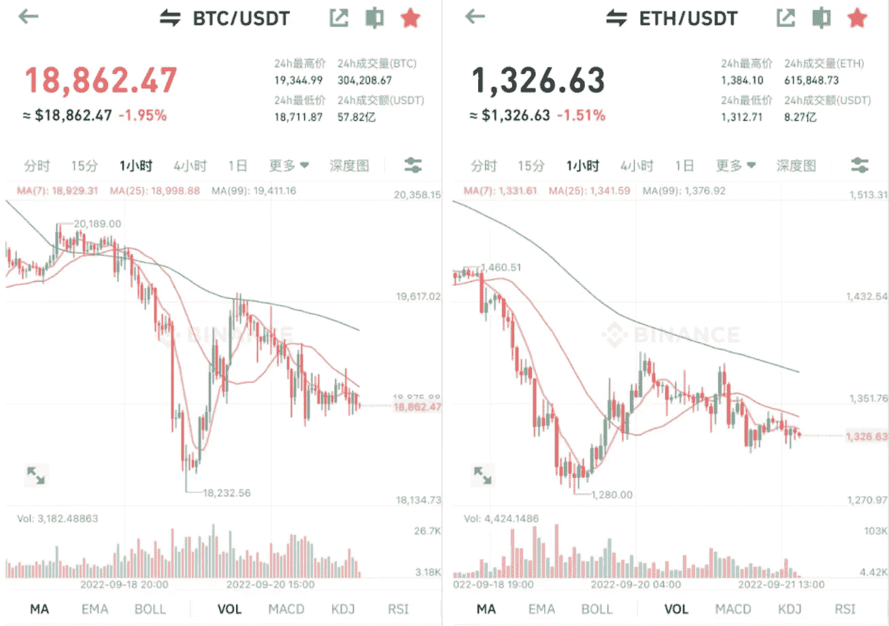
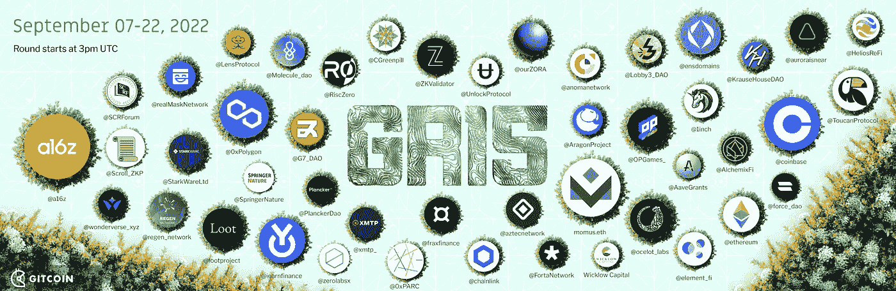
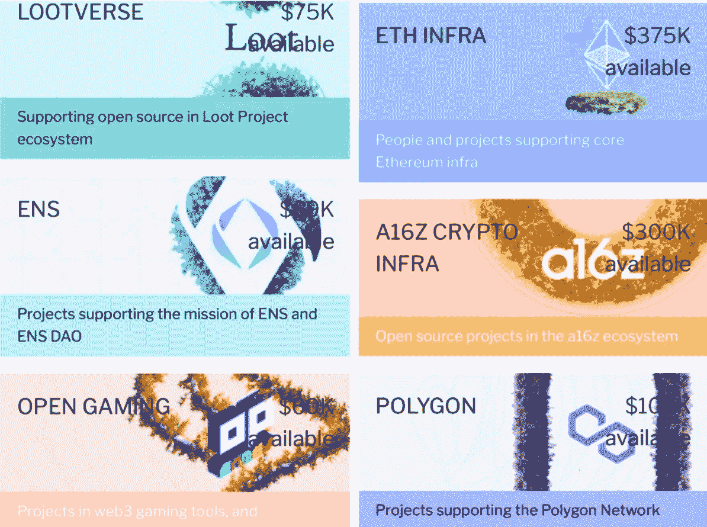

# MicroStrategy 收购 BTC，损失 15 亿美元，低迷时期有什么机会

> 原文：<https://medium.com/coinmonks/microstrategy-buys-btc-and-loses-1-5-billion-what-opportunities-in-the-downturn-9a8dedd9281f?source=collection_archive---------36----------------------->

BTC 继续下跌，一直在 19k 美元左右波动，目前价格是 18850 美元。

回想去年 2 月，我刚进入加密世界的时候，比特币是 55k 美元。当时大家都在喊 10 万美元，市场热情高涨。

市场波动的时候，有人喊着 5 万、4 万美元的 BTC 再也见不到了。没想到现在看到 30k，20k。不知道后期有没有 1w 等。

后市未知。市场已经在讨论和呼吁 BTC 在 15k 美元，12k 美元，10k 美元，8k 美元的价格。很多人只是陷入了下跌的情绪中。如果他们只是喊而没有自己的分析，市场会继续做空。继续低迷。

BTC and ETH hourly lines

比特币价格持续下跌，MicroStrategy 再次宣布收购 BTC。从今年 8 月到 9 月，已经购买了 301 个比特币，平均价格为 19851 美元。

这家提供企业级分析服务解决方案的公司，长期以来一直在购买比特币。它目前持有 13 万个比特币，总成本为 39.8 亿美元，平均价格为 30639 美元。

按照现在 18850 美元的比特币价格，已经亏了超过 15 亿美元，真的是被套牢了。

这是一家走在区块链前沿的传统企业，要么成功从 web2 转型到 web3，要么是一次无悔的尝试。

MicroStrategy loses 1.5 billion

当前的密码市场动荡不定，环境充满不确定性。对未来市场是否有信心，会直接影响到游戏性。

小组里有一位老玩家，在币圈摸爬滚打多年，是 BTC 的忠实信徒。他说他能持有它并在未来变得富有是确定性很高的事情，但他没有经历过市场的起伏，所以很难理解它的意义。简单。

当然，购买加密货币只是一种玩法。区块链还有很多项目，很多 web3 项目也在继续推进。例如，Gitcoin 最近开始了第 15 轮捐赠。

Gitcoin Round15 project information

Gitcoin.co 是一个早期项目融资平台。任何有好的项目创意但没有资金或资源的团队或个人，都可以申请在平台上展示自己的项目，以获得关注和支持。

那些有资金或资源的人可以为这个项目捐款。如果项目后期发展良好，他们可以获得一定的空投回报；如果项目没有完成，那么捐赠就没有回报。

之前有个别玩家捐赠 gitcoin、乐观等项目获得 GTC 和 OP 的代币空投，赚了不少钱；楚小莲在参与前 2 次捐款后也收到了 ENS 的空投，获利数千美元。

当然，大部分捐赠的项目都没有开发，也没有空投。

Gitcoin R15 Various Types of Projects

Gitcoin R15 目前正在进行中，涉及公共产品、去中心化科学项目、气候解决方案、WEB3 社交网络、ETH 基础设施、各种公链生态等几十个项目都可以捐赠。

有分析能力的可以根据未来趋势和项目背景自主选择；他们也可以跟着市场热度，随机捐款。有些项目是为了公益，有些是为了基建，有些可能营销噱头更多。捐赠的项目未来可能会收到空投，也可能项目归零，没有收入。

Various web3 projects

随着熊市的到来和前几轮空投捐款少的神话，本轮 g15 的度明显下降，没有人气特别高的项目，但熊市正在积蓄力量，或许好的项目也在其中。

这是区块链时代所有人参与早期项目的方式。区块链期待改变世界，我们是其中的一部分。当然，改变不一定成功，一切都会回归平静。

作为一种新的技术尝试，区块链需要更多的包容性和更大的不确定性，但机遇也在其中酝酿。无论 BTC 还是 Gitcoin，这只是其中一种玩法。只有参与其中，才能看到故事。

以上只是我个人的看法和总结，不含投资建议，读者的任何投资行为与作者无关。

我是褚小莲，我在学习区块链，关注元宇宙和 NFT，关注 web3。

> 交易新手？试试[加密交易机器人](/coinmonks/crypto-trading-bot-c2ffce8acb2a)或者[复制交易](/coinmonks/top-10-crypto-copy-trading-platforms-for-beginners-d0c37c7d698c)