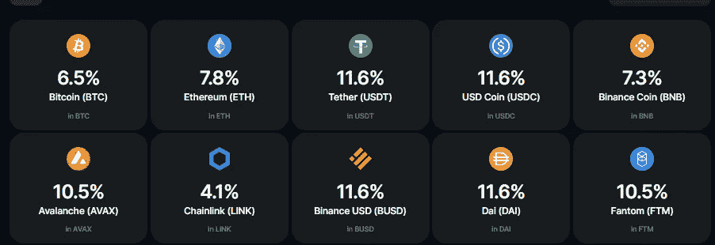
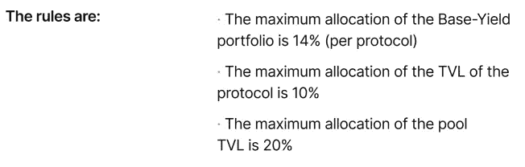
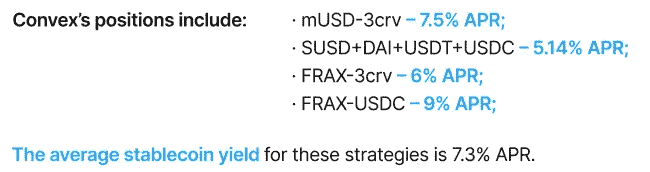
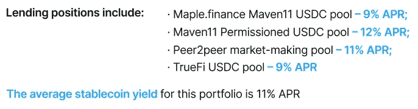
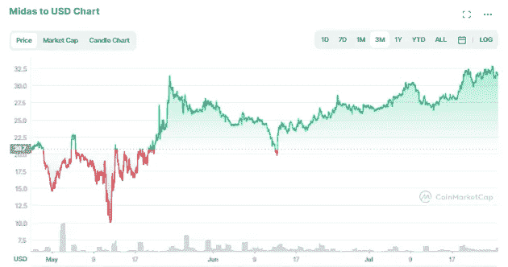

# Midas 的首份投资报告——深度分析(2022 年 8 月)

> 原文：<https://medium.com/coinmonks/midas-first-investments-report-an-in-depth-analysis-41dea129d4ce?source=collection_archive---------6----------------------->

大家好，如果你关注过我的其他帖子，你会知道我一直是 [Midas Investments](https://midas.investments?p=0191) 的忠实粉丝，所以我怀着极大的兴趣阅读了上个月发布的[首份投资报告](https://midas.investments/reports/july-2022.pdf)。报告本身正是朝着许多用户(包括我自己)一直要求的更加透明的方向迈出的一步，所以让我们来看看幕后是什么，好吗？

但首先，简单介绍一下…

# 迈达斯快速介绍

与其他投资平台类似， [Midas Investments](https://midas.investments/?p=0191) 是一个加密投资平台，你可以通过各种不同的加密货币获得被动收入。但是它与其他平台的区别是什么呢？APY 汇率。由于没有锁定期，它们仍然继续提供一些市场上最好的本地回报(甚至在 Midas 的推动下更高)，这些回报每天都在复利和增值:

由于 Midas 团队一直在努力提高风险抵抗性，并能够长期保持收益率，因此从 8 月 10 日开始，这些利率被降低，如上所示。虽然我的德根面总是希望看到更高的回报，但我的非德根面更喜欢可持续性和可获得性，而不是意外的锁定，就像我们在 [Celsius](/coinmonks/observations-from-celsius-legal-plan-6439620f264c) 、Voyager 或最近的 Hodlnaut 等公司看到的那样。

作为一个平台，Midas 现在正在经历第三次熊市，他们一直提供高于任何非托管平台的回报。尽管过去几个月市场崩盘，但 Midas 获得了指数级的新资本，这最终导致他们一次又一次地重新制定和降低策略风险，以提供持续稳定的回报。

在使用 Midas 近 9 个月之后，我很难再认真对待任何其他“知名”平台，如 Blockfi 和 Gemini，它们充其量只能在蓝筹股上提供微不足道的 take any，或者如果你幸运的话，在 stables 上可能提供 7-9%左右的利率。通过他们的 AMA、youtube 视频和 discord，在不泄露竞争优势秘密的情况下，团队继续尽可能地保持透明，他们继续就他们已经采取或计划采取的步骤或变化给出足够的通知(我将进一步讨论)，这最终提高了我对他们生态系统的信任度。

# 最大的问题是:它们如何产生收益？

正如我之前提到的，Midas 在 7 月底发布了他们的第一份投资报告,该报告强调了一些已知的事情，提供了一些关于新战略的新细节，也为他们的秘方提供了一些启示(但不是配方)。我将详细介绍每种策略，但首先也是最重要的，也许我读到的最有趣的东西是 Midas 关于协议流动性和资产多样化的 DeFi 风险管理的“规则”:

他们制定的这些规则基本上让 Midas 躲过了许多子弹，这些子弹杀死了许多其他协议和平台，包括 stETH 上的挤兑(杀死了 Celsius)，UST 死亡螺旋(在几天内抹去了 500 多亿美元)，甚至是 USDT 的临时 depeg。

**他们的策略不错，但并不完美**。在他们的[最后一个 AMA](https://www.youtube.com/watch?v=LZgoAcjDAOI&t=2959s) 中，Trevor 报告说他估计他们 85%的 AUM 是完全流动的，剩下的 10-15%需要至少几天才能释放。正如他们在业绩报告中所述(过去几个月在几个 ama 中也重申了这一点)，Midas 团队正在开发一个自动警报系统，该系统将有助于警告并可能退出头寸，使他们能够防止基金受到黑客或黑天鹅事件的影响。

关于他们策略的另一个方面是，他们的策略似乎在不断变化(这也在他们的“趋势”策略中得到强调，我将在后面详细介绍)。策略可以在一周内改变多次，我想这可能会使 Midas 团队很难实现策略的完全透明。换句话说，我不确定如果他们每天都在宣布策略上的改变会有多大帮助。对我个人来说，我很难跟踪一个月才改变一次的时间。

# 战略

过去，在他们的 wiki 下，他们将收益策略分为两类，但在这份报告中，我们现在看到它分为几类。虽然在性能报告中，他们按照协议对其进行了细分，但通过阅读不同的策略，我将事情概念化为两个不同的部分——基本产出策略和算法策略。他们的“基本收益策略”主要由稳定的策略组成，算法策略由他们所谓的“趋势策略”和算法交易组成。

**基础收益策略(稳定收益策略)**构成其 AUM 的最大分配，主要由稳定收益或蓝筹股收益组成。他们引用的方案和产率是:

1.  凸面:

2.不同的贷款协议:

3.以及对 [GMX](https://gmx.io/trade?ref=Jaik83) 和[流动性](https://www.liquity.org/blog/understanding-liquitys-stability-pool)的头寸——这两个协议都利用了市场清算。在过去的之前，我曾写过关于 GMX[的文章，但本质上，它是一个平台，一个让 GLP 或 GMX 的投资者从清算/交易费用中获利，同时相对没有非永久性损失的平台。](/p/2c2eff249b7b)

你会注意到，通过查看数字，每个基础收益率策略的平均年利率与 Midas 平台上的回报率不匹配。换句话说，这些策略只提供平均 11%的年利率，那么如果 Midas 向其用户提供 11.6%的 APY，它是如何盈利的呢？

答案是通过他们的算法策略。就他们的“趋势”策略而言，这些基金仅占 AUM 的大约 5%,但他们的目标投资回报率为 40%。当某些市场趋势出现时，趋势策略基金会从基础收益基金中调配出来。当市场趋势出现时，Midas 团队通过算法得到信号，执行 40%左右的目标投资回报率。报告中还不清楚这些交易是如何通过算法推导出来的，但如果它们能够产生 40%的目标投资回报率，我可以想象这可能是一个值得保守的秘密。

他们强调的第二个算法策略是算法交易，他们使用两种不同的算法来产生 25%-40%的目标 APR。与“趋势”策略一样，目前尚不清楚这些交易究竟是如何进行的，但该报告详细介绍了 BTC/美元和 ETH/美元对在 Bybit 上进行的算法交易。这些回报可持续吗？过去几年一直在做同样事情的其他算法交易平台，如南波瑠投资公司，似乎也是这么认为的。算法交易的美妙之处在于，回报是基于代币的波动性，而不是基于整体市场是涨是跌。尽管锁定期很长，但像南波瑠这样的平台已经证明，无论市场状况如何，算法交易都是非常有利可图的。

# 为什么他们不能更透明？

我从迈达斯那里读到的关于他们为什么没有 100%公开他们的方法的最清楚的解释可能是来自他们的首席运营官的 reddit 帖子:

> `We try to be as transparent as we can be` *我会进一步阐述这个问题。我们没有公布确切的战略有几个原因:
> 我)这是给迈达斯我们的竞争优势。正如我之前提到的，我们有一个分析师团队，他们不断监控 defi 空间，以制定策略，使我们能够利用大量流动性支持较低风险范围内的强劲收益机会。这三个标准的组合是一个难以实现的目标。虽然我们并不担心我们的用户直接复制这些策略，但很明显，在公共领域发布我们的策略会对 Midas 提供的 USP 造成损害。我们现在的规模足以让竞争对手和潜在竞争对手关注我们的新闻和更新，而我们只会为竞争对手的增加敞开大门。*
> 
> *ii)定期改变策略。我们本周发布的内容下周可能就无关紧要了。虽然我们的战略大纲将保持不变，但其中的实际战略会不断变化。*
> 
> 提供的信息不可能让每个人都满意。有些人想要更多的风险，有些人想要更少的。有些人希望我们探索其他机会。Crypto 充满了各种观点，而观点往往是分裂性的。我们坚信我们的 Defi 团队。他们在构建我们的战略时考虑到了优化的收益潜力和强大的风险管理元素，他们向我们的用户提供我们支付的收益，而没有外部影响/压力使我们的战略朝着特定的方向发展。

迈达斯对他们所有的方法 100%透明吗？没有。但随着我了解到他们的策略对不同市场条件的适应性和数量，我明白了为什么很难做到这一点——许多可能给出的细节可能会不断变化。尽管如此，我不得不说，我已经搜索了 YouTube 视频、discord 频道和其他独立评论，有一点是肯定的——**使用 Midas 的人正在从他们的存款中获得报酬，他们也一直在 Midas 中来回存款和提取他们的加密货币，没有任何问题……多年来一直如此。**再次重申，我没有发现他们不能提取或使用资金的任何一项审查。

# 安全措施

**审计** : Midas Investments 计划获得 [Armanino](https://www.armaninollp.com/) 的审计，但这是在他们获得瑞士资产管理执照和/或阿联酋(迪拜)营业执照之后，这是他们目前的主要工作重点之一。今年夏天，迈达斯打算[“完成并宣布整个公司结构”，](https://www.reddit.com/r/midas_community/comments/vstbav/comment/ignetn3/?utm_source=share&utm_medium=web2x&context=3)，预计在秋季完成审计。如果你没听说过阿玛尼诺，他们就是去年审计 Nexo 的人。

**保险**:今年早些时候为了增强安全性，即使 Midas 本身没有保险，现在所有资产都放在[防火墙上，](https://www.fireblocks.com/platforms/security/)也有保险。我不是责任专家，但我的假设是，如果你的迈达斯持有的资产被黑客入侵，那么会有保障，但如果你自己被黑客入侵，那就没有保障了。对于包括 BlockFi 和 Celsius 在内的许多不同平台来说，这是一个非常相似的设置。我读到的一件有趣的事情是，当他们主要专注于 Masternodes 时， [Midas Investments 确实经历了一次黑客攻击](https://www.reddit.com/r/midas_community/comments/soa0wn/comment/hx9w87w/?utm_source=share&utm_medium=web2x&context=3)，但 Midas 用户从未感受到影响，因为该公司自己吸收了损失。虽然这是令人担忧的，因为黑客意味着漏洞，但我很欣慰的是，他们正计划接受审计，以帮助进一步识别潜在的漏洞。此外，对我来说，他们在将损失转嫁给他们的用户之前遭受了严重的财务损失，这一事实显示了他们的诚信，也更加增加了我对迈达斯的信任。

**2-FA:** 与一月份相比，他们现在已经将 2-FA 电子邮件登录身份验证和 KYC 整合到他们的平台中。从 5 月份开始，他们还引入了使用 google authenticator 的 2-FA 移动认证，并正在开发一个选项，允许用户将取款地址列入白名单。虽然它确实增加了平台本身的安全性，但我知道像 KYC 和谷歌登录这样的事情对一些人来说是一个巨大的威慑，尤其是对那些希望尽可能少地透露个人信息的人来说。唉，安全是有代价的。

# 有什么风险？

像任何非托管平台一样，最大的风险是**如果它不是你的钥匙，它就不是你的密码**。这就是为什么你一定要做自己的研究，看看你个人是否信任这个平台，并把你的资产交给它，这一点非常重要。也就是说，正如我之前提到的，他们已经在这个领域存在了四年多，从我发现的情况来看，他们有着非常出色的记录。如果你发现任何相反的情况，请联系我，因为我非常想听听。

**没有利率会永远持续下去，尤其是如果市场继续低迷，我也无法想象这些利率会持续下去。话虽如此，我确实相信我们还没有看到当前熊市的底部，所以我确实相信利率在未来将不得不重新调整，但不是因为迈达斯缺乏尝试。此外，我过去在 BlockFi、Nexo 和 Celsius 等地方持有更多资产，但正如我们在这三家公司中看到的那样——你的规模越大，就越有可能受到监管。如果 Midas 继续吸引更多的用户和更多的增长，随着加密市场随着更多的监管而成熟，我无法想象这个肥缺会永远存在。**

**俄罗斯**:乌克兰战争爆发前，迈达斯最初的总部设在俄罗斯。自那以后，他们报告说，该小组的大部分成员已经转移到俄罗斯境外，其余成员也同意在必要时这样做。正如我之前提到的，他们正在瑞士和迪拜申请许可，以进一步分离他们以前的联系。在 5 月份的《AMA》中，CEO 特雷弗更进一步报道说，他将于年去以色列，正式将自己的国籍改为以色列。也就是说，迈达斯团队的主要成员已经在 AMA 和他们的[维基页面](https://wiki.midas.investments/introduction/team)上公开了自己的身份，很明显，他们的团队正在变得越来越国际化。

# 迈达斯令牌

虽然这可能会有所改变，但目前$MIDAS 令牌除了作为 MIDAS 平台的储值工具之外，并没有真正的用途。换句话说，如果你在投资$MIDAS 代币，你就是在投资 MIDAS 本身。如果 Midas 赚的钱比预期的多，额外的价值将被转移到 Midas 流动性池，这反过来又增加了$MIDAS 代币的价值。在 Midas 中，代币的价值基本上是从 Midas boosts 循环到流动性池，然后再回到 Midas boosts。2 月下旬，他们报告说，目前的令牌发放速度大约为每天 1600 个令牌，然后在未来 3-5 年内限制在 500 万个左右，其中 150 万个押注于 Midas 本身。迄今为止，大约有 290 万本在流通。

如果你想了解更多关于$MIDAS token 的信息，我强烈推荐你阅读我上个月[做的深入分析。在这里，我分析了美元是如何在熊市中持续冲击 ATH 股市的。](/coinmonks/how-midas-is-hitting-aths-in-a-bear-market-fb6c201c0da)

# 结论

到现在一共九个月了，到目前为止我印象非常深刻的不仅仅是 Midas 团队，还有 Midas 社区本身。他们真的营造了一种环境，帮助像我这样的普通零售商通过他们的每周报告了解市场，并教会人们如何通过被动收入实现利润最大化。我对 Midas 的信任越来越多，随着市场变得越来越糟糕，我发现 Midas 是我持有和积累稳定硬币的第一选择，尤其是当 Anchor、Celsius 和 Voyager 等公司不再可行时。

如果您还有任何问题，我强烈建议您查看八月中旬与迈达斯的首席执行官特雷弗一起进行的[最后一次 AMA。在这里，他深入回答了人们对迈达斯未来的许多潜在预期。如果你还没有尝试过 Midas 但是感兴趣，请考虑支持我的博客，使用我的会员链接:](https://youtu.be/LZgoAcjDAOI) [https://midas.investments？p=0191](https://midas.investments/?p=0191) 。

否则，如果您有任何问题或意见，请随时在下面留下。感谢您的阅读，请务必关注我的新推特账户:[https://twitter.com/CryptosWith](https://twitter.com/CryptosWith)

免责声明:最后提醒一下，这不是财务建议，仅用于教育和娱乐目的。请一如既往地做自己的研究，找到最适合你的投资。干杯大家！

> 交易新手？试试[加密交易机器人](/coinmonks/crypto-trading-bot-c2ffce8acb2a)或者[复制交易](/coinmonks/top-10-crypto-copy-trading-platforms-for-beginners-d0c37c7d698c)