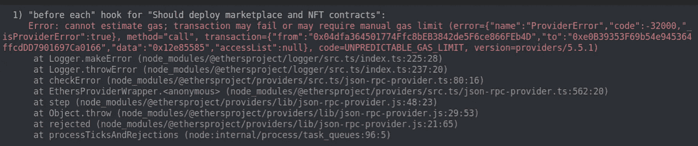
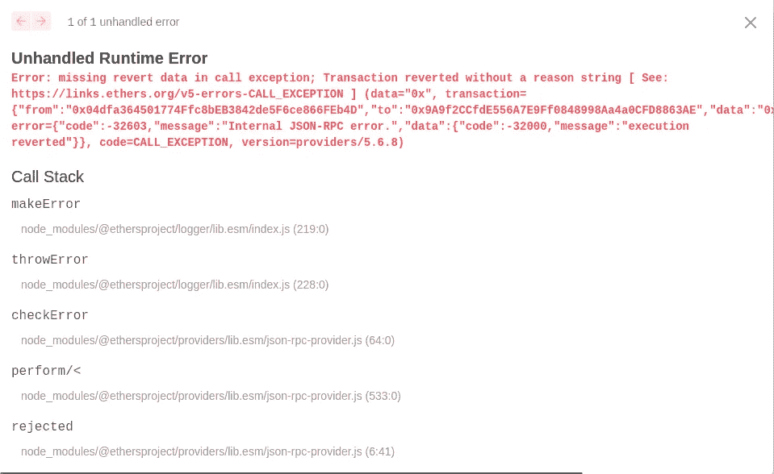
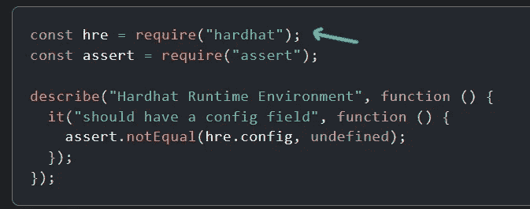
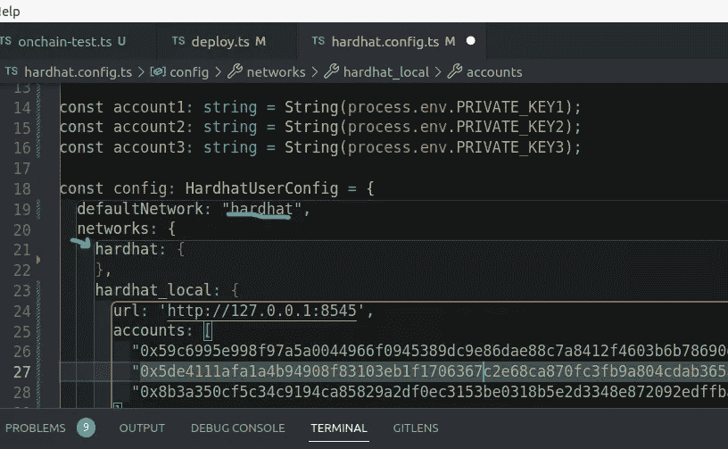

# 将项目从 Hardhat 本地区块链迁移到 Live Testnet 区块链

> 原文：<https://medium.com/coinmonks/migrating-project-from-hardhat-local-blockchain-to-live-testnet-blockchain-c1d57bcd08d?source=collection_archive---------18----------------------->

> 我为什么写这个博客？当我开始使用 hardhat 进行开发时，我只使用本地环境进行测试，但当我试图在一个现场测试网上部署和测试我的 web3 应用程序时，我面临了很多问题，并且感到困惑。下面是解决这些问题的文章。此外，我还发现了本地 solidity development 与 live 区块链之间的数据差异。

## 不必要的错误

下面是我在迁移到区块链测试网时遇到的一个错误。



导致这个错误的原因是，在使用`npx hardhat clean`将智能合约部署到 onchain testnet 或 mainnet 之前，我没有清理 hardhat 工件。

## 本地环境与 onchain testnet 或 mainnet 中事务日志输出的差异

下面是 hardhat 本地事务的事件日志与实时在线区块链事件日志之间的区别。

#待定，详细信息将很快添加。

# 可能的部署方法:

## 1.Hardhat 运行时全局变量

ref:[https://hard hat . org/hard hat-runner/docs/advanced/hard hat-runtime-environment # as-global-variables](https://hardhat.org/hardhat-runner/docs/advanced/hardhat-runtime-environment#as-global-variables)

*   当我们没有指定任何关于区块链的配置时，就会发生这种情况。但实际上，我们希望控制我们的智能合约部署在哪里，而不是一些只运行“Hardhat Runtime Only Blockchain”的全局变量。
*   在运行任务、测试或脚本之前，Hardhat 将 HRE 注入全局范围，将其所有字段转换为全局变量。
*   当任务执行完成时，这些全局变量被删除，恢复它们的初始值，如果它们有一个的话。

## 2.const { ethers } = require(" hard hat ")；

> 这是我推荐的方法。

*   这是一个版本 ether.js 库+几个 hardhat 帮助器来简化 hardhat 中的智能合约开发。

## 3.从“ethers”导入{ ethers }；

*   这是不带任何安全帽助手的 ether.js 库。

## 4.从“@ethersproject/providers”导入{ EtherscanProvider }；

*   该库用于获取提供程序。

# 方法 1:安全帽运行时

*   运行时意味着将在上创建一个新的区块链来处理该协定，一旦部署了该协定，将删除区块链，使部署的非持久性。
*   有两种方法可以实现这一点。

## 方法 1:全局**安全帽运行时全局变量**

ref:[https://hard hat . org/hard hat-runner/docs/advanced/hard hat-runtime-environment # as-global-variables](https://hardhat.org/hardhat-runner/docs/advanced/hardhat-runtime-environment#as-global-variables)

## 方法 2:我们可以使用来自哈特醚的“hre”

ref:[https://hard hat . org/hard hat-runner/docs/advanced/hard hat-runtime-environment # access-the-hre-from-outside-a-task](https://hardhat.org/hardhat-runner/docs/advanced/hardhat-runtime-environment#accessing-the-hre-from-outside-a-task)

*   当在 hardhat 中编写任务时，我们不需要显式导入“hre ”,它作为一个全局变量存在。
*   但是当我们需要在任务之外使用“hre”时，我们需要使用下面的方法



## 方法三:我们可以在 hardhat.config.ts 中设置运行时 hardhat

*   要么你可以完全删除网络配置，这样它将只使用运行时的 hardhat。
*   或者您可以如下指定运行时环境。



# 方法 2: Hardhat Node/Onchain Testnet 或 Mainnet

Github 回购:[https://github . com/le 4 kno 3/Solidity-Contracts/tree/main/nftmarketplace-contract-3](https://github.com/Le4kno3/Solidity-Contracts/tree/main/nftmarketplace-contract-3)

> 重要提示 1:无论何时您从 hardhat 运行时或 hardhat 本地节点转移到 onchaintestnet 或 mainnnet，**请确保运行** `npx hardhat clean`删除所有早期文件，否则您将会得到不必要的错误。还要确保 **onchain 钱包有所需的代币**或硬币来执行部署和交易。
> 
> 重要说明 2:如果在运行 deploy contract 命令或与 smart contract 交互后没有看到响应，则需要再等待几分钟。如果一个事务失败，你会得到一个错误。但如果没有响应，那么它仍然在运行，这需要时间，所以坐下来放松，让它完成。

*   这是我的首选方法，而不是使用 hardhat 运行时环境。
*   我喜欢使用“安全帽节点”本地区块链，并使用它来完成我的开发。
*   要创建这个本地区块链，只需在另一个终端上运行下面的命令。

```
npx hardhat node
```

*   这将在`[http://localhost:8545](http://localhost:8545)`运行区块链

下面是一个示例 deploy.ts

```
import * as fs from 'fs';
import { ethers } from "hardhat";
import * as dotenv from "dotenv";dotenv.config();async function main() {const [owner, nftbuyer, nftseller] = await ethers.getSigners();
  // Promise<ethers.Signer[]>
  // We get the contract to deployconst NFTMarket = await ethers.getContractFactory("NFTMarket", owner);
  const myNFTMarket = await NFTMarket.deploy();
  await myNFTMarket.deployed();const signerAddress = await owner.getAddress();
  const nftBuyerAddress = await nftbuyer.getAddress();
  const nftSellerAddress = await nftseller.getAddress();
  console.log("Owner address:", signerAddress);
  console.log("NFT buyer address:", nftBuyerAddress);
  console.log("NFT seller address:", nftSellerAddress);
  console.log("NFTMarket contract deployed to:", myNFTMarket.address);// We get the contract to deploy
  const NFTToken = await ethers.getContractFactory("NFTToken", owner);
  const myNFTToken = await NFTToken.deploy(myNFTMarket.address);await myNFTToken.deployed();console.log("NFTToken contract deployed to:", myNFTToken.address);let config = `
  export const nftMarketplaceAddress = "${myNFTMarket.address}"
  export const nftTokenAddress = "${myNFTToken.address}"
  export const nftContractOwner = "${signerAddress}"
  export const nftBuyer = "${nftBuyerAddress}"
  export const nftSeller = "${nftSellerAddress}"`;let data = JSON.stringify(config);
  fs.writeFileSync('cache/deploy.ts', JSON.parse(data));
}// We recommend this pattern to be able to use async/await everywhere
// and properly handle errors.
main()
  .then(() => process.exit(0))
  .catch((error) => {
    console.error(error);
    process.exit(1);
  });
```

部署后，测试期间所需的合同地址和用户地址存储在 cache/deploy.ts 中。完成后，您可以使用下面的测试脚本

```
import { ethers } from "hardhat";import { expect } from "chai";import { nftTokenAddress, nftMarketplaceAddress } from './../cache/deploy';
import NFTMarket from "../artifacts/contracts/NFTMarket.sol/NFTMarket.json";
import NFTToken from "../artifacts/contracts/NFTToken.sol/NFTToken.json";let myNFTMarket: any;
let NFTMarketAddress: string;
let myNFTToken: any;
let NFTTokenAddress: string;
let ownerAddress: any;
let sellerAddress: any;
let buyerAddress: any;
let listingPrice: number;
let provider: any;console.log("NFT Marketplace Address is: ", nftMarketplaceAddress);
console.log("NFT Token Address is: ", nftTokenAddress);beforeEach(async () => {// provider = ethers.provider;
  [ownerAddress, sellerAddress, buyerAddress] = await ethers.getSigners();//set providermyNFTMarket = new ethers.Contract(nftMarketplaceAddress, NFTMarket.abi, ownerAddress);NFTMarketAddress = myNFTMarket.address;myNFTToken = new ethers.Contract(nftTokenAddress, NFTToken.abi, ownerAddress);NFTTokenAddress = myNFTToken.address;listingPrice = await myNFTMarket.connect(ownerAddress).getListingPrice();
  // listingPrice = 0.0025;
});describe("MarketPlace", () => {
  it("Should deploy marketplace and NFT contracts", async () => {
    const nftMarketAddress = await myNFTMarket.address;expect(nftMarketAddress).to.equal(NFTMarketAddress);
  });it("Should have a listing price", async () => {const expectedListingPrice = ethers.utils.parseEther('0.0025');expect(listingPrice).to.equal(expectedListingPrice);});it("Should create market item", async () => {
    //we are now creating 2 NFT tokens in the NFTToken contract
    const tx = await myNFTToken.connect(ownerAddress).createToken("[https://www.mytoken1.com](https://www.mytoken1.com)");
    // const tx2 = await myNFTToken.connect(ownerAddress).createToken("[https://www.mytoken2.com](https://www.mytoken2.com)");
    // const count = await myNFTToken.tokenCount();const itemPrice = ethers.utils.parseUnits('0.1', 'ether');//transaction of token
    const tokenID = (await myNFTToken.getLastTokenID()).toString();
    console.log("The created token ID is: ", tokenID);let items = await myNFTMarket.fetchRemainingMarketItems();items = await Promise.all(items.map(async (i: { tokenId: { toString: () => any; }; price: { toString: () => any; }; seller: any; owner: any; }) => {
      const tokenUri = await myNFTToken.tokenURI(i.tokenId);let item = {
        price: i.price.toString(),
        tokenId: i.tokenId.toString(),
        seller: i.seller,
        owner: i.owner,
        tokenUri
      };
      return item;
    }));
    console.log(items);
  });
});
```

> 加入 Coinmonks [电报频道](https://t.me/coincodecap)和 [Youtube 频道](https://www.youtube.com/c/coinmonks/videos)了解加密交易和投资

# 另外，阅读

*   [麻雀交换评论](https://coincodecap.com/sparrow-exchange-review) | [纳什交换评论](https://coincodecap.com/nash-exchange-review)
*   [美国最佳加密交易机器人](https://coincodecap.com/crypto-trading-bots-in-the-us) | [经常性评论](https://coincodecap.com/changelly-review)
*   [在印度利用加密套利赚取被动收入](https://coincodecap.com/crypto-arbitrage-in-india)
*   [Godex.io 审核](/coinmonks/godex-io-review-7366086519fb) | [邀请审核](/coinmonks/invity-review-70f3030c0502) | [BitForex 审核](https://coincodecap.com/bitforex-review)
*   [5 款最佳免费加密货币制图工具](https://coincodecap.com/crypto-charting-tools)