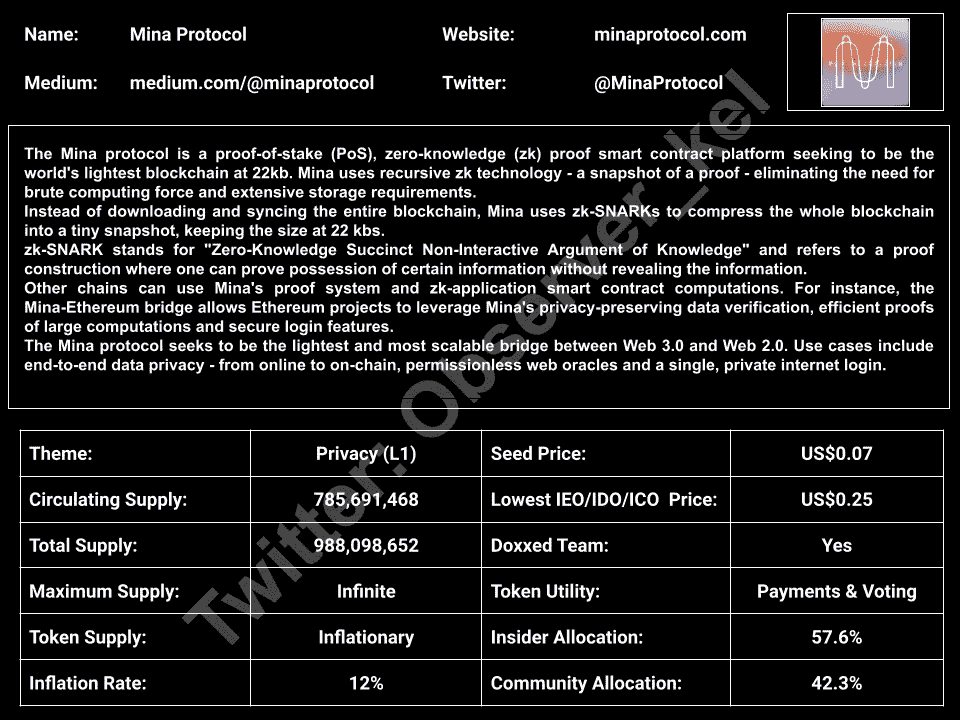
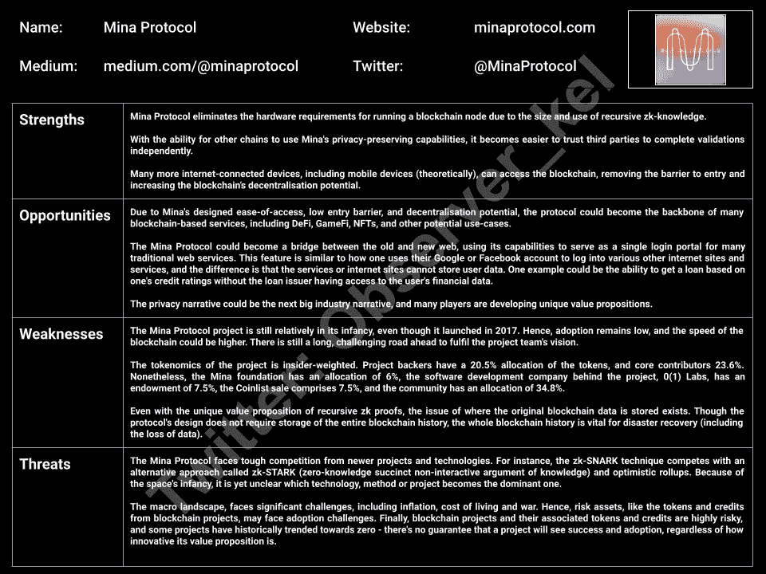
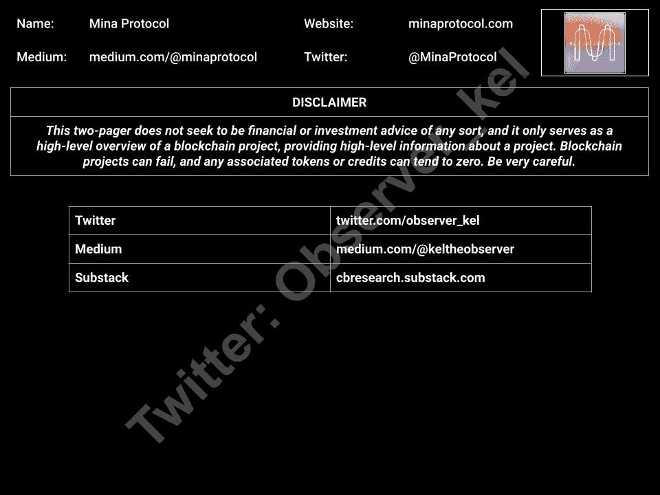
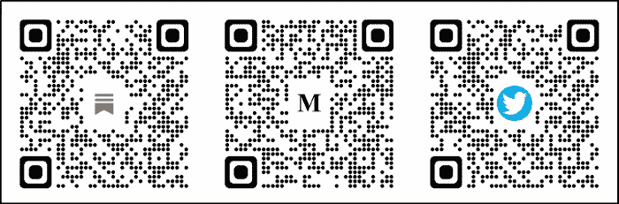

# Mina 协议:概述

> 原文：<https://medium.com/coinmonks/mina-protocol-an-overview-c90aa7403225?source=collection_archive---------51----------------------->

Mina 协议的高级概述——一个连接 Web 3.0 和 Web 2.0 的以隐私为中心的 L1 智能合约平台

Overview and Token Details

Strengths, Weaknesses, Opportunities and Threats

Disclaimer and Socials

*在*[*@ observer _ kel*](https://twitter.com/observer_kel)*、on*[*Medium*](/@keltheobserver)*关注我的 Twitter，订阅我的免费* [*Substack 简讯*](https://cbresearch.substack.com/) *了解更多关于 Web3、NFTs 和 crypto 的前瞻性思想和 alpha。*

> 不知道什么时候买卖 cryp，试试[复制交易](http://coincodecap.com/go/bityard)。

> 加入 Coinmonks [电报频道](https://t.me/coincodecap)和 [Youtube 频道](https://www.youtube.com/c/coinmonks/videos)了解加密交易和投资

# 另外，阅读

*   [如何购买 Monero](https://coincodecap.com/buy-monero) | [IDEX 评论](https://coincodecap.com/idex-review) | [BitKan 交易机器人](https://coincodecap.com/bitkan-trading-bot)
*   [CoinDCX 评论](/coinmonks/coindcx-review-8444db3621a2) | [加密保证金交易交易所](https://coincodecap.com/crypto-margin-trading-exchanges)
*   [红狗赌场评论](https://coincodecap.com/red-dog-casino-review) | [Swyftx 评论](https://coincodecap.com/swyftx-review) | [CoinGate 评论](https://coincodecap.com/coingate-review)
*   [Bookmap 评论](https://coincodecap.com/bookmap-review-2021-best-trading-software) | [美国 5 大最佳加密交易所](https://coincodecap.com/crypto-exchange-usa)