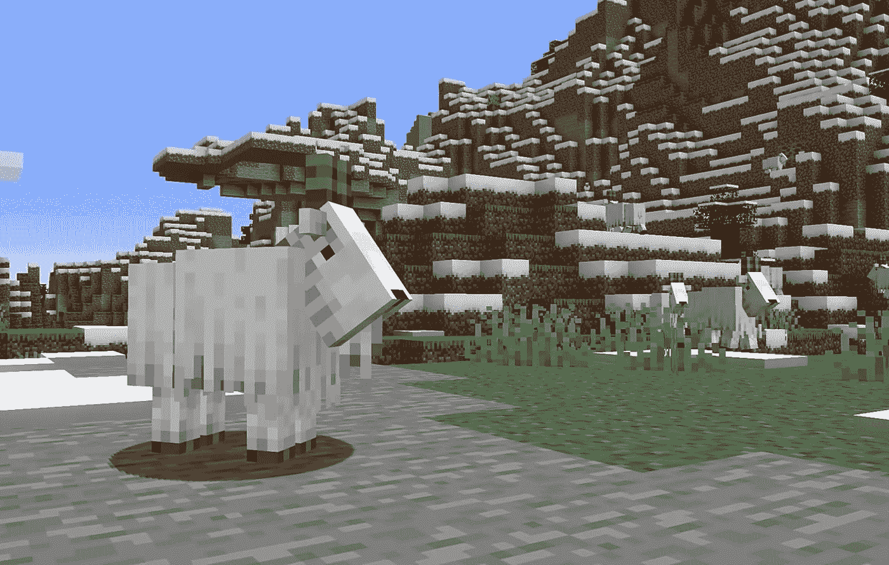
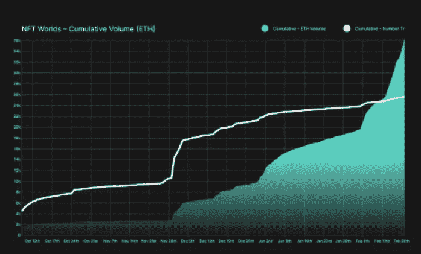
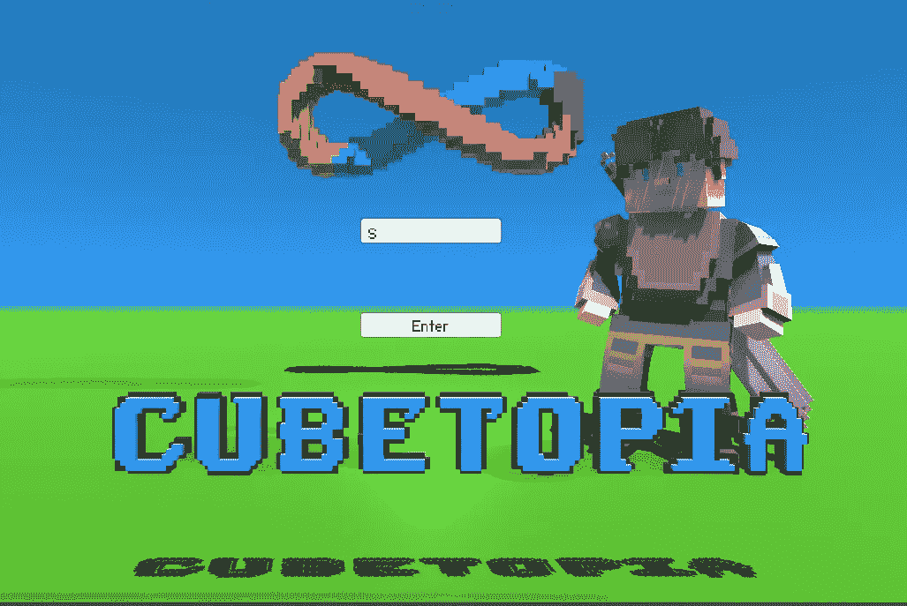

# 《我的世界》解除了元宇宙的游戏平台——禁止游戏中的 NFT 游戏！

> 原文：<https://medium.com/coinmonks/minecraft-de-platforms-nftworlds-metaverse-a-ban-on-in-game-nfts-1eb28c87742c?source=collection_archive---------11----------------------->

## Web2.0 消除了集中化的风险。

《我的世界》是由 Mojang 工作室开发的最大的[沙盒](https://en.wikipedia.org/wiki/Sandbox_game)和[生存](https://en.wikipedia.org/wiki/Survival_game)电子游戏之一。随着《《我的世界》》成为非常成功的[有史以来最畅销的游戏](https://en.wikipedia.org/wiki/List_of_best-selling_video_games)，微软最终在 2014 年 11 月通过 Xbox 游戏工作室(当时被称为微软工作室)收购了大部分股份。它在全球拥有 1.41 亿活跃玩家，这说明了它的受欢迎程度。

## NFTWorlds 对《我的世界》做了什么？

NFT 世界是一个赚取游戏平台，世界所有者可以为玩家或他们世界内的专属社区创建自己的无限元宇宙游戏或体验。他们没有构建自己的游戏，而是创新了《我的世界》的元宇宙& NFT 游戏平台，这是一个开源的生态系统。他们推出了一个由 10，000 个独特的世界组成的集合，这些世界在更广泛的《我的世界》生态系统中构成了一个分散的游戏赚取生态系统。他们看到了一些快速的牵引:

[https://parcel.so/learn/nft-worlds-analysis](https://parcel.so/learn/nft-worlds-analysis)

# 《我的世界》& NFTWorlds 怎么了？

一切都很顺利，然后 Mojang 工作室突然宣布他们不会支持 NFT 的游戏。这是他们在网站上说的一部分:

> “为了确保*《我的世界》*玩家有一个安全和包容的体验，区块链技术不允许被集成到我们的*《我的世界》*客户端和服务器应用程序中，也不得被用于创建与任何游戏内容相关的 NFT，包括世界、皮肤、角色物品或其他模块。”

## 那么它把 NFTWorlds 放在哪里呢？

真的在荒郊野外！这不仅仅是停止一个游戏功能，对他们来说，这是关于他们的令牌持有者，他们的玩家建立了他们的世界。《我的世界》宣布后几个小时，NFTWorld 的本地令牌下跌了 58%以上，导致玩家不确定他们现在不知道自己在游戏中的未来会如何。以下是他们在 Twitter & Discord 上宣布的内容:

## 为什么会这样？

## 一个词:中心化——导致网络世界的去平台化

即使《我的世界》是开源的，它仍然由微软拥有和管理，他们的利益高于一切。没有人知道是什么促使他们这样做，但很明显 NFTWorlds 正在做的事情变得足够大，足以让他们干预和阻止，因为他们没有从中获得任何东西。

无论是 NFTWorlds 还是任何其他元宇宙项目，有一件事是一个大的危险信号，那就是一定要远离集权，集权有两种形式:

1-像 NFTworlds 的情况一样，元宇宙是建立在一个集中的现有游戏之上的

2-游戏本身可能是分散的，但游戏资产、id 等可以存储在像 AWS 这样的集中服务器上。

## 有什么解决办法？前端、后端和存储没有第三方！所有东西都 100%在链条上

这个问题只有一个解决方案，即 100%去中心化，以避免可能导致去平台化或其他重大挫折的政策变化。唯一可能的协议是互联网计算机，其中整个元宇宙和游戏资产是分散的和连锁的。没有第三方云或服务提供商可以去平台化或改变策略，因为治理也是分散的。最重要的是，没有汽油费，游戏可以无限扩展。

## 进入立方体世界！100%建立在互联网计算机链上

在互联网计算机上构建的一个很好的例子是元宇宙立方体。这是一个多人 RPG 沙盒游戏，玩家可以在区块链上拥有一个独特的岛屿，创建他们想要的任何东西，与朋友一起玩，灵活出售 NFT。总而言之，这是一款将《我的世界》世界带入区块链上的魔兽世界的 Web3 游戏——它允许玩家在你的浏览器中与朋友一起建造、聊天和冒险。

[https://mqkdm-zqaaa-aaaah-ablsa-cai.raw.ic0.app/](https://mqkdm-zqaaa-aaaah-ablsa-cai.raw.ic0.app/)

像 Cubetopia 这样的元宇宙世界是 Web3.0 的原生，内置了令牌组学、治理、NFT 铸造和交易以及互操作性，是时候让 NFTWorlds 这样的游戏平台在这里重建他们的元宇宙，而不是受 Web2.0 集中化的支配了！

> 交易新手？试试[密码交易机器人](/coinmonks/crypto-trading-bot-c2ffce8acb2a)或者[复制交易](/coinmonks/top-10-crypto-copy-trading-platforms-for-beginners-d0c37c7d698c)