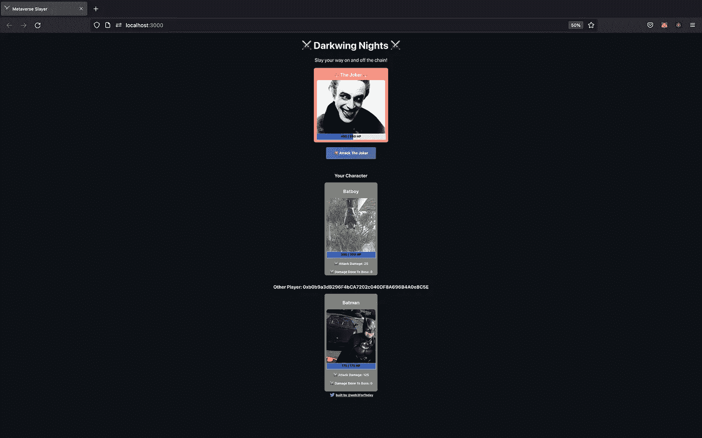

# 具有可靠性和 Javascript 的迷你回合制 NFT 游戏

> 原文：<https://medium.com/coinmonks/mini-turn-nft-game-with-solidity-and-javascript-ccb156058058?source=collection_archive---------6----------------------->

我所知道的最好的学习方法是通过建立。反过来，我所知道的最好的教学方式是展示我制作的东西。这篇博文将涉及一个我在 buildspace 的帮助下构建的 dapp(去中心化应用)。如果你没有听说过它们，如果你想进入区块链第三网站，它们是必不可少的。他们有很棒的教程，一个活跃的电报求助频道，从技术角度来看这些项目很有挑战性，所以你会学到很多！此外，这些项目非常适合构建和添加额外的功能。我增加了多玩家功能，为每个玩家增加了一个总损坏属性，增加了一个用户界面来交流角色死亡后的后续步骤，并在 IPFS(星际文件系统)上保存了图像。

我要做的第一件事是在我的终端中运行这个脚本，将我的 Solidity smart 契约部署到 Rinkeby 测试网络:npx hard hat run scripts/deploy . js—network rinke by

我使用的是以太坊开发环境 hardhat。我运行了一个 hardhat 脚本来创建这个项目，它提供了大量的内置功能，包括一个本地测试环境，这在构建您的合同时非常有用。更多关于安全帽的信息，请点击这里:[https://hardhat.org/](https://hardhat.org/)

My deploy script

我的代码的第一行将实际编译我们的契约，并生成我们使用契约所需的必要文件。它使用 Hardhat 运行时环境，简称 hre，这是一个 hardhat 在运行任务、测试或脚本时公开的对象。然后，我们将合同部署到 rinkeby 测试网络，这是一个实际的外部区块链，并向构造函数发送参数来初始化我们的游戏角色。我们控制台记录合同的地址，因为我们将需要它和一个叫做 ABI(应用程序二进制接口)的东西，以便稍后从我们的前端与我们的合同进行通信。在我们将脚本部署到名为“YourContractName.json”的文件中之后，可以在我们的 hardhat 项目的工件目录中找到 ABI。ABI 本质上是实体世界和 Javascript 世界之间的通信层。ABI 指定了我们的契约的不同方法以及它们的输入和输出格式。

合同部署至:0x 0046 c 78 EC 1987244 c 01 c 64203065874 aadbb 3647

现在，我将合同地址和 ABI 添加到我的前端，并启动我的服务器开始游戏。把每个合同想象成一个生活在区块链上的新游戏，我们的前端是我们交流和体验游戏的方式。这是网站的第一页，欢迎用户加入游戏，并提示用户连接他们的钱包进行游戏。在 web3 中，你的钱包是你登录分散式应用程序的方式，它的作用就像你的用户名和密码以及你的钱包。这个应用程序正在期待一个特定的浏览器钱包，Metamask，它允许我们购买，存储和发送加密货币。此外，Metamask 还支持以太坊测试网络，如我们今天将使用的 Rinkeby。为什么是测试网络？因为我不想付真的税。这个应用程序将完全一样的工作在 mainnet(网络与真正的以太网)你只需要改变几行代码。

Things are looking Epic!

用户单击该按钮，要么进入元掩码登录，要么被告知安装元掩码:

一旦用户登录元掩码，他们将被带到 dapp 的选择字符页面:

They feel very me =)

在这里，用户可以铸造一个他们喜欢的角色的 NFT(不可替换的令牌)。什么是 NFT？一个可替代的代币就像一美元，一美元等于一美元。另外一美元也等于 100 美分。然而一个狗 SquirrelMan NFT 是不能与一个蝙蝠侠 NFT 互换的。我使用 OpenZeppelin 创建了这些令牌，OpenZeppelin 是一个用于安全智能合约开发的库。这些令牌遵循 erc-721 标准:[https://ether eum . org/en/developers/docs/standards/tokens/ERC-721/](https://ethereum.org/en/developers/docs/standards/tokens/erc-721/)

这些图像还不是 NFTs，但你看到的每个角色的图像都托管在一个名为 IPFS(星际文件系统)的分散存储网络上，这个相同的图像将用于创建你的 NFT。我喜欢 PoodleMoth，所以我将单击“Mint PoodleMoth ”,这将把我带到这个屏幕:

这是我的 Metamask 钱包弹出的窗口，要求我确认交易。我用 RinkebyETH 付款，你可以从这样的水龙头上找到它:【https://rinkebyfaucet.com/

气体是一种计算单位。燃气费是以太坊区块链得以运营的原因。燃气费是激励人们运行聚集在一起形成以太坊区块链的节点。天然气价格遵循供求规律，在网络使用高峰时段变得更加昂贵。汽油费阻止了许多类型的恶意攻击，因为它使恶意用户向网络发送垃圾邮件的成本过高。用户可以支付更高的汽油费来更快地验证交易。

我准备确认交易，奇怪的是，我们被带到了这个屏幕:

Where my NFT =(

什么鬼东西？我们的 NFT 在哪里？made =)当我在元掩码事务上单击 confirm 时，这个函数就运行了，这实际上就是铸造我们的 NFT。简单来说，制作 NFT 指的是在以太坊区块链上将数字文件转化为数字资产的过程。一旦在区块链，这个数字文件现在是 NFT，它将永远储存在这里。

My Solidity code to mint an NFT

好吧，那为什么要等？当我们执行这个函数时，我们向以太坊区块链发送一个事务，加密生成一个事务散列，如下所示:0x 97d 99 BC 7729211111 a 21 b 12 c 933 c 949 d4f 31684 f1 d 6954 ff 477d 0477538 ff 017

然后，该事务被广播到网络，并与许多其他事务一起包含在一个池中。矿工必须挑选你的交易，并将其包括在一个区块中，以验证交易并认为它是成功的。这个过程需要时间，而时间的长短与你愿意支付的价格直接相关，即汽油价格。Gas 是指测量在以太坊区块链上执行特定操作所需的计算工作量的单位。天然气价格是你愿意为每单位天然气支付多少钱来验证你的交易。

好的，所以我们在等待一个好的理由，如果我们能负担得起，我们可以少等一会儿。酷！

Enter PoodleMoth!

史诗！！！我们的 NFT 在这里。对吗？是啊，有点。lol。好吧，让我们具体点。你的 NFT 制造出来了，现在生活在区块链的林克比河上。贵宾犬的所有统计数据——攻击伤害、boss 伤害、生命值——都直接来自区块链，然后被解析成 Javascript 可以读取的格式，然后显示在前端。像我之前说的图像被存储在一个叫做 IPFS 的分散文件存储系统中。因此，我们在我们的契约上调用一个位于区块链的函数，这个函数返回我们的 NFT。所以我们的 NFT 实际上生活在区块链！https://opensea.io/用同样的方式在他们的网站上呈现 NFT。只要去他们的网站(我这里用的是他们的 testnet【https://testnets.opensea.io/ )输入 Solidity 智能合约的地址:0x 0046 c 78 EC 1987244 c 01 c 64203065874 aadbb 3647 或者去这里方便:[https://testnets . opensea . io/assets/rinke by/0x 0046 c 78 EC 1987244 c 01 c 64203065874 aadbb 3647/1](https://testnets.opensea.io/assets/rinkeby/0x0046c78ec1987244c01c64203065874aadbb3647/1)

然后砰。NFT =)

Check out Attack Damage and Health Points!

水平怎么样了？攻击伤害和生命值是我游戏中每个角色和反派的属性。你可以决定你的 NFT 有什么属性。属性不仅仅是为了玩 NFT 的游戏，对收藏者来说也很重要。例如，来自 Bored Ape 游艇俱乐部的 NFT 具有某些属性(短莫霍克发型、夏威夷风格、疯狂风格),这使它成为独一无二的、更具互动性的所有权体验。查看这个 Solidity 代码片段，其中我覆盖了 OpenZeppelin 的 tokenURI 函数，将我想要的数据设置为将要创建的 NFT。

Overiding OpenZeppelins tokenURI function

好酷。我们能玩这个该死的游戏吗？是的，我们开始吧！你可能会问自己为什么 DogSquirrelMan 会在游戏中，因为我们没有铸造他。另一个钱包铸造了他，同时在和我们玩游戏。你可以看到他们的钱包地址和他们的 NFT 的属性，以及到目前为止对老板造成的损害。一个有趣的下一个功能，我打算建立一个钱包到钱包的信息服务，这样玩家可以协调攻击。

yo DogSquirrelMan go for his knees

好吧，我只是按下了攻击按钮，然后我的 MetaMask 钱包弹出来，要求我确认交易(出于冗余的考虑，不打算显示它)。因为我正在改变区块链的状态，如果我们在直播的话，这个交易会花钱，但是我们在测试网络上，所以我付钱给 RinkebyETH。然后，我们等待交易被验证的区块链，一旦它是我们看到一个小丑角色的视觉效果(一些先进的 CSS)，然后我们看到他和我们的属性更新。厉害！我们刚刚向区块链发送了一个事务，以更改区块链上的 NFT 的属性，然后将该信息呈现给我们的前端。如果你很聪明，你可能会想，但是等等，我们的 Javascript / React 前端怎么知道这个特定的事务已经在区块链上完成了呢？此外，我们如何获取更新的值，然后用它们刷新我们的前端 UI(用户界面)？事件！在这种情况下，我们在一个名为 attackBoss 的函数中“发出”一个名为 AttackComplete 的事件，该函数位于我们的 Solidity 契约 on Yes！区块链=)你懂了！如果你好奇的话，CharacterNftMinted 是当我们铸造我们的 NFT 并想告诉我们的前端时引发的事件。

events are super helpful =)

一旦我们的事件监听器获得事件，我们的前端就会显示小丑和 PoodleMoth 的最新生命值。当玩家攻击小丑时，他当然也会造成一些背部伤害。

下面是我们的 Solidity 契约中 attackBoss 函数的代码。注意我们的逻辑，只让 hp > 0 的 NFT 玩。还要注意，这个函数的底部是我们触发 AttackComplete 事件的地方。

下一个代码片段是 React 前端的代码，它打开 useEffect 生命周期函数中的事件监听器，监听从区块链发出的事件 AttackComplete，当它发出时，我们触发 AttackComplete，这是 React 前端中的一个函数，用于更新我们的 UI，以反映区块链上发生的变化。

onAttackComplete 函数从 Solidity 中发出的事件接收输入，并更新正确的字符。记住我们也有 DogSqurirelMan 玩我们的游戏，因为有多个玩家，我们需要告诉我们的前端哪个玩家是我们，哪个不是。我们通过使用公共钱包地址来实现这一点，这是一个唯一的标识符，我们通过使用一个名为 msg.sender 的内置函数在代码的可靠性方面分配给我们的 NFTs，该函数将与我们的合同交互的人的钱包地址返回给我们。酷豆沙拉！说到 DogSquirrelMan，让我们看看他是什么做的。狗 SquirrelMan 攻击和:

DogSquirrelMan has Bark!

正如我们所料，我们看到了 DogSquirrelMan 更新。请记住，我们扮演的是 PoodleMoth，所以我们看到的是另一个玩家 DogSquirrelMan update。不错！让我们把它带到一个逻辑的极端，看着 DogSquirrelMan 遭遇他不合时宜的灭亡。狗 SquirrelMan 再次勇敢的进攻，为了黑暗之夜的利益牺牲了自己。我在 JS 代码中监听 Solidity 事件 NftDeath，当它发出时，我使用 state 和 setTimeout 函数进行一些条件渲染，通过 UI 向用户传达发生的情况。

Nothing like death laughing at you

那么另一个玩家的 NFT 怎么样了？很棒的问题！它仍然存在于漂浮在以太周围的林克比区块链(没有双关语)上，生命值为 0。你可以通过一个叫做焚烧的过程来摧毁一个 NFT:[https://poster grind . com/is-it-possible-for-an-NFT-to-be-destroy/](https://postergrind.com/is-it-possible-for-an-nft-to-be-destroyed/)但是这需要花费金钱，因为它改变了区块链的状态。此外，NFT 仍然可以作为收藏品或纪念品，即使它在游戏中不再有用。所以我在我的 Solidity 代码中添加了一个事件，如果我保存在这个 allPlayersInGame 数组中的任何一个玩家的健康值等于零，这个事件就会触发。我在 Solidity 代码的 attackBoss 函数中检查了这一点。如果他们的健康值等于 0，我会从 allPlayersInGame 数组中删除代表该玩家的结构(https://solidity-by-example.org/structs/ ),我把它放在代码的可靠性部分。我还触发了一个事件 NftDeath，它带有两个参数，即 msg.sender 和 allPlayersInGame 数组。

发出的 NftDeath 事件将在前端触发一个名为 nftDeath 的函数。还有其他前端代码已经删除了死字符，这是在 onAttackComplete 函数中找到的，该函数在 Solidity 事件“AttackComplete”发出时进行侦听。

还记得我从 allPlayersInGame 数组中删除的结构吗(向上两个图像)。您可能会问自己，如果我们已经在前端考虑了这种行为，为什么我们还要在后端这样做。是的，这有点多余，但是当一个新的角色和刚刚死去的角色进入同一类型的游戏时，我发现了一个 bug。基本上，两个相同类型的角色会显示完整的属性。所以现在我删除了代码的 Solidity 端的 struct，它将 struct 设置为默认值。该结构如下所示:

地址变量的默认值是我在下面的代码中检查的值:

default Solidity address

所以我利用这个默认行为，并依靠它将那些讨厌的 bug 挡在我的 dapp 之外。

PoodleMooth 进行了一场勇敢的战斗，但最终还是死了:

在这个让你知道你的角色已经死亡的条件渲染之后，你会被带回铸币厂角色界面。我一直想试试蝙蝠侠，看看运气如何，我们得到了完美的二人组(蝙蝠侠也在玩)。我在想，如果游戏中有蝙蝠侠的话，一个很酷的拉伸功能将会给蝙蝠侠增加双倍的攻击力。

经过一场漫长而艰苦的战斗，小丑被打败了，蝙蝠侠和蝙蝠男孩将永远幸福地生活在锁链上。

但是不要相信我的话。自己去看合同住在这里:0x 0046 c 78 EC 1987244 c 01 c 64203065874 aadbb 3647 和 Opensea 上的收藏链接在这里:[https://test nets . Opensea . io/collection/dark wing-nights-xxt 6 tzayu](https://testnets.opensea.io/collection/darkwing-nights-xxt6tzayou)

所以你可能会问自己接下来会发生什么？我将把这个合同放在另一个称为合同工厂的合同中。我将部署契约工厂，以允许用户通过单击按钮来部署新的契约。契约工厂还将跟踪契约(游戏)的所有实例。我还将添加一个随机数发生器来增加一个致命一击的特性，这个特性可以在 10%的时间内将打击力增加三倍。我真的很喜欢某些球员有协同关系的想法，所以我也将探索这一点。如果您喜欢此内容，请在 https://twitter.com/web3ForToday[或 https://www.linkedin.com/in/ryanjohnotoole/](https://twitter.com/web3ForToday)[关注我。感谢阅读祝你这周过得愉快。](https://www.linkedin.com/in/ryanjohnotoole/)

> 交易新手？尝试[加密交易机器人](/coinmonks/crypto-trading-bot-c2ffce8acb2a)或[复制交易](/coinmonks/top-10-crypto-copy-trading-platforms-for-beginners-d0c37c7d698c)