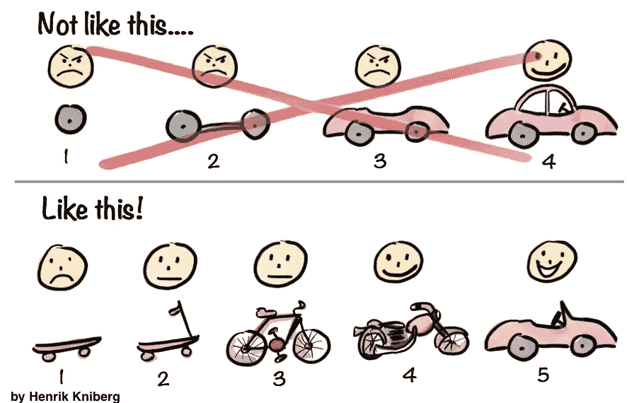
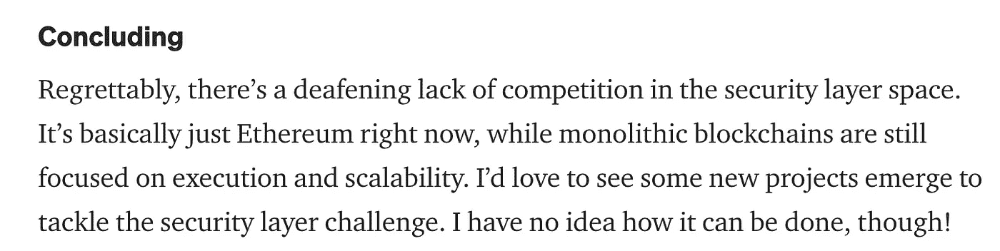
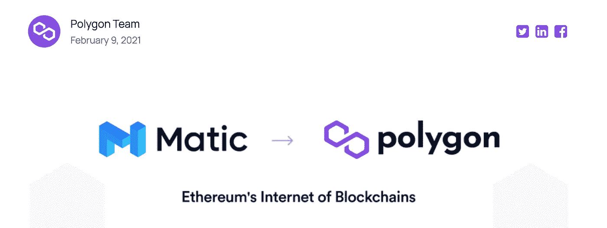
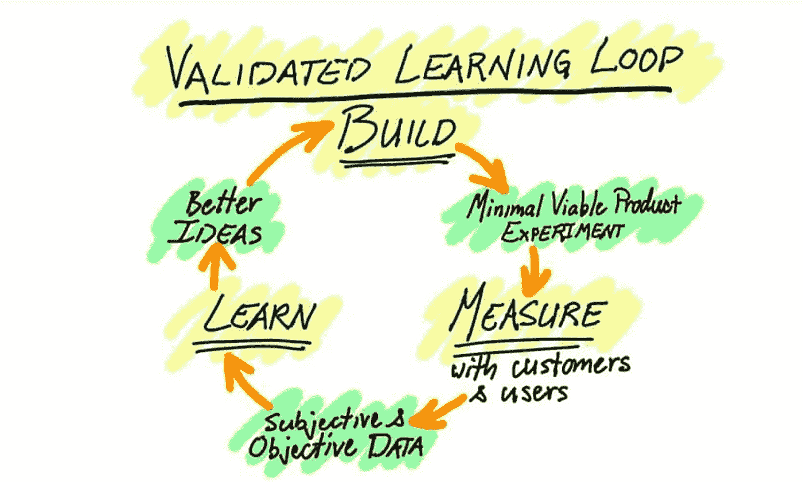

# 最小可行区块链

> 原文：<https://medium.com/coinmonks/minimum-viable-blockchains-ef2f58591a70?source=collection_archive---------25----------------------->

## 在这篇文章中，我以以太坊和 Polygon 为例，讨论了精益创业概念如何应用于区块链项目。

# 最小可行产品

最小可行产品(MVP)是史蒂夫·布兰克(Steve Blank)和埃里克·赖斯(Eric Reiss)推广的一个概念，主导了创业文化近 20 年。

一个 [MVP](https://en.wikipedia.org/wiki/Minimum_viable_product) 是“一个产品的版本，它有足够的功能可以被早期客户使用，然后他们可以为未来的产品开发提供反馈。”

如果这听起来是一个简单而明显的想法，那是因为它确实如此。但也很深刻，被大多数创业者忽略了。

我不会深入探讨 MVP 的想法，(为此你可以阅读[的《顿悟的四个步骤》](https://www.amazon.com/Four-Steps-Epiphany-Steve-Blank/dp/0989200507)和[的《精益创业》](https://www.amazon.com/Lean-Startup-Entrepreneurs-Continuous-Innovation/dp/0307887898/ref=sr_1_1?keywords=lean+startup&qid=1662324019&s=books&sprefix=lean+%2Cstripbooks%2C75&sr=1-1))但我会强调它是如何成功应用于区块链协议的。

# 以太坊 MVP

以太坊就是一个明显的例子。Vitalik 和他的团队已经花了足够多的时间尝试在比特币上进行开发，得出的结论是需要一个更可编程的区块链。

让我们来看一下产品是如何进入市场的。

以太坊最初的版本是 2014 年[透露](https://www.youtube.com/watch?v=l9dpjN3Mwps&t=601s)，2015 年[推出](https://blog.ethereum.org/2015/07/30/ethereum-launches)。它有独特的竞争优势，但远非最佳:

独特元素:

*   **可编程性:**以太坊是第一个也是唯一一个图灵完全智能契约区块链。

次优元素:

*   **共识机制:**团队一开始就想用 [PoS](https://ethereum.org/en/developers/docs/consensus-mechanisms/pos/) 作为以太坊的共识机制，但是那样会耗时太长。相反，他们从比特币那里借用了经过测试的 [PoW](https://ethereum.org/en/developers/docs/consensus-mechanisms/pow/) 。
*   **执行环境:**众所周知， [EVM](https://ethereum.org/en/developers/docs/evm/) 需要做很多工作。它经常被以太坊社区内外的人批评。但是[很像 Javascript](https://lform.com/blog/post/how-javascript-became-the-dominant-language-of-the-web/) ，它工作得足够好。

以太坊没有追求完美，而是推出了产品，并发现产品市场适合渴望建立新加密资产的社区。

为什么发布时间如此重要？

[当然是经过验证的学习](https://en.wikipedia.org/wiki/Validated_learning)。以太坊需要变得流行和拥挤，团队需要:

*   **建立一个战争基金:**他们将牵引运用到扩展解决方案研究中——重复类似[执行分片](https://ethereum.org/en/upgrades/sharding/) / [等离子](https://en.wikipedia.org/wiki/Validated_learning)和登陆[卷装](https://ethereum.org/en/developers/docs/scaling/)的想法。
*   **找到正确的策略:**他们转向了[以汇总为中心的路线图](https://ethereum-magicians.org/t/a-rollup-centric-ethereum-roadmap/4698)。

通过对汇总进行优先级排序，Ethereum 团队和社区接受了他们的执行层(市场领导者)将不会是未来分散应用运行的地方。相反，如果一切进展顺利，它可能会作为定居点基础设施淡出人们的视线。

这个支点经常被低估。让其他连锁店成为焦点的决定需要严肃的谦逊——一种从[战场](https://www.commit.works/everyone-has-a-plan-until-they-get-punched-in-the-mouth/)学到的谦卑(也就是多年饱和的区块空间和高费用)。到目前为止，没有其他领先的可编程区块链明确地[优先选择](https://polynya.medium.com/security-layers-or-qualifying-security-decentralization-7a5c93a36ba3)作为结算层，尽管有些[出人意料地做好了](https://twitter.com/apolynya/status/1531114219868856320?s=20&t=qqFyAr1BP5QDDUMklPa2DA)的准备。

From Polynya’s article

# 多边形 MVP

多边形是另一个明显的例子。一个缓慢而昂贵的以太坊展示了对快速而廉价的块空间的明确需求。多边形小组发现了这一点，并迅速行动。

很像以太坊的第一个版本， [Polygon PoS](https://polygon.technology/solutions/polygon-pos/) (Polygon 的第一个产品)有一个独特的边，但并不被认为是最佳解决方案:

独特元素:

*   以太坊-结盟:EVM-兼容性显然很重要，但只是故事的一部分。PoS 链最初被设计为以太坊的 EVM 兼容第二层，以区别于许多其他 EVM 兼容链。

注意:Polygon 团队因为称 PoS 链为第二层而受到很多批评，但是我认为这个定义已经随着时间的推移而发生了变化。第二层曾经是任何技术上建立在以太坊(或另一个基础层)上的解决方案的合理术语。

次优元素:

*   **单片设计:**Polygon 团队非常了解以太坊的研究，但是他们知道 rollups 还不实用。为了速度，他们从 [Cosmos](https://cosmos.network/) 借用了经过测试的 [Tendermint](https://tendermint.com/) 共识机制。

让我们问与以太坊同样的问题。为什么 Polygon 在启动时如此重要？

Polygon 团队需要市场的动力和反馈来:

*   **建立战争基金:**他们建立了庞大的国库，[收购了](https://cointelegraph.com/news/polygon-acquires-hermez-network-for-250m-will-merge-native-tokens)高质量的技术/团队，[向 ZK 投资了](https://blog.polygon.technology/the-polygon-thesis-strategic-focus-on-zk-technology-as-the-next-major-chapter-for-polygon-1b-treasury-allocation/)10 亿美元
*   **找到正确的策略:**他们[转向](https://blog.polygon.technology/matic-network-becomes-polygon-ethereums-internet-of-blockchains-expands-mission-and-tech-scope/)纯以太坊解决方案套件。

很多人没有意识到多边形团队枢轴转动的程度。

最初，他们把以太坊作为一个滩头阵地，但表面上并不致力于此(类似于今天的 StarkWare)。一篇 2018 [文章](https://blog.polygon.technology/what-is-matic-network/?utm_source=pocket_mylist)写道，“我们选择以太坊作为展示我们可扩展性的第一个平台”。这与最近的一集形成鲜明对比，在该集中，联合创始人桑德普明确表示，“如果未来 Polygon 开始关注其他地方，我将不会在那里。”

# 总结想法

以太坊和多边形团队都推出了他们知道并不完美的解决方案。他们把一件重要的事情做得很好，然后和其他人吵了起来。他们对有效的部分进行三倍缩减，对无效的部分进行迭代。他们不害怕改变叙述。

他们建造了。他们测量了。他们学会了。

From The Lean Startup

结果呢？这两个项目都非常成功，并为未来做好了准备。

而且他们最初的一些愿景终究会变成现实！

感谢阅读！🦖🥚

欢迎在推特上联系:[twitter.com/0xDinoEggs](https://twitter.com/0xDinoEggs)

> 交易新手？尝试[加密交易机器人](/coinmonks/crypto-trading-bot-c2ffce8acb2a)或[复制交易](/coinmonks/top-10-crypto-copy-trading-platforms-for-beginners-d0c37c7d698c)