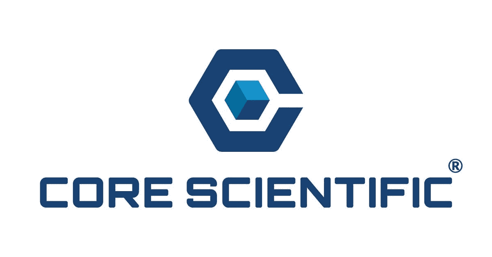
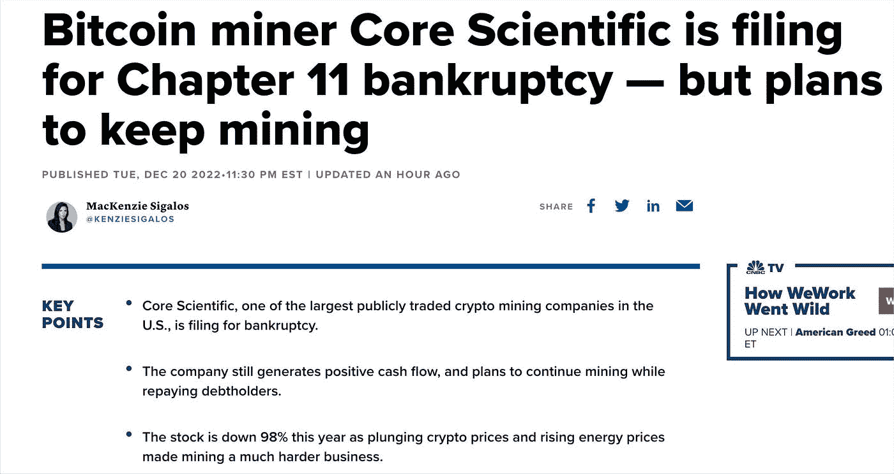
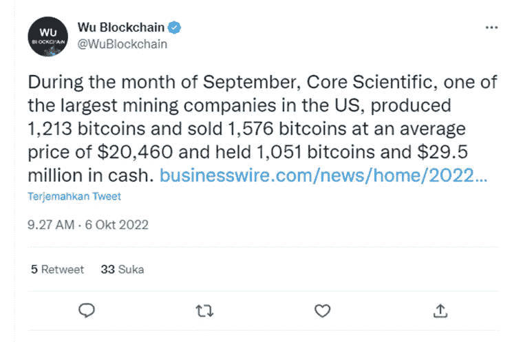
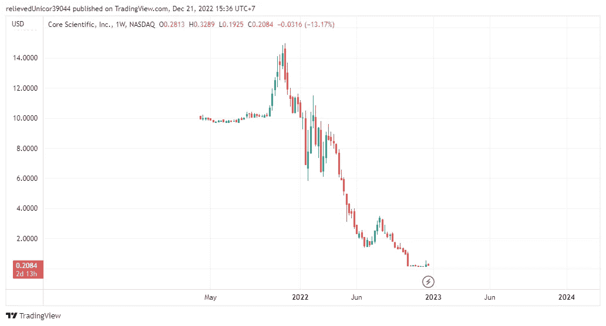
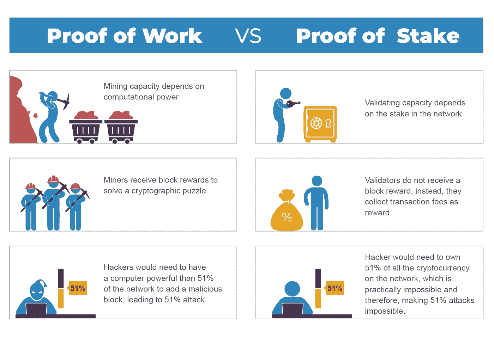

# 矿业公司$CORZ 破产了。股权证明是解决方案吗？

> 原文：<https://medium.com/coinmonks/mining-company-corz-went-bankrupt-is-proof-of-stake-the-solution-1c673cce32ef?source=collection_archive---------45----------------------->

2020 年，加密货币的所有领域都崩溃了。从开发者到加密货币贷款人。很多创始人/开发者的名字都无法处理这个问题，甚至陷入案件。

其中一家$CORZ 加密货币矿业公司(Core Scientific)正在提交一份破产保护报告。由于比特币价格停滞不前且不断下跌，公司健康状况每况愈下。9 月，加密货币矿业公司在越来越大的抛售压力下，将其持有的比特币减少了 1576 BTC，至 20，460 美元。

[Wu Blockchain di Twitter: “During the month of September, Core Scientific, one of the largest mining companies in the US, produced 1,213 bitcoins and sold 1,576 bitcoins at an average price of $20,460 and held 1,051 bitcoins and $29.5 million in cash. https://t.co/br7yZI2Joh" / Twitter](https://twitter.com/WuBlockchain/status/1577848028337086469?ref_src=twsrc%5Etfw%7Ctwcamp%5Etweetembed%7Ctwterm%5E1577848028337086469%7Ctwgr%5E8c5a0d6607a3756d844651a8b1fb5b4ae9f26ffc%7Ctwcon%5Es1_&ref_url=https%3A%2F%2Fwatcher.guru%2Fnews%2Fbitcoin-top-mining-company-sells-1576-btc-as-sell-pressure-rises)

B.Core Scientific $CORZ 最大的债权人 Riley Financial(一家金融服务公司)上周向该公司的股东和贷款人写了一封公开信。**金融服务公司指出，破产是不必要的，可以通过提交一份 7200 万美元的财务计划来解决。**

Core Scientific $CORZ Stock Price

Core Core Scientific $CORZ 的股价从 14 美元的高点跌至 0.208 美元的价值。Core Scientific $ CORZ 的股价自最高价以来下跌了 98%以上，这是一个惊人的数字。难怪这家公司申请破产保护。

## 引自美国消费者新闻与商业频道

> 核心科学公司$CORZ 仍在产生正现金流。然而，这些现金不足以偿还他租赁的设备所欠的融资债务。公司将继续正常运营，直到与公司债务持有人达成协议。

## 工作证明是个问题

**这一事件说明，除了大量的能源消耗和对环境的破坏**之外，证明工作还存在很大的风险。那么昂贵的租金和维护费用必须由矿工承担。

也许最好的解决方案是 etherium 昨天所做的，当时他们通过委托一定数量的 etherium 作为矿工进行验证来实现利益证明。除了不需要放置采矿工具的空间和维护成本之外，标桩证明似乎还提供了便利。

> 交易新手？尝试[加密交易机器人](/coinmonks/crypto-trading-bot-c2ffce8acb2a)或[复制交易](/coinmonks/top-10-crypto-copy-trading-platforms-for-beginners-d0c37c7d698c)