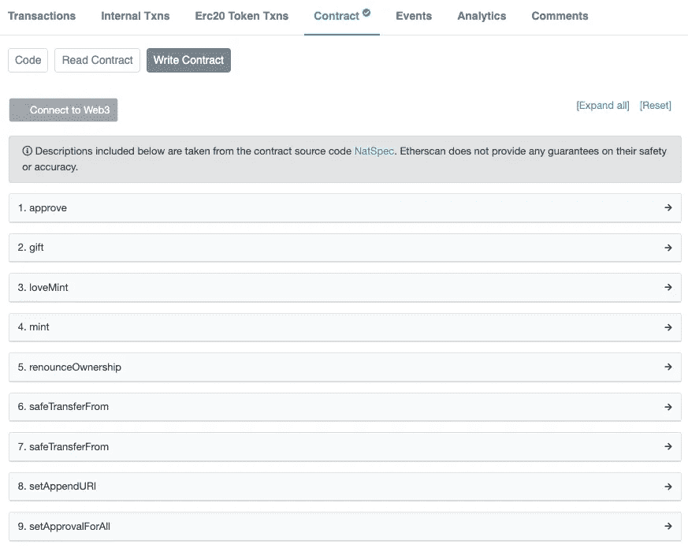

# 如何从以太坊合同中直接铸造 NFT

> 原文：<https://medium.com/coinmonks/mint-nft-direct-from-contract-a1e60bd21153?source=collection_archive---------6----------------------->

## 如何跳过项目网站，连接 Etherscan.io，直接与以太坊合约互动，铸造 NFT。

如果你曾经铸造过一个 NFT，你可能已经进入了一个项目的网站，连接上你的钱包，点击了一个“铸造”按钮。钱包会弹出一条确认交易加油的信息，然后……瞧！你铸造了你的 NFT。

但是你知道吗，有些项目你可能不需要通过项目的网站。这就是我将在本文中向您展示的内容。

注意，本文主要适用于 PFP 项目，而非 1/1 art。


Photo by [Mo](https://unsplash.com/@meid88?utm_source=medium&utm_medium=referral) on [Unsplash](https://unsplash.com?utm_source=medium&utm_medium=referral)

# 基础知识

在没有太多技术细节的情况下，了解薄荷流程是必不可少的。

通常，我们有项目的网站。这就是我们所说的前端，我们互动的部分。

但是每当我们执行一个动作，比如造币，这就发生在以太坊契约上，后端。前端调用合同的特定动作。

但是通常可以在不与项目网站交互的情况下调用 mint action。

出于几个原因，您可能希望这样做。例如，网站的性能可能会受到试图创造或增加安全性的用户数量的影响，从而减少您连接到钱包的网站数量。

然而，一些项目创建了特定的方法，使得它从契约中变得有挑战性。

# 合同地址

我们需要能够直接从合同中生成的第一件事是合同地址。

有几种方法可以做到这一点，但让我分享常见的三种方法:

## 1)官方不和谐链接

该项目在官方的 discord 链接上发布合同的 URL。

这是首选，因为是项目发布的官方链接。

## 2)铸造 NFT

来自官方项目集合中的一个铸造的 NFT。查找项目活动，第一条记录显示了铸造这件物品的交易的链接。


Mint transaction at the item activity. Right on the Date, there is the icon to go to the transaction.


The transaction page on Etherscan.io

这是一个简单的方法，但需要特别注意，以确保你是在 OpenSea 的真实项目集合上。

## 3)使用聚合站点

一些聚合网站，比如 rarity.garden，可以提供更多关于热门项目的信息。它们通常包括指向项目合同的 Etherscan.io 链接。


Lovebirds NFT on rarity.garden app

同样，总是要反复检查，以确保这份合同是项目的官方文件。

这并不罕见，假收藏也出现在这种工具上，导致你铸造错误的 NFT。

对于这篇文章，我将使用 [@Love_BirdsNFTs](https://twitter.com/Love_BirdsNFTs) 的契约:

```
0xB7960ec09EE11ba7606eB881991D6dED46D8c198[https://etherscan.io/address/0xb7960ec09ee11ba7606eb881991d6ded46d8c198](https://etherscan.io/address/0xb7960ec09ee11ba7606eb881991d6ded46d8c198)
```

> 交易新手？试试[密码交易机器人](/coinmonks/crypto-trading-bot-c2ffce8acb2a)或者[复制交易](/coinmonks/top-10-crypto-copy-trading-platforms-for-beginners-d0c37c7d698c)

# 合同代码和功能

打开合同链接时，您将看到合同交易。

当选择合同菜单时，您将看到合同的详细信息，包括其源代码。

您还会注意到两个附加子菜单:阅读合同和编写合同。


Contract screenshot from etherscan.io

请注意，您可能会发现项目中有一组共同的功能，但它们可能会因名称而异。

Read Contract 将向您显示只读功能，执行起来不需要花费太多时间，并允许您检查一些信息，如最大供应量、每笔交易的最大令牌数，甚至特定令牌的所有者。


Example of Reading functionalities

另一方面，写契约是需要 gas 来执行的功能，因为它们将在区块链上写。



Example of Write functionalities

要执行写入功能，您必须将您的钱包连接到 Etherscan.io。单击功能列表正上方的“连接到 Web3”按钮。

它会问你要连接哪个钱包:


Wallet connect to Etherscan

由于该功能是由 Etherscan.io 提供的测试版功能，它们显示了一条额外的警告消息:


Etherscan beta warning message

连接钱包后，您会看到一个带有部分钱包地址的绿色指示器:


Wallet connected to Etherscan

当我们扩展 mint 函数时，我们可以看到该方法所需的参数。

在这种情况下，payableAmount 是铸币价格(对于免费铸币项目是 0)，而 _amount 是我们想要铸币的代币数量。


Mint parameters

在撰写本文时，love birds 项目已经售罄。无论如何，让我们尝试推动一个新交易，看看会发生什么:


Metamask confirmation pop-up

Metamask 将打开，要求确认一个疯狂的气体成本来执行。

每当收到意外的参数时，就会发生这种情况。在这种情况下，我们试图创造一个已经达到最大供应量的项目。

让我们尝试一个还没有发明的项目，月兔:


Transaction confirmation on Metamask

现在我们看到这个造币厂更现实的汽油成本。注意，直接与合同交互时，还会显示“未知处理时间”的消息。

您也可以通过编辑来调整气体限制，但如果您不知道气体如何工作，则不建议这样做。

如果你有汽油的资金，点击确认，交易将通过区块链。

此外，一些项目允许在同一笔交易中进行多次造币，但如果您尝试的数量超过项目限制，您将会看到类似的疯狂气体成本:


Insane gas trying to mint multiple tokens.

# 不总是可能的

通过 Etherscan 上的合同，读写功能始终可用。

然而，根据项目的实现，有时与 mint 功能进行交互是非常具有挑战性的，或者是不可能的。

有些项目会进行预先验证，比如 allowlist 或任何其他试图创建的钱包状态。

这些验证可以使用散列信息作为参数来生成不同的功能参数。由于这个散列信息是由项目的网站生成的，并在合同中进行管理，如果不知道这个逻辑是如何实现的，通常很难复制这个逻辑。

例如，WizNFT 项目使用一个名为“proof”的参数，它是由前端在运行时使用非公开的特定规则创建的。

如果没有这些信息，就很难正确填写该属性。


WizNFT Mint functionality

# 结论

直接从合同中进行铸造允许您将钱包连接到 Etherscan.io，而不是铸造站点。

但是，您必须始终小心这些步骤，确保您正在与正确的契约进行交互。

此外，始终检查元掩码上的交易确认。如果气疯了，那就是有问题。请记住，区块链的错误是任何人都无法逆转的。

如果你也担心保持底价上涨，查看“NFT 项目的底价”中的一些想法。

[](/coinmonks/floor-price-of-nft-projects-355ce6cb10ac) [## NFT 项目的底价

### 底价可能是一个项目成功的标志。但这到底意味着什么呢？

medium.com](/coinmonks/floor-price-of-nft-projects-355ce6cb10ac) 

**mδRK mδRROC**是摄影师、艺术家、NFT 创作者和收藏家。他的 IT 背景使他能够进一步探索 NFT 和区块链世界。

你可以在推特上找到他，地址是 [@markmarroc](https://twitter.com/MarkMarroc) 。

参观:【markmarroc.com 