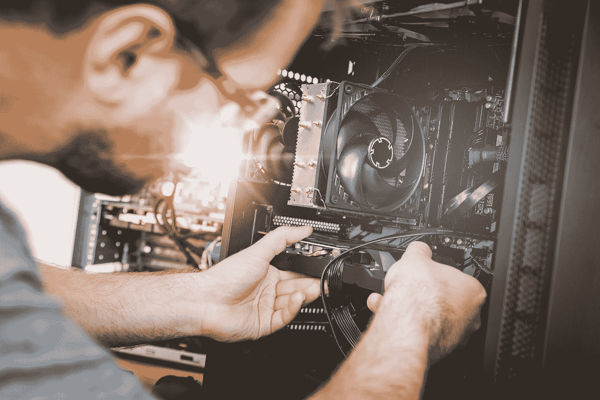

# 对以太坊升级的误解

> 原文：<https://medium.com/coinmonks/misconception-about-ethereum-upgrade-aka-merge-e77e8e4c7163?source=collection_archive---------40----------------------->

Photo by [JESHOOTS.COM](https://unsplash.com/@jeshoots?utm_source=medium&utm_medium=referral) on [Unsplash](https://unsplash.com?utm_source=medium&utm_medium=referral)

以太坊合并令人兴奋。许多人可能希望合并解决许多现有的问题，但这些可能会成为误解。

以下是一些误解:

❎以太坊燃气费将降低

❎的交易会更快