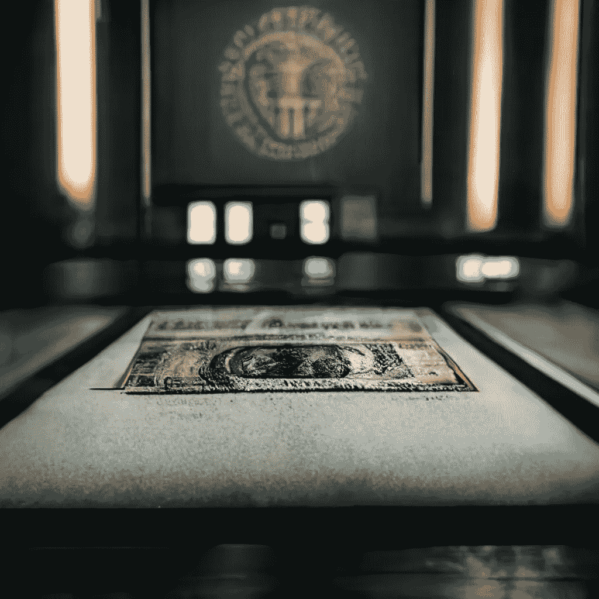
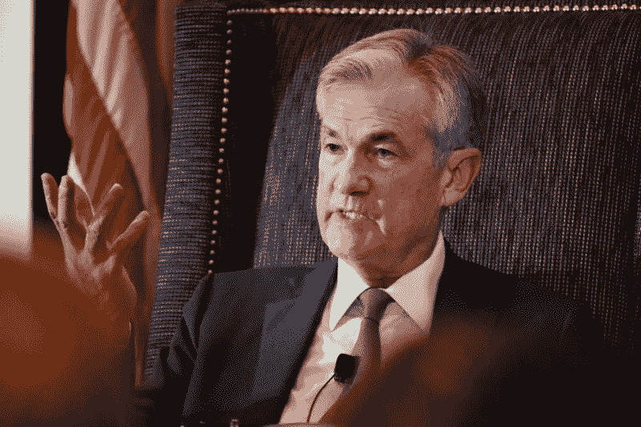
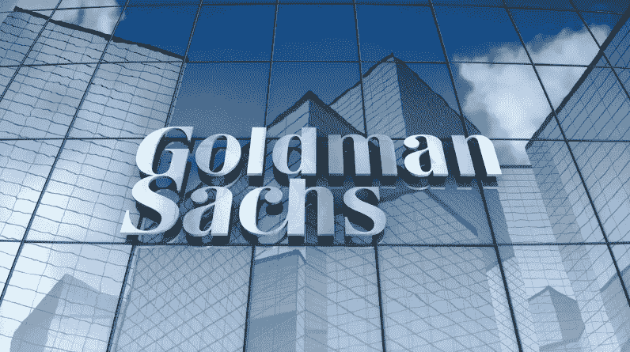
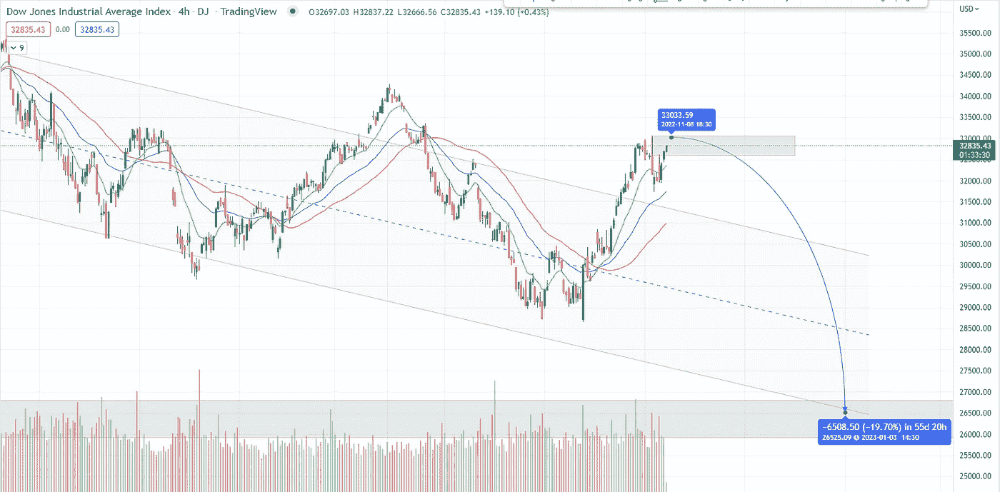
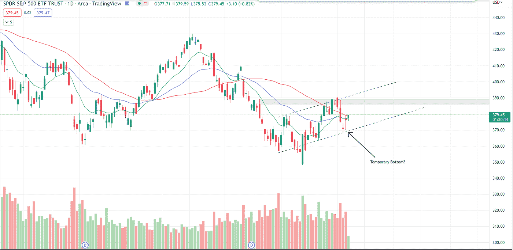
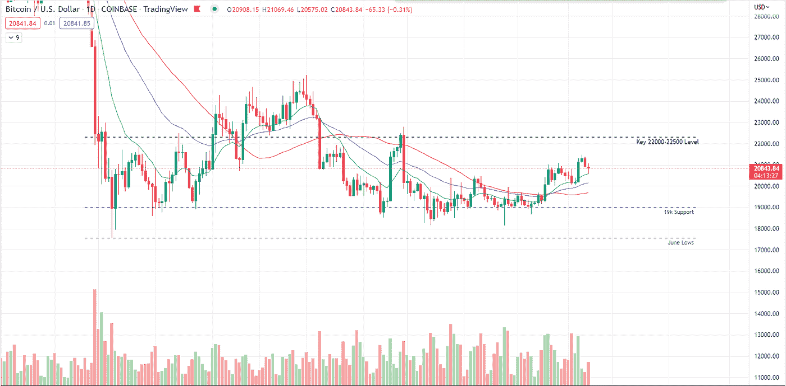

# 糟糕预测中的混杂信号

> 原文：<https://medium.com/coinmonks/mixed-signals-amongst-poor-forecasts-6c6c1e0f9ded?source=collection_archive---------50----------------------->

最近几周(11 月初)的新闻

# 在本周的报告中

*   美国就业报告和美联储加息给出了混杂的信号
*   高盛调整股市预测至新低
*   币安抛售了其竞争对手 FTX 的所有 FTT 代币。FTX 面临迫在眉睫的问题。
*   以太坊中心化的担忧持续上升。现在该网络面临审查指控。
*   DJIA 和 S&P500 价格分析。
*   BTC 价格分析。

‍

# 美国就业报告和加息

‍

11 月 4 日星期五，美联储公布了美国的失业率，显示为 3.7%，而此前的共识值为 3.6%，此前为 3.5%。

‍

随着就业报告和周三加息 75 个基点，我们很可能在 12 月份看到第五次加息 75 个基点。

‍

在可预见的未来，谨慎仍然是正确保护和投资的词汇。

‍

Bankrate 的高级经济分析师 Mark Hamrick 预计，明年招聘步伐将会放缓，他指出，许多人预计失业率将会突破 4%的水平。

‍

**杰富瑞的经济学家 Aneta Markowska 写道，劳动力和住房短缺将把潜在通胀的“底线”定在 4%左右，“我们认为打破这一底线需要劳动力市场大幅疲软，这使得衰退不可避免。”**

‍

考虑到 Hamrick 对未来一年就业率下降的预期，以及 Markowska 对劳动力市场表现不佳不可避免的衰退的陈述，我们看到美国出现了一幅悲伤的画面。

‍

当然，美国的状况会蔓延到世界其他地方，因此这不仅是美国的前景，也是全球的前景，我怎么强调谨慎都不为过。

‍

银行、投资者和政治家都很害怕，应该说，在当前的市场中，似乎没有人有优势。

‍

另一方面，由于持续加息对经济士气构成的风险，一些交易员似乎预计 2023 年底将小幅降息 30 个基点。

‍

幸运的是，对于美联储官员来说，士气似乎没有经济的整体结构那么重要。因此，如果官员们头脑清醒，我们不应该指望 12 月份加息 30 个基点。
‍
‍

不幸的是，正如我们最近越来越多地看到的那样，政治、法律和商业领域似乎无所不包。

*美联储主席杰罗姆·鲍威尔*

‍

# 高盛股票预测

‍

根据高盛(Goldman Sachs)的最新预测，明年大盘收益将无处可去。

‍

策略师大卫·科斯汀表示，标准普尔 500 的利润率已经向下弯曲，因此，他将 S&P 2023 年的每股收益预期从之前假设的 3%下调至 0%。

‍

“在疲软的第三季度财报季之后，标准普尔 500 净利润率自疫情以来首次同比下降，我们下调了 2022 年(从 226 美元降至 224 美元)、2023 年(从 234 美元降至 224 美元)和 2024 年(从 243 美元降至 237 美元)的每股收益预期，”gs 策略师大卫·科斯汀写道。

‍

当然，正如这些时候所预期的那样，科斯汀确实指出，利润收缩的唯一例外是能源行业，过去几个月来，许多大型对冲基金和投资者越来越关注该行业。

*高盛*

# 币安对 FTX

‍

币安首席执行官赵昌鹏最近宣布，他们将出售其目前持有的所有计算机 FTX 的 FTT 代币。

‍

CZ 没有透露他的公司将出售多少 FTT，但作为加密货币交易所去年退出 FTX 股权的一部分，币安以 BUSD(币安的 stablecoin)和 FTT 的形式获得了大约 21 亿美元的价值。

‍

币安首席执行官赵昌鹏将“最近的爆料”列为清算的原因，他进一步表示，由于其头寸的规模以及他不希望对市场运动产生重大影响，FTT 代币的出售可能需要几个月才能完成。

‍

CZ 解释说，FTT 的清算主要是出于风险管理的原因，这可能暗示了从 Terra 的 Luna Classic 下跌中吸取的教训，以及它对市场参与者的影响。

‍

他还补充道，“我们不会支持那些在背后游说反对其他行业参与者的人。”另一个暗示是 PVP 元素的可能性，许多密码专家在 Terra Luna 丑闻中谈到过，像 FTX 这样的名字可能参与了计划中的 Celsius 崩溃。

‍

看起来，币安清算代币的决定似乎是因为 FTX 首席执行官创立的投资基金 Alameda Research 最近泄露的资产负债表。这份资产负债表声称，阿尔梅达研究基金的绝大部分都被 FTT 代币套牢了。

一笔近 2300 万的存款，在撰写本文时价值约 5.84 亿美元，被发现从一个未知的钱包转移到，赵通过 twitter 帖子确认了这是交易所令牌卸载的一部分。

# 以太坊审查问题

‍

自从 9 月份合并以来，以太坊一直面临着关于其集中化的批评和理论攻击。

‍

据报道，在发现 51%的以太坊符合外国资产控制办公室(OFAC)的标准后，这种情况再次发生。

‍

遵守 OFAC 法案允许美国政府机构实施经济和贸易制裁。此前，OFAC 机构制裁龙卷风现金和几个以太坊地址。

‍

据报道，符合 OFAC 标准的以太坊块的日铸造量最近增长到了惊人的 73%。

一些以太坊的看涨者对合并后网络变得易于审查的说法进行了反击。

‍

Cyber Capital 创始人兼首席投资官贾斯汀·邦斯(Justin Bons)指出，即使以太坊验证机的 OFAC 合规率达到 50%，区块仍将在 30 秒内生成，而且没有一笔交易因 OFAC 制裁而被阻止。

‍

根据以太坊路线图，下一个路线图时期被称为“天灾”。该祸害的目标是“确保可靠和可信的中立交易的包容性，并避免集中和其他协议风险的 MEV。”MEV 指的是矿商在其生产的区块内包括、排除或重新排序交易的能力。所以本质上审查的能力。

‍

以太坊的创始人维塔利克·布特林(Vitalik Buterin)此前描述了一种可信的中立机制，即“不歧视或反对任何特定的人”。

‍

让我们希望布特林忠于以太坊路线图的根源。

# ‍

这里有一个免费的 PDF 格式的回调 trading‍指南，一个伟大的优势和交易技术:[https://www.boomish.org/free-e-books](https://www.boomish.org/free-e-books)

# 道琼斯工业平均指数和 S&P500

‍

正如本周所言，我们已经看到了道琼斯、S&P 和纳斯达克等大指数的相对强势。

‍

我们上周谈到的回调已经开始，尽管许多指数在大抛售后已经找到了一些很好的支撑。

‍

大多数指数看起来仍未准备好迎接更大的宽慰反弹。多头的目标是在 DJIA 等指数上达到新高，在市场上领先，尽管 DJIA 的市场结构非常奇怪，也不是持续牛市的最佳市场结构(见图 1)。
‍
‍

道指 26000 点的关键长期水平目前位于通道底部。在合适的条件下，这些水平可能会在未来两个月内达到。

‍

至于 S&P，它在与 370 水平重合的航道底部找到了一些良好的立足点。形成一个次日锤弹有力，周一绿烛有力的弃婴蜡烛。所有这些迹象都对多头有利，尽管阻力潜伏在 380-390 点上方。
‍

‍

*图 14h DJIA 2022 年 2 月—2022 年 9 月(交易视图)*

*图 2 1D S&p500 2022 年 5 月—2022 年 11 月(交易视图)*

‍ *‍*

‍

# 比特币

‍

对于比特币，目前没什么好说的。

‍

比特币与更广泛的传统市场的相关性如此之强，以至于它被搁置一旁，与大型指数同步波动。

‍

在上周的新闻简报中讨论的向上突破，在过去的一周中已经出现了不错的多头跟进。

‍

尽管关键阻力位于 22000-22500 点，我们距离可能的强力拒绝只有 5%的距离(见图 3)。

‍

总体而言，我认为 BTC 下跌的可能性要比上涨的可能性大得多，尤其是在地缘政治和经济环境中。

‍

*图 3 1D BTC 2022 年 4 月—2022 年 9 月(交易视图)*

> 交易新手？尝试[加密交易机器人](/coinmonks/crypto-trading-bot-c2ffce8acb2a)或[复制交易](/coinmonks/top-10-crypto-copy-trading-platforms-for-beginners-d0c37c7d698c)