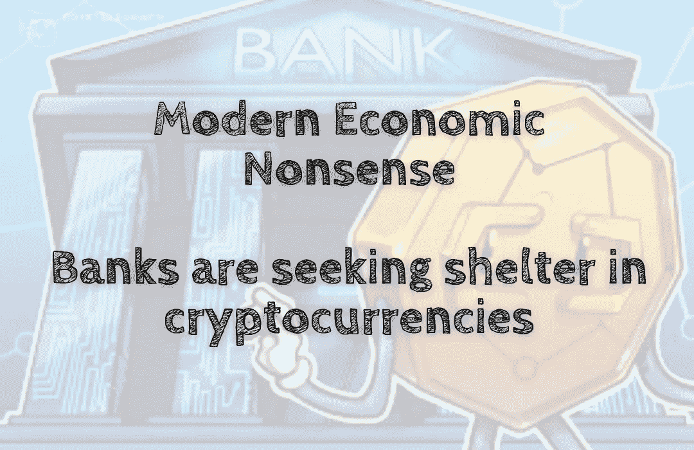

# 现代经济学废话——银行正在加密货币中寻求庇护

> 原文：<https://medium.com/coinmonks/modern-economic-nonsense-banks-are-seeking-shelter-in-cryptocurrencies-46124b092351?source=collection_archive---------46----------------------->

过去几年，加密货币越来越受欢迎。随着这种增长，主要零售金融机构和投资公司也开始使用这些数字资产来存储价值或进行交易。不仅仅是小型信用合作社也参与其中。花旗银行和摩根大通等知名机构已经宣布计划提供…