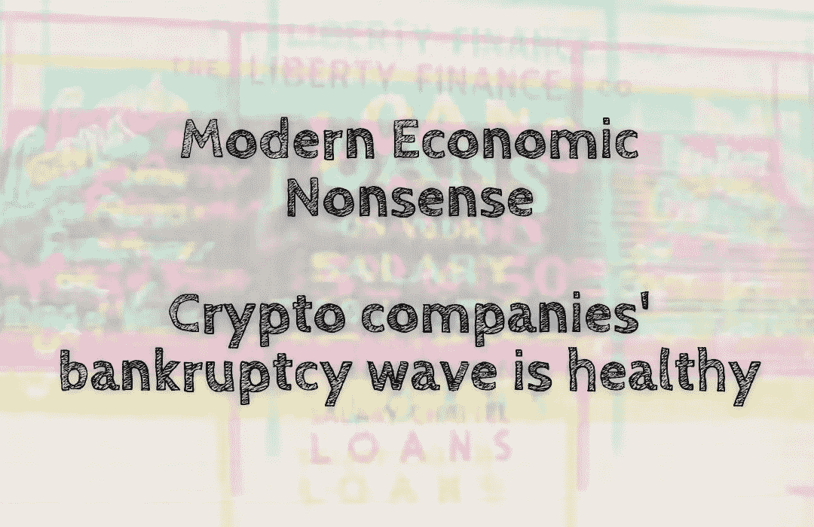

# 现代经济废话——加密公司的破产浪潮是健康的

> 原文：<https://medium.com/coinmonks/modern-economic-nonsense-crypto-companies-bankruptcy-wave-is-healthy-e6d56724731a?source=collection_archive---------29----------------------->

过去几个月，随着价格持续下跌，加密市场处于熊市趋势。在 2021 年的大部分时间里，市场一直处于牛市，维持这样的价格上涨不再可能。随着价格下跌，通过出售资产或风险资本维持运营的加密公司将受到比……更严重的打击