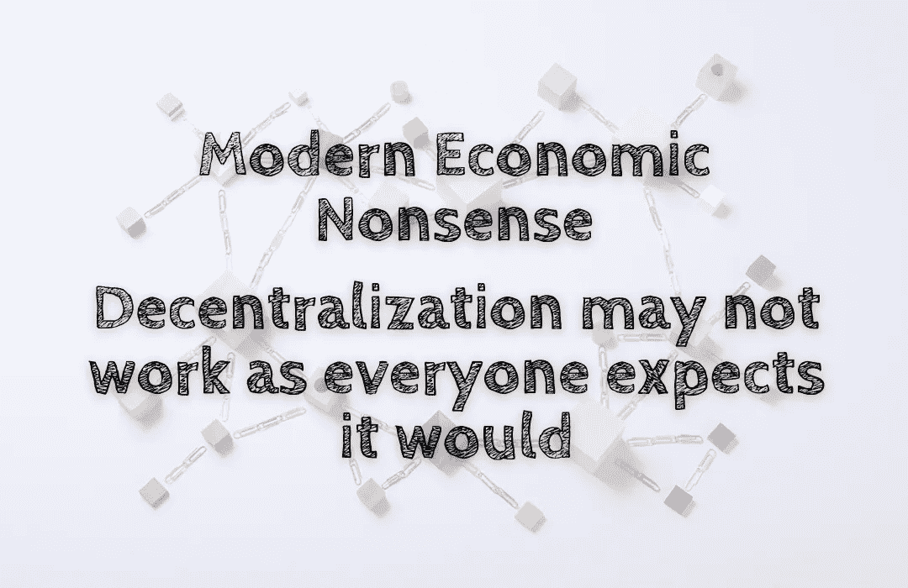

# 现代经济学的废话——权力下放可能不会像所有人预期的那样奏效

> 原文：<https://medium.com/coinmonks/modern-economic-nonsense-decentralization-may-not-work-as-everyone-expects-it-would-70452ca84ad9?source=collection_archive---------54----------------------->

谈到去中心化，大多数人都认为网络的能力越强，对用户和其他网络参与者越有利。毕竟，一个集中的系统控制着一个或多个能代表其他人做决定的个人或组织。然而，随着区块链技术和…