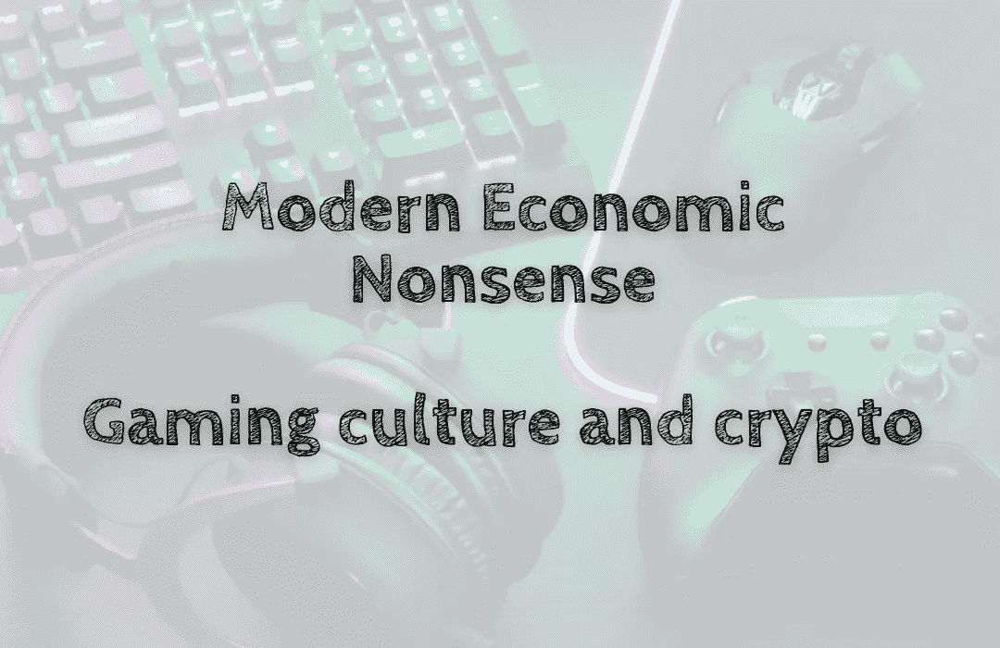

# 现代经济废话——游戏文化和密码

> 原文：<https://medium.com/coinmonks/modern-economic-nonsense-gaming-culture-and-crypto-52ba8b7d5b7e?source=collection_archive---------63----------------------->

多年来，游戏行业一直肩负着让尽可能多的人参与进来的使命。为此，他们创新了与观众沟通的方式。其中一项创新是虚拟现实(VR)的引入及其随后在游戏中的应用。虚拟现实让游戏变得身临其境，并通过允许玩家从不同的角度体验事物给了他们急需的优势…