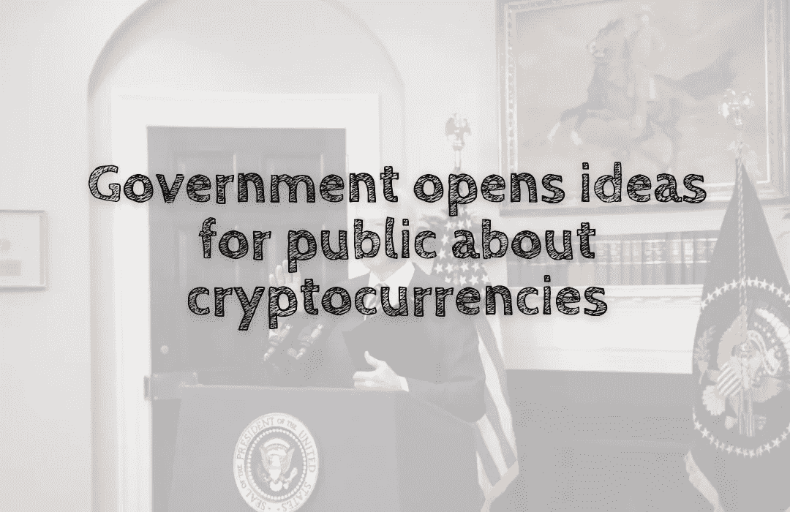

# 现代经济学废话——政府向公众开放关于加密货币的想法

> 原文：<https://medium.com/coinmonks/modern-economic-nonsense-government-opens-ideas-to-the-public-about-cryptocurrencies-34f6bc9d6cdd?source=collection_archive---------42----------------------->

美国政府公开讨论加密货币及其未来。此外，它打开了邀请加密行业解决未来法定货币问题的大门。

# 背景

政府决定就…向公众开放咨询期