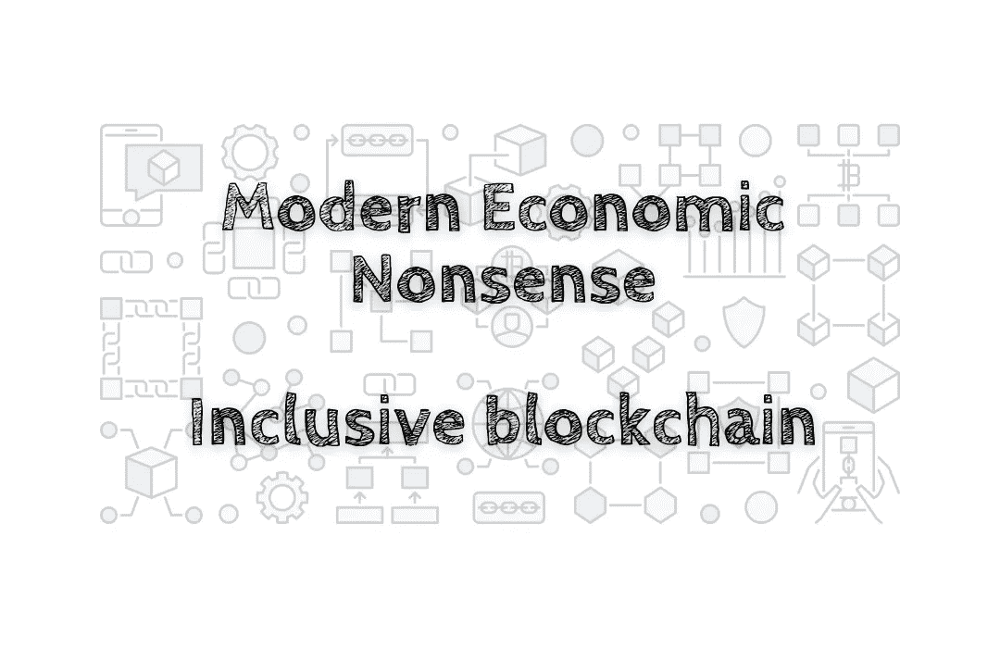

# 现代经济学废话——包容的区块链

> 原文：<https://medium.com/coinmonks/modern-economic-nonsense-inclusive-blockchain-4e707c22d971?source=collection_archive---------56----------------------->

过去一年，加密货币的世界变得更加广阔。随着越来越多的公司采用区块链和虚拟货币，该行业变得更加包容。区块链是记录所有加密货币交易的数字账本。它是分散的，所以没有一家银行或公司控制它。结果是一个更便宜、更安全的交易记录系统和一个市场…