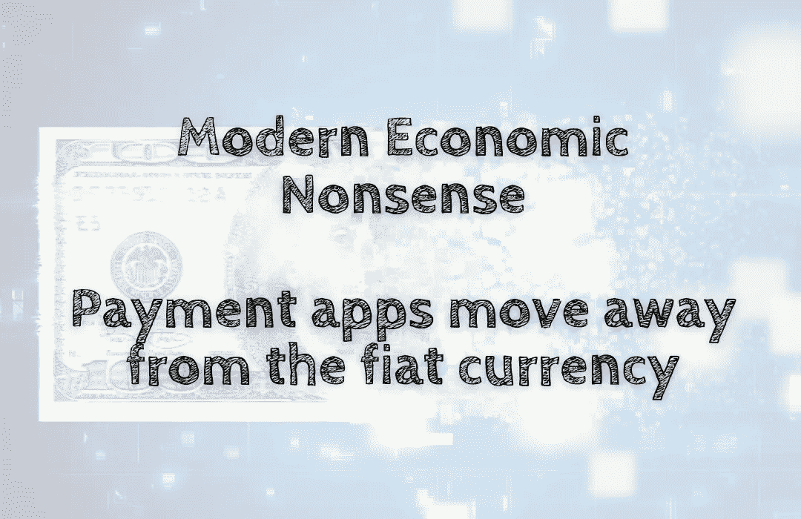

# 现代经济学废话——支付应用远离法定货币

> 原文：<https://medium.com/coinmonks/modern-economic-nonsense-payment-apps-move-away-from-the-fiat-currency-73140b6834d8?source=collection_archive---------43----------------------->

世界金融系统正变得越来越数字化，许多支付应用正在利用这一趋势赚钱。PayPal、Chase QuickPay 和 American Express 只是几家提供数字钱包解决方案的公司，这些解决方案使消费者更容易用卡支付。这些类型的解决方案对那些没有银行账户或…