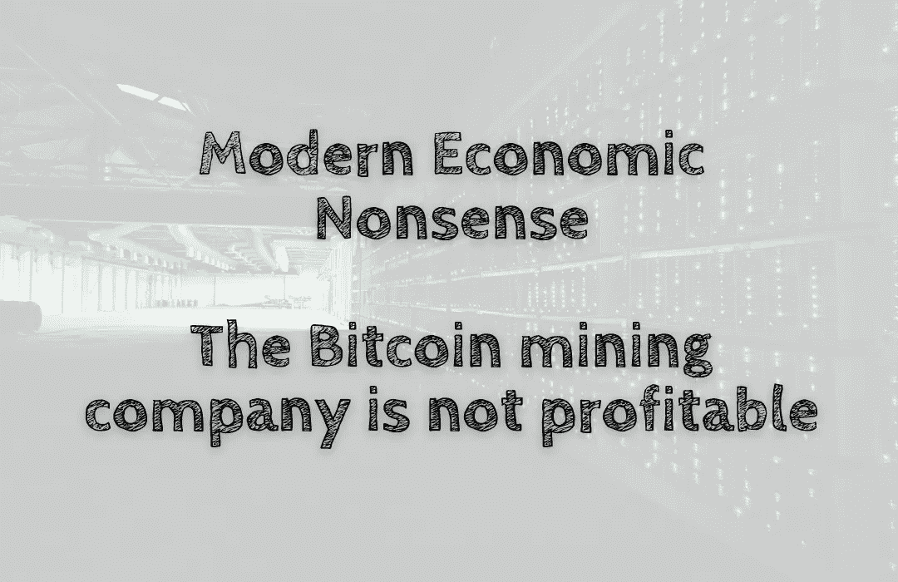

# 现代经济学废话——比特币矿业公司不盈利

> 原文：<https://medium.com/coinmonks/modern-economic-nonsense-the-bitcoin-mining-company-is-not-profitable-b4a3c643c22a?source=collection_archive---------27----------------------->

加密货币挖掘是一项复杂的业务。除了不断增加的运营成本，它也是资本密集型的。一家矿业公司需要购买硬件，如 ASIC 机器、电源和其他重要组件。随着这些物品的价格持续上涨，它们的运营成本也在上涨。采矿公司不能在一个…