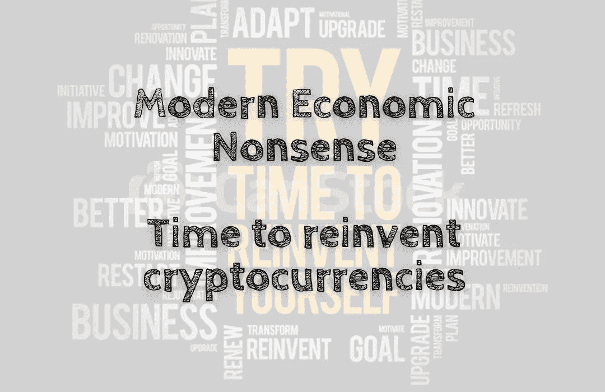

# 现代经济学废话——是时候重新发明加密货币了

> 原文：<https://medium.com/coinmonks/modern-economic-nonsense-time-to-reinvent-cryptocurrencies-96a74ea70e81?source=collection_archive---------48----------------------->

加密货币一直很受欢迎，但也存在问题。银行和其他金融机构一直不愿与他们接触，而公众也没有理解他们潜在的价值主张。为了解决这些问题，他们需要彻底改造。我们可以从三个要素开始:技术、采用和信任。诚然，技术发挥着核心作用…