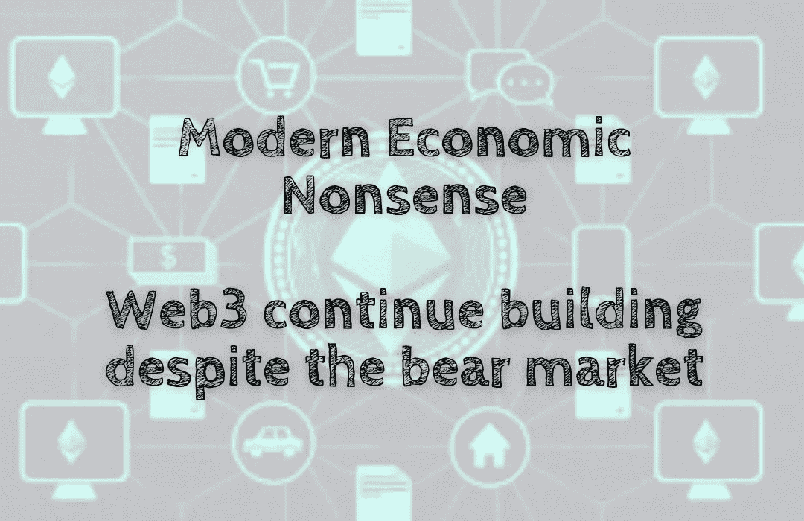

# 现代经济学废话——尽管熊市，Web3 仍在继续建设

> 原文：<https://medium.com/coinmonks/modern-economic-nonsense-web3-continues-building-despite-the-bear-market-b3aa70958815?source=collection_archive---------34----------------------->

当前的熊市对许多项目来说都非常艰难，尤其是那些不能快速成功的项目。因此，许多项目决定停止开发，等待市场回暖。有些甚至已经完全关闭。然而，并不是所有人都放弃或接受了市场条件。有些项目有…