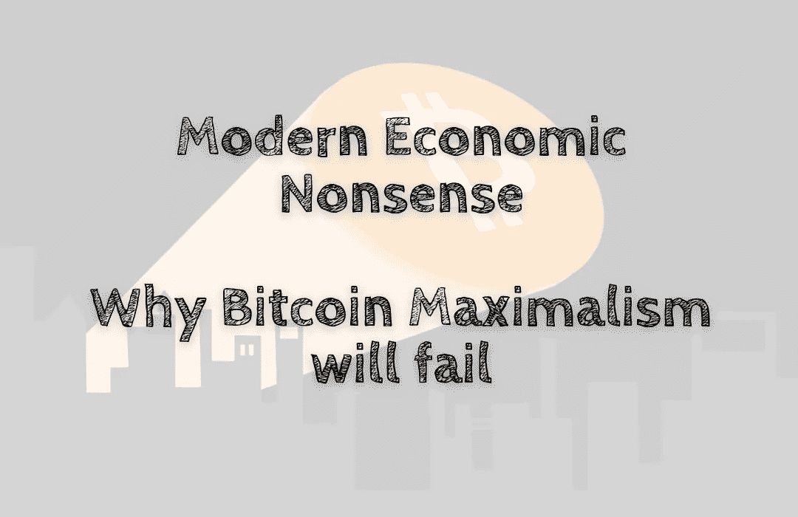

# 现代经济学废话——为什么比特币最大化主义会失败

> 原文：<https://medium.com/coinmonks/modern-economic-nonsense-why-bitcoin-maximalism-will-fail-fcfbd590df43?source=collection_archive---------18----------------------->

可以用于支付的数字货币的想法非常引人注目。金融普惠已经成为发展中国家的一个主要焦点，许多公司正在试图通过数字货币解决这一问题。最知名的可能是比特币，但也有几个 altcoins。然而，与任何新技术一样，有两个主要挑战…