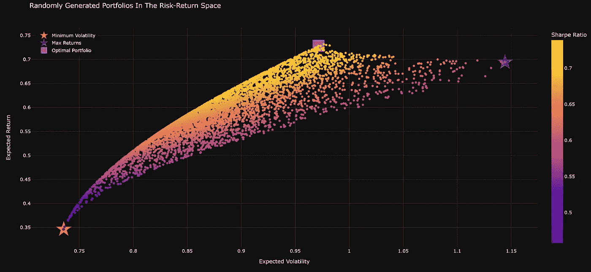
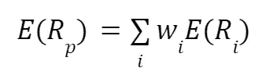
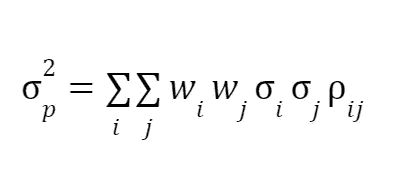
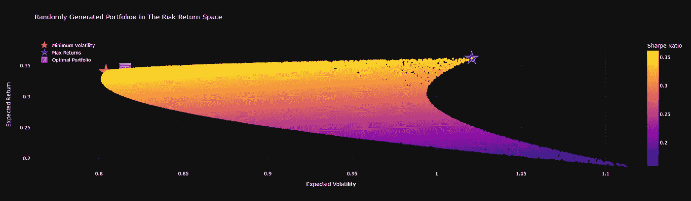
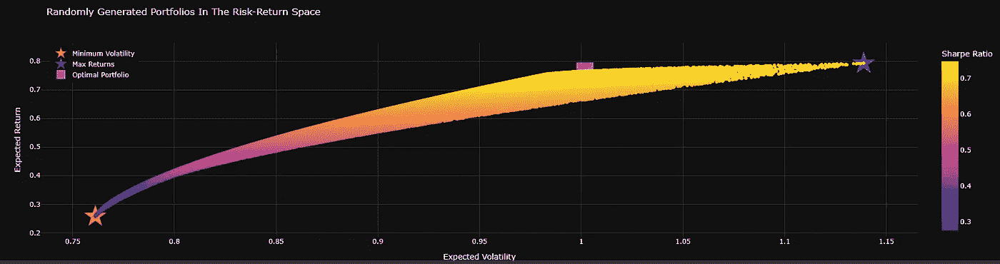
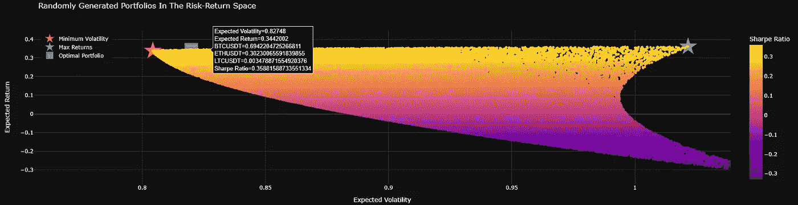
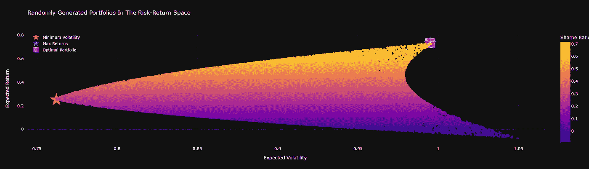

# 密码的现代投资组合理论

> 原文：<https://medium.com/coinmonks/modern-portfolio-theory-for-crypto-a84d721414ec?source=collection_archive---------2----------------------->

# Python、加密和有效前沿指南



Image by author

# 介绍

我是 Youtube 上 Benjamen Cowen 的忠实粉丝，他偶尔会在视频中解释现代投资组合理论(MPT)和有效前沿(EF)。因为我很穷，负担不起他的分析，我决定用 Python、币安 API 和 Plotly 自己创建一个加密货币 EF。在这篇文章中，我将介绍如何使用你想要的投资组合创造你自己的有效边界。

## 您将需要什么:

*   一些编程知识。
*   你电脑上的 Python 3
*   [python-币安](https://python-binance.readthedocs.io/en/latest/)。
*   Plotly 用于绘制 EF。

# 现代投资组合理论

首先，让我给你们一些现代投资组合理论和有效边界的背景知识。

现代投资组合理论是由哈里·马科维茨在 1952 年首先提出的。这种模式是基于这样一种想法，即投资者应该分配他们的资金，以减少风险和最大化回报。此外，MPT 表示，分散投资对于降低投资风险至关重要。投资组合可能包括股票、债券、房地产、大宗商品、对冲基金和任何其他资产类别，在我们的案例中，我们将关注加密货币市场。

投资者使用不同的多样化方法，如资产配置模型、部门配置模型、行业配置模型和地理配置模型。这些分散投资的方法一起工作来帮助最小化损失，同时最大化收益。大多数共同基金公司遵循这些准则，以提高其投资组合的表现。在加密领域也可以做到这一点，我们可以以比特币为例，这是一个智能合约平台，也是一种增加多样化但也增加风险的迷因币。

根据方差和相关性等统计指标，单个投资的表现不如它对整个投资组合的影响重要。

## 有效边界

有效边界是投资界使用的一个术语，用来描述在给定风险水平下具有最高回报的投资组合。有效边界经常被用作金融领域的一个例子，以说明如何对不同的投资组合进行数学分析，以找到一个提供高回报和低风险的最佳组合。Markowitz 的模型关注两个因素:预期收益和收益的标准差。曲线呈弓形，一端是高预期收益，另一端是高波动性。

在加密的投机世界中，基于高预期回报而不考虑方差的投资可能看起来很有吸引力，但正如马科维茨所引用的那样:“这条规则更好地解释和指导了‘投资’与‘投机’行为的区别。”

# 计算

现在事情可能变得有点数学化了，但是请原谅我，让我们定义下马科维兹模型中需要的每个方程。

## 预期收益



Where Rp is the return on the portfolio, Ri is the return on asset i and wi is the weighting of the component asset (i is the proportion of asset “i” in the portfolio)

## 投资组合回报差异



Where Pij is the correlation coefficient between the returns on assets i and j

## 投资组合回报波动


Portfolio Volatility

# 创造我们自己的高效前沿

在这个例子中，我将考虑由比特币、以太坊和其他另类投资组合组成的几个不同的投资组合，在本的视频中，他总是喜欢使用莱特币，因为从历史上看，当你使用莱特币时，你会为类似或更小的回报承担更多风险，这就是 MPT 的魅力所在，它可以帮助你决定从历史上看什么是好的投资。如果你真的很喜欢，你可以开始加入预测的未来回报，但这就是华尔街的家伙们拿着高薪做的事情。

我们将通过生成一定数量(N)的随机加权投资组合来创建 EF。

你可以在这里找到一个[谷歌协作笔记本](https://colab.research.google.com/drive/161QdYDCLbD-W_sAYs9xYCTc5XAxFtB3R?usp=sharing)，如果感兴趣的话可以自己运行这个。

## Python 库

为了创建 EF，我们需要下面的库。

```
*import* pandas *as* pd
*from* binance *import* Client
*import* numpy *as* np
*import* plotly.graph_objects *as* go
*import* plotly.express *as* px
```

## 建立

在这里，我们建立了我们的币安客户。

```
# Set up our Binance clientclient = Client()
```

## 生成随机投资组合

为了生成 MPT，我们需要随机的投资组合，对于每个投资组合，我们需要随机的权重。分别乘以它们的平均回报，得到投资组合回报，以及给定时间范围内的标准偏差(方差),加密时为 365，但股票为 252

## 投资组合统计

定义一个返回加权投资组合统计数据的函数

## 获取价格功能

一个从币安 API 获取加密货币价格的函数。

## 收集数据并生成投资组合

在这里，我们从币安 API 获取数据，需要一些操作才能以我们需要的格式获取数据。

为什么我们要记录价格？其原因是返回的记录是时间累加的。这意味着今天的对数变化为+0.1，明天的对数变化为-0.1，这将为您提供与昨天相同的加密资产价值。如果你计算百分比变化，这是不正确的。

在这里，我们还定义了投资组合的数量和无风险利率，我们将使用它们来评估夏普比率。对于这个利率，我使用了比特币的无风险回报，平均而言，如果我们考虑无风险美元利率，BTC 的无风险利率为 **3.69%** 。[1]

```
symbols = ['BTCUSDT', 'ETHUSDT', 'ADAUSDT']
prices = []

*# Here we get the prices for our symbols
for* symbol *in* symbols:
  prices.append(get_daily_data(symbol))

*# switch the rows and columns of the dataframe* df = pd.concat(prices, axis=1)

*# define the number of random portfolios we create* num_portfolios = 10000
*# Define our risk free rate, we use Bitcoins here you can change it to whatever you want* risk_free_rate = 0.0369

*# Change the values to log* crypto_log = np.log(df / df.shift(1))

*# Get the portfolio returns and standard deviations* crypto_ptf_rs, crypto_ptf_stds, ports = generate_ptfs(crypto_log, num_portfolios)
```

## 创建结果数据框架

在这里，我们创建一个数据框，其中包含创建 EF 图所需的结果。

```
*# Add to a dataframe* df_std_rts = pd.DataFrame([crypto_ptf_rs, crypto_ptf_stds]).T
df_std_rts.columns = ["rs", "std"]
dfw = pd.DataFrame(ports)
dfw.columns = symbols
*#Join the portfolios datagrame and returns together* results = pd.concat([df_std_rts, dfw], axis=1, join='inner')
*# calculate the sharp ratio* sharp = (crypto_ptf_rs - risk_free_rate)/crypto_ptf_stds*0.50
*# Add it to the dataframe* results["Sharp"] = sharp
```

## 寻找最优风险投资组合

在这里，我们找到了最优风险投资组合以及最小波动性投资组合和最高回报投资组合。

```
*# Finding the Max Sharp Ratio and therefore the optimal portfolio* op_port = [results["std"][results['Sharp'].idxmax()], results["rs"][results['Sharp'].idxmax()]]

*# x and y allow us to graph the Minimum Volatility and Max Returns* x= []
y= []
*for* symbol *in* symbols:
    x.append(results["std"].iloc[results[symbol].idxmax()]) *# finding the standard deviation for each symbol* y.append(results["rs"].iloc[results[symbol].idxmax()]) *# finding the returns deviation for each symbol*
```

## 绘制数据

下面是绘制有效边界所需的代码。

# 解释结果

EF 本质上是沿着图表外部的曲线，它允许我们在给定的波动性下最大化我们的风险，我们可以看到图表在投资组合的顶部形成了一个拱形，这条线包含了最有效的投资组合，被称为有效边界。这条线下的所有投资组合都不是有效的，因为它们提供的回报与有效边界上的投资组合相同，但你需要承担更高的风险。

EF 允许您根据自己的风险承受能力设计最佳投资组合，通过增加投资组合的数量，我们将更接近真正的最佳投资组合。它还允许我们根据历史结果选择投资组合。

然而，我们也可以假设，随着加密货币市场的成熟，我们将期待看到更低的回报，因此这不应被视为福音

【2015 年以来的 BTC、瑞士联邦理工学院和美国糖尿病协会

我将在这里包括几个结果。这是 100，000 个数据点的 BTC、瑞士联邦理工学院和 ADA，自 2015 年以来的结果，你可以查看 collab，你可以看到随着我们沿着曲线上升，我们获得了更多的回报，但也承担了更多的风险，当优化风险时，你会希望投资组合生活在 EF 中。例如，全 BTC 投资组合在一段时间内会给我们 35%的年回报率，但年波动率约为 80%，而全 ETH 投资组合给我们更高的年回报率，但年波动率超过 100%。这里的最佳投资组合是 78%的 BTC 和 22%的 ETH



EF for ADA portfolio since 2015 — Image by Author

【2019 年以来的 BTC、瑞士联邦理工学院和阿达

有趣的是，如果我们缩短时间，我们的最优投资组合会发生变化。这里的最佳投资组合是 49%的 ETH 和 51%的 ADA。这符合我们的预期，长期持有比特币很好，以太坊也是很好的长期投资，然而，短期内我们可以通过低价位获得一些惊人的回报。



EF for ADA portfolio since 2019— Image by Author

【2015 年以来的 BTC、瑞士联邦理工学院和瑞士长期技术公司



EF for LTC portfolio since 2015 — Image by Author

对于本的 BTC、ETH 和 LTC 的经典例子，我们可以在这里看到，自 2015 年以来，与 ADA 配对类似，最佳投资组合是 78% BTC 和 22% ETH，任何包含 LTC 的投资组合都承担了更高的风险，以获得类似或更小的回报。

**自 2015 年以来，BTC、瑞士联邦理工学院和瑞士长期技术公司**

LTC 投资组合和 ADA 投资组合的区别在于，2019 年以来的投资组合根本不包含 LTC，这意味着 Litecoin 在短期或长期内都没有表现好。这个投资组合向我们展示了以太坊在短期内的表现，最佳投资组合是 99%的以太网和 1%的 BTC，这里也没有考虑 LTC。



EF for LTC portfolio since 2019 — Image by Author

# 结论

在这篇文章中，我描述了如何使用 Python 创建加密货币的有效边界。希望这能帮助你们中的一些人为未来的牛市优化投资组合。对我来说，这是一个有趣的练习，它向我展示了从长远来看，你希望你的投资组合主要由比特币组成，并带有一些以太坊，短期内 alt 是好的，但从长远来看，它们太不稳定了。然而，我确信有些也会成熟，我不会把这里的任何东西当作真理，但是我鼓励你们所有人去尝试一些不同的投资组合，这可能会帮助你们解释你们投资组合的一些未来结果。

# 参考

[1] - [加密货币比特币资产作为投资工具的收益与风险分析](https://www.intechopen.com/chapters/78745) — Sunita Dasman (2021)

> 交易新手？试试[密码交易机器人](/coinmonks/crypto-trading-bot-c2ffce8acb2a)或者[复制交易](/coinmonks/top-10-crypto-copy-trading-platforms-for-beginners-d0c37c7d698c)