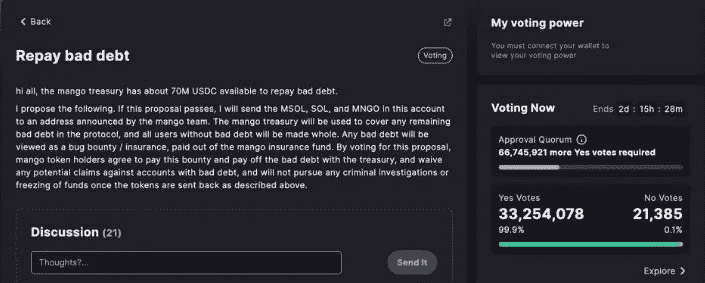

# 攻击者有可能修改 Mango 的宣传资料，这将带来 1 亿美元的损失

> 原文：<https://medium.com/coinmonks/modifying-mango-collateral-was-possible-for-the-attacker-100-million-exploit-c265b6944ccd?source=collection_archive---------18----------------------->

## 这相当于一场借贷竞赛，因为如果你的抵押品被高估，你可能会用它来借款，他们就是这么做的。

用户可以在位于索拉纳区块链的分散式芒果加密货币交易所进行现货交易和贷款。

继上周币安的 BNB·区块链遭受 8000 万美元的黑客攻击后，这是不到一周内第二次重大的分散式金融攻击。

根据区块链审计员奥特塞克的说法，总部位于区块链的分散式金融网络芒果受到了超过 1 亿美元的攻击，他说“攻击者能够修改他们的芒果抵押品。”

MNGO 治理令牌的价值远远高于其应有的价值。有了它，攻击者就可以借很多钱，然后用这些钱来耗尽 Mango 的流动性储备。

攻击者使用 500 万 USDC 作为账户资金的抵押，在市场订单上提供了 4.83 亿单位的 MNGO 永久合同。

然后，他们再次以每份 0.03 美元的价格买入 MNGO 永久合约。

美国东部时间下午 6:26，操纵者开始移动 MNGO 的价格，从 0.03 美元到 0.91 美元。

攻击者通过从芒果市场财政部获得 1.16 亿美元的贷款，耗尽了平台的流动性。

受到黑客攻击影响的有 USDC、MSOL、索尔、BTC、USDT、SRM 和 MNGO。

攻击者使用 USDC 在十分钟内将 MNGO 的价格从 0.02 美元提高到 0.91 美元。重要的是要记住，集中式交换不能成为这种协同攻击的目标。

MNGO 是一种很少交易的令牌，在网络上几乎没有流动性，这使得剥削者很容易操纵价格。

Mango 团队进一步表示，不存在甲骨文提供商的问题，甲骨文定价功能符合预期。

这一漏洞凸显了分散式交易所的一些安全缺陷，并且是在最近几个月 DeFi 协议的一系列代价高昂的妥协之后出现的。

10 月 11 日，有四个漏洞，价值约 1.22 亿美元。利用数字货币钱包 Rabby Wallet 的智能合约，区块链 QANplatform 上以太坊桥的 189 万美元，TempleDAO 的 200 万美元，以及对索拉纳芒果市场的 1.18 亿美元的攻击，黑客窃取了 20 万美元的加密货币。

由于 MNGO/USDC 市场是 MNGO 永久掉期的价格参考，这种脆弱性是由市场流动性差造成的。

攻击者仅用几百万 USDC 就将 MNGO 的价格抬高了 2394%。在今年 3 月芒果的 Discord 频道中，据报道提到了这种特定的攻击载体。

中央加密货币交易所不能以同样的方式影响价格，因为当一个交易者对一种资产进行大笔出价时，其价格会全面上涨。你不能指望马上产生可观的利润。

根据 Harbor 的联合创始人 Kunal Agarwal 的说法，尽管有潜力，dex 仍然只有有限的进化历史，并提供独特的安全威胁。

造成这种情况的黑客公开联系了芒果社区，并在公司的论坛上提出了妥协方案。

*随着加密货币市场的扩大，黑客变得更加活跃，并利用系统的漏洞。区块链分析公司 chain analysis 估计，今年迄今为止，加密货币黑客已经窃取了超过 20 亿美元。在接下来的几个月里，这个数字可能会增加。区块链和去中心化金融让安全成为一种承诺，然而，这种承诺似乎并不完全真实。*

在美国 8 月份实施制裁之前，Tornado Cash 可能是许多 DeFi 黑客首选的洗钱手段。

然而，由于 Tornado 的流动性储备已基本耗尽，犯罪分子正转向替代洗钱技术。

分散式交易所(dex)已经被 BSC 令牌中心和 Mango 开发商用于令牌交易。为了将偷来的钱转移到七个不同的区块链，包括以太坊，BSC 剥削者还使用了交叉链桥。

> 交易新手？试试[密码交易机器人](/coinmonks/crypto-trading-bot-c2ffce8acb2a)或[复制交易](/coinmonks/top-10-crypto-copy-trading-platforms-for-beginners-d0c37c7d698c)