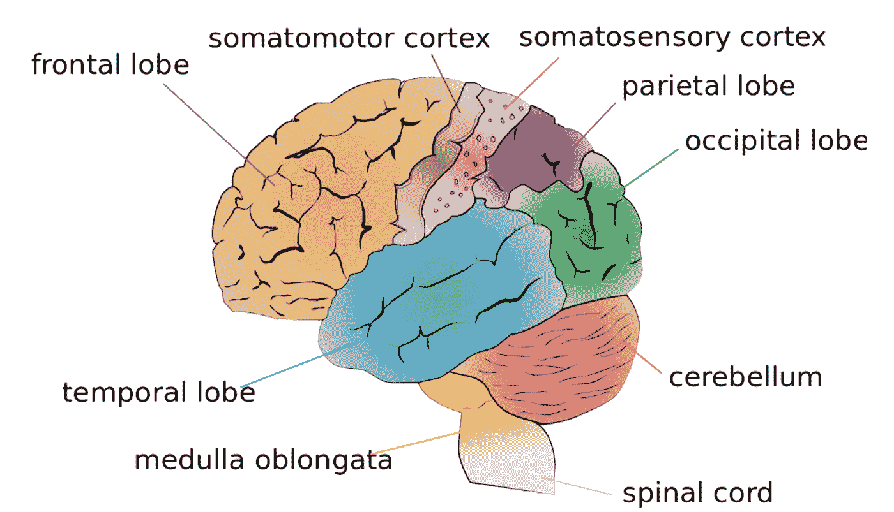
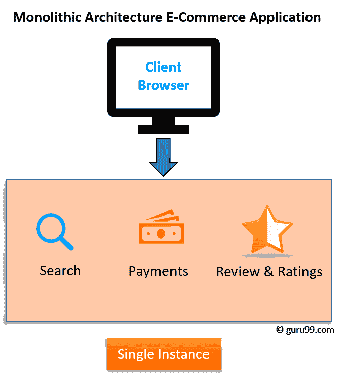
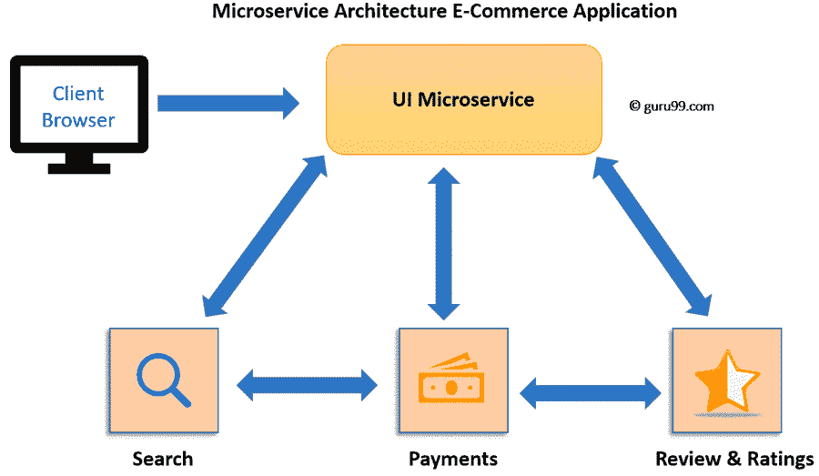
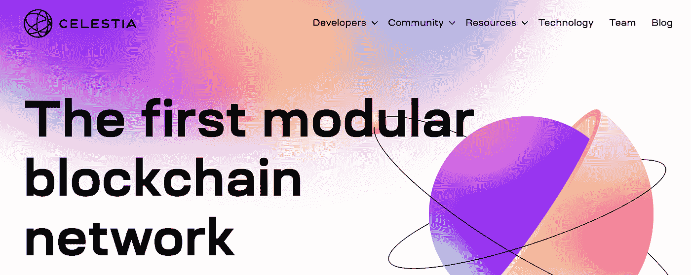
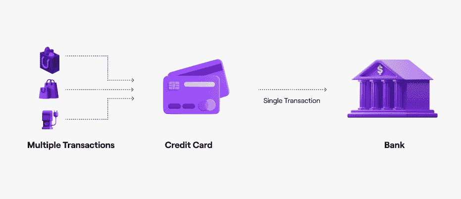
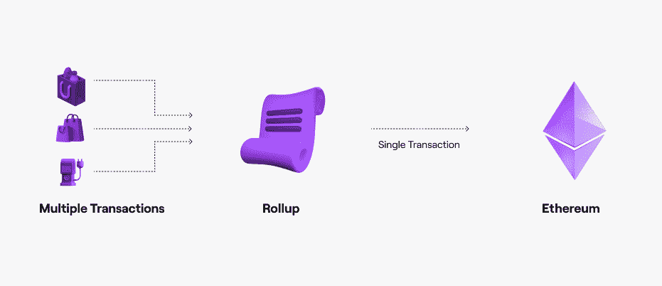
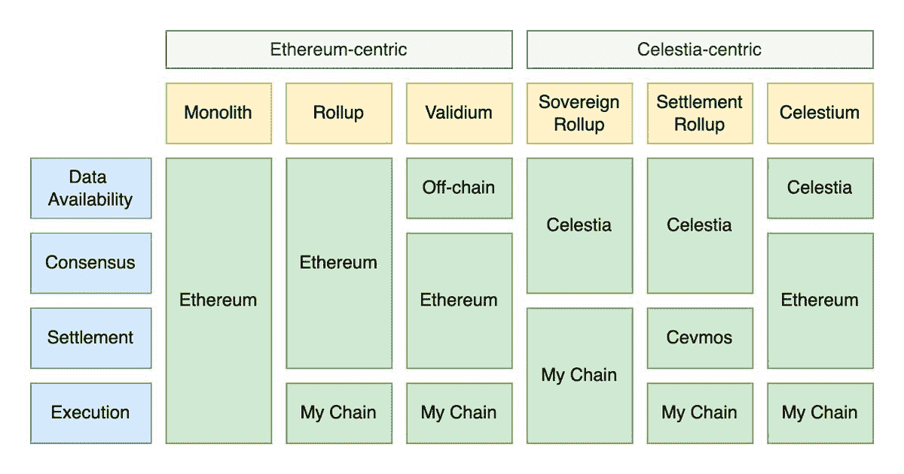

# 通俗地说，模块化区块链

> 原文：<https://medium.com/coinmonks/modular-blockchains-in-laymans-terms-eef0549d6ffe?source=collection_archive---------33----------------------->

## 在本文中，我将在日常生活/ web2 / web3 的背景下讨论模块化，并通过高层次和低层次的视角来分解模块化区块链。

# 什么是模块化？

为了理解模块化区块链，我们必须首先理解“模块化”的概念。

“模块性”这个词可以有多种用法，但它通常指的是系统由独立的部分或“模块”组成的程度。

在某些情况下，模块化被用来描述系统内部件的*物理*分离。例如，模块化计算机系统是这样一种系统，其中各种部件被容纳在可以容易地连接和断开的独立单元中。

在其他情况下，模块化指的是系统内部件的*逻辑*分离。例如，模块化软件程序是将各种功能组织成可以独立执行的独立模块的程序。

模块化有很多优点。它使系统更容易设计、构建、维护和定制，以满足特定用户或应用的需求。

# 模块化无处不在

[在 ETHDenver](https://www.youtube.com/watch?v=M8-0IAsTp3c&t=1020s)[的演讲中，Lane Rettig](https://twitter.com/lrettig) 讲述了我们每天都在处理的模块化系统——从大学课程和音乐到人体和大脑。

Modular system

Modular system within a modular system

Lane 做得很好，所以我不会深入他的大多数例子(我建议观看他的演讲！)，但值得强调的是，模块化不仅仅是一个技术概念，而且已经证明可以成功扩展我们生活的方方面面。

我将深入探讨的一个例子是[单片与微服务架构](https://youtu.be/M8-0IAsTp3c?t=782)，它建立在我们在本文前面提到的模块化软件思想的基础上，并很好地延续到区块链。

> 交易新手？尝试[加密交易机器人](/coinmonks/crypto-trading-bot-c2ffce8acb2a)或[复制交易](/coinmonks/top-10-crypto-copy-trading-platforms-for-beginners-d0c37c7d698c)

# web2 如何扩展:微服务

应用程序过去被构建成整体(把整体应用程序想象成大块的代码)，并且很难扩展。

让我们用一个从本教程中借来的简单的电子商务例子。电子商务应用程序的主要功能是搜索、支付和评论/评级。所有这三个函数都捆绑在一个实例上运行的一大块代码中。

Ecommerce app with monolithic architecture

如果电子商务商店流行起来，工程师们必须运行更多的实例，每个实例复制一大块代码。

但是，如果搜索和付费增长 100 倍，而评论/评级只增长 10 倍，会发生什么？

工程师仍然需要为评论/评级复制 100 倍的代码，尽管这是不必要的，因为这些功能是捆绑在一起的。

这是一个假设的例子，但亚马逊和类似的公司[在 21 世纪初也面临类似的问题](https://blog.dreamfactory.com/microservices-examples/)。“开发延迟、编码挑战和服务相互依赖抑制了亚马逊满足其快速增长的客户群的扩展要求的能力。”

作为回应，行业转向微服务。顶级科技公司使用它们的例子数不胜数，包括网飞、优步和谷歌。事实上，谷歌开源了基于他们的内部微服务管理软件的 [Kubernetes](https://thenewstack.io/scaling-microservices-on-kubernetes/) ，该软件已经成为行业标准，正在帮助所有类型的公司利用微服务。

如果我们假设的电子商务应用程序过渡到使用微服务，该架构将类似于下图，其中所有三个功能都独立扩展。该应用将更容易操作并且更具成本效益。

Ecommerce app with microservice architecture

这部分是为了说明一点:我们今天使用的 web2 应用程序**已经是模块化的**！

为什么这还不明显？嗯，web2 终端用户从来不关心软件架构。架构留给了工程师和最终用户，他们只是担心应用程序的实用性和体验。

由于 web3 将后端基础设施金融化，并将其与治理和文化相融合，一批新的受众正在考虑它。

# web3 如何扩展:模块化区块链

好了，我们已经讨论了模块化和一些真实世界的例子。现在让我们探索模块化区块链。

模块化区块链(以及这个术语本身)[背后的想法是由](https://blog.celestia.org/celestia-a-scalable-general-purpose-data-availability-layer-for-decentralized-apps-and-trust-minimized-sidechains/) [Celestia](https://celestia.org/) 的联合创始人 Mustafa Al-Bassam 在 2019 年提出的。在文章中，他表示“我们的长期愿景是帮助构建一个区块链生态系统，其中包含模块化数据可用性层和可集成在一起的执行引擎。我们相信这是下一代可扩展的区块链架构。”

然而，模块化区块链[进入时代精神](https://twitter.com/sassal0x/status/1449904400583983105?s=20&t=Y8T6TMTxusKe9XwkZiEyIA)是在 2021 年末，当时笔名为 Polynya 的加密专家的博客帖子开始获得关注。[这是我得知的第一个帖子](https://polynya.medium.com/the-lay-of-the-modular-blockchain-land-d937f7df4884)，似乎是受到对[电脑芯片设计](https://polynya.medium.com/processors-blockchains-modular-is-revolutionary-ded01824b603)的深刻理解的启发。

人们很快在这个基础上建立起来，包括安东尼·萨萨诺，班克勒斯，当然还有塞莱斯蒂亚。此后，Celestia 将模块化的区块链叙事推向了新的高度，主办了[会议](https://www.youtube.com/watch?v=35_rr8Vf-4k&t=27524s)和[教育资源库](https://celestia.org/learn/)。

业界现在([主要是](https://twitter.com/nickwh8te/status/1503844163137290244?s=20&t=KzzrkVJM1K0OWhR3WdbxhA))一致认为模块化架构是前进的方向。

Celestia website

那么，什么是模块化的区块链，什么是它的前身，整体式的区块链？

主要思想与我们之前讨论的整体架构和微服务架构没有什么不同。单片区块链是将区块链函数捆绑在一起的大块代码，而模块化区块链将函数分解成层。

让我们从提供简单心智模型的*高级视图*和提供更细致视角的*低级视图*来探索这些层。

# 模块化区块链的高级视图

我们将从《T21》的这篇多边形文章中借用一个类比开始。

当你买一杯咖啡时，你不太可能给咖啡师你的银行账户信息。相反，你可以刷信用卡。

刷卡后，您的信用卡公司将该交易与最近的其他交易进行排队，并定期与您的银行“结算”。这意味着您的银行实际上不需要处理单个交易。相反，它充当事实的仲裁者，只要它与你的信用卡公司交互，它就简单地比较你的总借贷。

这种关系包括两个层面:

*   执行层(信用卡)
*   结算层(银行)

模块化区块链非常相似。考虑两个主要层:

*   执行层(汇总)
*   结算层(例如以太坊)

现在让我们假设您正在使用 web3 支付应用程序购买那杯咖啡。

在你付款后(可能使用二维码而不是卡),汇总将你的交易与其他最近的交易排队，正如你可能已经猜到的，定期用以太坊“结算”它们。

这是什么意思？

在执行层，假设它是一个支持任意智能契约的汇总，您的事务将与所有类型的其他事务一起排序和执行。然后，Rollup 网络参与者使用复杂的数学来证明事务被正确执行或者事务被错误执行。这是通过结算层(在这种情况下是以太坊)智能合约可以近乎确定地验证的方式完成的。

具体来说，假设 rollup 在一段时间内执行 100 个事务，在另一段时间内执行 1000 个事务。Ethereum 在这两种情况下会做同样多的工作，因为它每次验证一批交易时只需要执行一个交易。这很重要，因为以太坊需要做的执行工作越少，它就越分散。

同样，本节过于简单，旨在提供一种简单的方式来思考区块链层。下一节更全面。

当我们这样做的时候，另一个简单的思维模型是一个 ZIP 文件！

# 模块化区块链的低层视图

是时候深入草丛了。

在上一节中，我们讨论了两个主要层:

*   执行层
*   沉降层

让我们重新定义一下，引入两个额外的层:

*   执行层
*   沉降层
*   共识层
*   数据可用性层

在上一节中，我排除了共识和数据可用性，认为它们是结算层的一部分。这是一种[常见的简化](https://thedailygwei.substack.com/p/the-worlds-settlement-layer-the-daily)和设计模式，因为拆分结算/共识/数据可用性通常会产生更多[复杂的安全假设](https://twitter.com/vitalikbuterin/status/1479501366192132099?lang=en)。也就是说，一切都需要权衡(例如安全性与灵活性)，开发人员正在尝试各种类型的设计。

彼得·沃茨[发布了](https://twitter.com/ptrwtts/status/1509869606906650626)一个很棒的图形来可视化不同的组合，这仍然只是可能的一小部分。

至此，如果您是面向技术的，您可能想知道每一层在更细粒度的级别上是做什么的。

为此，我将向您介绍一些非常棒的资源，您可以尝试一下:

*   [学习 Celestia 的模块化](https://celestia.org/learn/)
*   [模块化区块链:伏特资本的一次深潜](https://volt.capital/blog/modular-blockchains)
*   乔恩·夏博诺的《以太坊搭车人指南》

我想更深入地研究一下模块化堆栈的某些方面，但是我将把它们留给以后的文章。也可以随时给我发信息提建议！

# 总结想法

我们仍处于模块化革命的开端。

很明显，模块化架构是一种技术上更优越的区块链扩展方式，但目前还不清楚主导设计是什么。在未来几年里，当我们找出最有效的方法时，看着百花齐放将会很有趣。

让游戏开始吧！

感谢阅读🦖🥚

欢迎在推特上联系:[twitter.com/0xDinoEggs](https://twitter.com/0xDinoEggs)