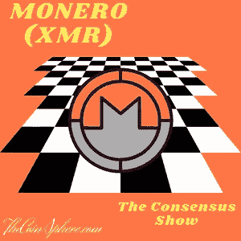

# Monero (XMR) —完整概述

> 原文：<https://medium.com/coinmonks/monero-xmr-complete-overview-d15b66bcd152?source=collection_archive---------27----------------------->

欢迎来到共识秀，在这里我将介绍世界上最流行的加密货币，并为您提供公正的信息，帮助您达成自己的共识。

[For the best Crypto News in the world, visit TheCoinSphere.com](http://thecoinsphere.com/)

Monero (XMR)是一种加密货币，近年来因其专注于隐私和安全而广受欢迎。它于 2014 年推出，目标是提供一种安全、私密的在线转账方式，它…