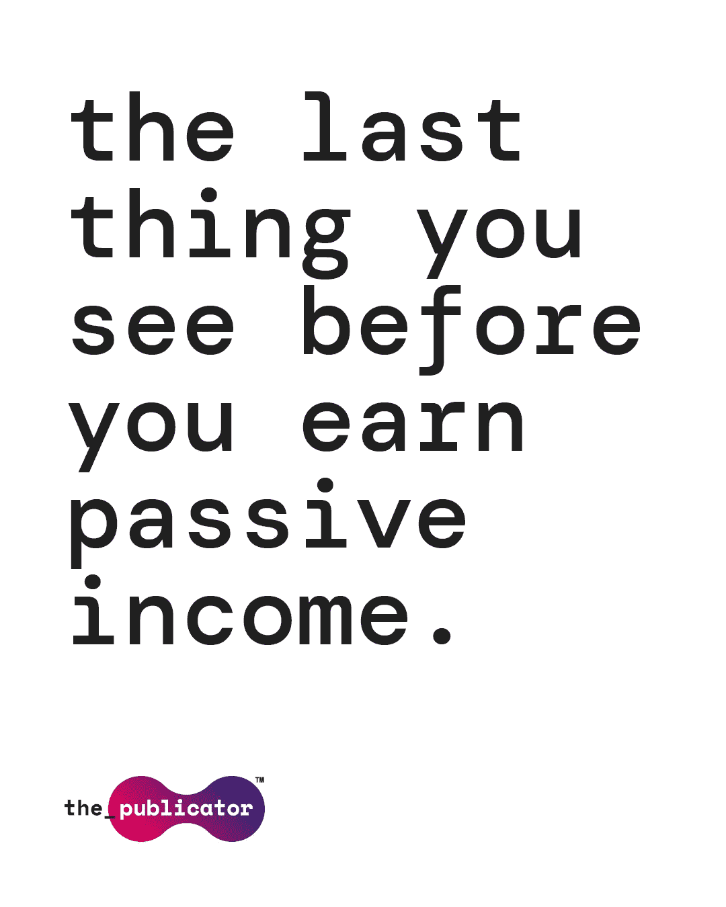

# 用 NFTs 赚钱:艺术家应该相信炒作的四个理由

> 原文：<https://medium.com/coinmonks/monetizing-with-nfts-3ff5f91cf305?source=collection_archive---------38----------------------->

**1。移动天平**

艺术家通常会保护他们的作品——他们也应该如此！任何认真致力于完善自己技艺的人，无论是节拍制作还是歌曲创作，很可能不仅会对他们的音乐在哪里被听到，而且会对它产生的价值产生依恋。因为第三方平台一直是成功发行和盈利的典型手段，所以新艺人在接触粉丝和获得版税的过程中感觉与众不同也就不足为奇了。

考虑到第三方平台的历史使用也不一定那么有利可图(在一些[案例](https://www.miragenews.com/streaming-has-made-it-more-difficult-to-succeed-in-music-industry/)，艺术家预计将从流媒体和下载中赚取的高达 82%的版税返还给第三方分销商或流媒体平台)，任何有抱负的后起之秀在货币化时都会感到动力不足，这是公平的。

但是因为 NFT 几乎可以由任何人[炮制，成功和利润的变量现在可以由独立艺术家个人控制。NFT 可以采用歌曲、视觉效果、现场参与或这些东西的组合的形式，这意味着艺术家可以以比他们通常发布的标准单曲或专辑更高的价格推广他们的产品。](https://www.creativebloq.com/how-to/make-and-sell-an-NFT)

**2。获得粉丝的“真实体验”**

将区块链视为终极电子邮件营销软件，但艺术家可以利用 NFTs 直接向粉丝发送个性化和有意义的内容，而不是发送普通的旧简讯。大众营销的“一次点击，发送给所有人”的方法当然有它的用处，但那些希望与他们的支持者和听众分享真正的艺术努力的人现在有了一条更直接的路线。由于 web3 交易面向公众、透明的性质，也因为 NFT 创作的每一件作品都是独一无二的，艺术家们可以将每一件作品追溯到某个粉丝，反之亦然。向专门的粉丝群提供定制的内容，无论是收藏品、门票还是商品，现在都有可能完全安全，甚至是独一无二的。

当然，这种趋势一整年都在冒泡。Cypress Hill 的 B-Real 提供了一张 NFT 门票，邀请一名粉丝在后台进行一对一的[会议](https://www.loudersound.com/news/cypress-hills-b-real-drops-a-hazy-double-a-side-alongside-nft-collection)，而 metal-heads 在发布他们的“死亡蝙蝠俱乐部”【NFT 系列】时有机会[加入重金属乐队](https://biz.crast.net/how-musicians-are-using-nfts-to-revolutionize-fan-engagement/)的一天闲逛(以及获得终身门票和其他独家优惠)。在这两种情况下，艺术家们都能够以一种新颖的方式接近和参与粉丝，这要归功于 NFTs 的多才多艺和直接的性质。

**3。为您的未来投资**

“饥饿艺术家”的刻板印象可能要结束了。尽管为专辑或音乐项目的创作提供资金是一项可以理解的昂贵事业，但艺术家不再需要依赖寻找主要的标签来为他们的项目创建财务基础。因为 NFT 可以由任何类型的纪念品制作——歌词、一次性录音、摄影棚照片——当谈到筹集必要的资金来创建一个新的企业时，创作者可以自行其是。更好的是，购买了有助于艺术家成功的 NFT 的粉丝可以在未来获得独家产品的奖励。通过这种方式，web3 架构允许一种此前被认为只对应用或游戏初创企业有用的众筹交易。

NFT 可以与“智能合约”(基本上是一个追踪令牌原始创造者版税的技术的花哨术语)绑定的事实意味着一次性销售有机会获得长期红利。鉴于像 OpenSea 这样的 NFT 市场为买家提供了在市场上转售代币的机会，这一机制可以提高备受追捧的代币的价值，这一点尤其如此。鉴于 NFT 的收藏可以附带创作费，通过二次销售获得版税的可能性似乎远比传统的“制作电台”方式更具吸引力。

最近的一个[例子](https://edm.com/news/deadmau5-nft-sales-potential-of-new-creator-economy)来自电子制作人 Deadmau5，他的 Head5 合集以 7.5%的创作费发行。该系列的交易带来了超过 20，000 美元的收入(不包括最初的销售！)自从它 10 个月前开始在市场上跳来跳去以来。这就是你所说的被动收入！

**4。影响文化**

尽管音乐的大规模流媒体带来了许多好处(尤其是对消费者和粉丝来说)，但保持相关性和成功的压力导致了一个质量与数量的难题。因为流媒体艺术家中有如此小比例的人能获得任何稳定的收入，业余爱好者效仿顶尖的专业人士似乎是很自然的。毕竟，如果[德雷克的](https://hiphopdx.com/news/id.69612/title.drake-reportedly-had-more-streams-in-2021-than-all-songs-released-before-1980)仍然坐在 Spotify 排行榜的首位，也许试着模仿他的声音并不是一个坏主意？不幸的是，这导致了许多听起来相似的内容。

谢天谢地，web3 架构和 NFTs 奖励原创。NFT 市场不仅提供单曲和专辑的目录，还提供结合和包含所有数字艺术形式的独特项目。就在最近，美国制作人 Hit-Boy 发布了 [KINGSHIP](https://time.com/6212805/beyonce-nas-producers-bored-ape-rock-band/) ，这是一个不仅仅是专辑的 NFT，包括新歌，独特的数字艺术，未来可以参加元宇宙活动，甚至可以独家邀请粉丝与艺术家互动的私人 Discord 频道。通过利用独特性、原创性和粉丝互动性，艺术家可以利用 NFTs 将音乐产业推向一个更加平易近人、更具创造性和更注重质量的竞技场。

Publicator 致力于为艺术家、粉丝和 NFT 爱好者创建一个平台，完全拥抱音乐行业的去中心化未来。你可以在[https://the-publicator.com/](https://the-publicator.com/)申请成为 beta 测试员。

> 交易新手？尝试[加密交易机器人](/coinmonks/crypto-trading-bot-c2ffce8acb2a)或[复制交易](/coinmonks/top-10-crypto-copy-trading-platforms-for-beginners-d0c37c7d698c)