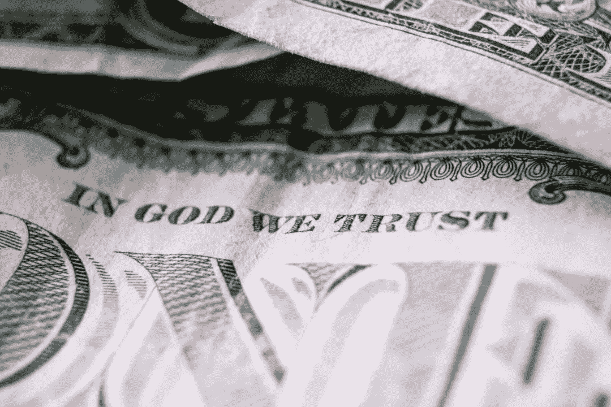

# 钱快要清醒了，可能是个好消息！

> 原文：<https://medium.com/coinmonks/money-is-about-to-get-conscious-and-it-may-be-good-news-e59b0bf8fb6d?source=collection_archive---------43----------------------->

Photo by Matthias Groeneveld from Pexels

不管你有没有玄学的本事，题目对你来说都是一样的。本十年标志着加密货币作为一种广泛使用的交易工具的出现和接受。随着超过 18，000 种加密货币的存在(截至 2022 年 3 月),其中许多与传统货币竞争，这几乎令人怀疑这将如何塑造我们的未来。

我是一个想要深入理解金钱如何运作并建立一个坚实的个人金钱观的人。现在，我发现自己处于一个非常幸运的时代，在这里，金钱的概念可以被挑战和玩弄！即使我们不了解这个市场，新兴技术也会要求我们这样做。我记得当我还是个孩子的时候，我经常在网上查找哪种货币的兑换价值最高。它过去是科威特第纳尔(目前 1 科威特第纳尔= 250.17 印度卢比)，我过去常常对它的高汇率感到非常兴奋。但是现在我们有了受人尊敬的比特币，价格高达 30，42，943.96 印度卢比！还有酷酷的以太坊 229771.64 印度卢比。汇率会随着时间而变化，但我希望你明白这一点。我们不能忽视这一点，而仍然觉得自己是经济链条中活跃的一部分。

当谈到见证货币进化的这个阶段，让我们质疑关于它的非常基本的概念时，有一些想法从非常积极的意义上完全出乎我的意料。我在 Zeeshan Usmani 先生在 2018 年 Hyperledger 全球论坛上发表的[演讲中听到了他们。它引起了人们的注意，钱最终会凭着自己的良心出现。有一套被编入程序的信念的钱，可能拒绝用于违背其道德准则的目的的钱，以及有自己的意愿被用于某些任务而不是其他任务的钱。为了更好地理解它，想象一下你想买你那个时代最新的 iPhone。你走进你最喜欢的苹果商店。你办理购买所需的所有手续。你很兴奋成为最新款 iPhone 的主人。但是当你开始付款的时候。你的钱不允许你购买期待已久的 iPhone！原因是在你的地方，人们昨晚饿着肚子睡觉！根据你的金钱信仰体系，你的钱最好捐给他们。](https://youtu.be/tfWnTqhp64w)

我们上面谈到的只是这种新兴技术可能呈现的许多令人兴奋的应用之一。为了满足我们的好奇心，我们可以经历更多。就像你在给孩子展示智能手机时使用“受限模式”一样，你也可以为给孩子的零花钱选择“受限模式”。这可能会阻止他把钱花在恶习上。这也可能有更广泛的应用，比如为非政府组织捐款建立更值得信赖的系统。其中，你可以在你的钱中嵌入限制，只花在支持你的事业的工作上。这样，钱就不能以服务我们亲爱的孤儿的名义积累起来，而用于自私的目的。类似的应用程序可能会帮助我们睡得更好，因为我们会知道，我们向政府缴纳的税款不能用于我们原本打算和规划的资金以外的工作。

从更直观的角度来理解，这是金钱获得了对其流动方向的控制，希望这是为了人类的进步。这笔钱的使用会有“内在”的条款和条件。随着智能技术的发展和人工智能的发展，想象事物有这样的意识控制对我们来说应该不难。随着令人兴奋的自动驾驶汽车领域蓬勃发展，不难看出，在货币、金融和经济领域，类似的革命不会等待我们。也许在现代人失去对什么是对什么是错的意识，贬低善恶知识的天赋的时候；将光明与黑暗分开的良知和认为真理优于谬误的思想启蒙——作为在地球上建立道德秩序的赞助人的代理人，正被呈现给金钱和机器。

据信爱因斯坦曾写道(在写给物理学家梅克斯·玻恩的一封信中):“无论如何，我相信他不玩骰子。”