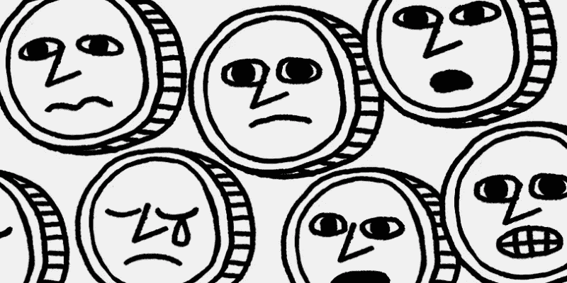

# 对 Binace 首席执行官的洗钱调查？DeFi 的又一天

> 原文：<https://medium.com/coinmonks/money-laundering-probe-of-binace-ceo-just-another-day-in-defi-4527f1748235?source=collection_archive---------20----------------------->

[Image Credit](https://www.flickr.com/photos/blockchain3/49679496148/in/photostream/)

全球最大的加密货币交易所的创始人兼首席执行官赵昌鹏因违反银行保密法正在接受调查。那是什么意思？这意味着该公司未能实施检测和防止洗钱(AML)的计划，并且从未采取措施向政府提供《银行保密法》要求的客户信息(KYC)。听起来很严重，对吧？基于分散金融(DeFi)世界已经迎来了洗钱的黄金时代这一事实，我认为这次调查只是分散金融世界中的又一天。

《1970 年银行保密法》是一项联邦法律，要求美国的金融机构协助政府机构侦查和防止洗钱。自成立以来，已经增加了许多新的法规，试图与专业洗钱者以及 DeFi 及其产品(如 crypto 和 NFTs)保持同步，这两者都拥有充斥着欺诈者、暴徒、卡特尔会计师和富人的社区。多亏了像[加密混合器](/coinmonks/why-are-bitcoin-mixers-legal-9dcd73380564)这样的创新，所有这些人都有烧不完的钱，并且可以在 DeFi 中快速安静地清理。

路透社的调查显示，2020 年，司法部要求提供文件，以确定“负责遵守《银行保密法》的币安雇员，其打击非法金融的政策细节，以及其向当局提交的任何可疑金融活动报告。币安被要求提供该交易所与涉及勒索软件、恐怖主义和暗网市场的用户以及美国制裁对象之间的任何交易信息。”

也许这听起来是一项艰巨的任务？现实情况是，在美国开展业务的金融机构，至少是那些不生活在 DeFi 幻想中的金融机构，应该定期主动地向美国政府提供这类信息。但不是 Defi 组织？币安对路透社调查引发的指控有何回应？据路透社报道，币安声称这家媒体巨头的研究方法已经“过时”，并表示币安正在“推动更高的行业标准”，并努力“进一步提高我们在我们的平台上检测非法加密活动的能力”，但没有提供任何实际计划的证据，也没有对反洗钱和 KYC 技术解决方案进行任何资本投资。

那么，监管者应该相信公司的话吗？不幸的是，美国的司法系统不是这样运作的。看来和赵也明白这一点，因为交易所不接受美国客户，自 2019 年以来一直没有。想进入币安交易所的美国人可以通过币安。美国也在监管机构的审查之下。似乎几乎每一个加密硬币，NFT 和加密交易所为基础的组织正在审查有缺陷的洗钱行为。我的意思是，这种专注于密码的首席执行官受到法律制裁的趋势并不仅限于和赵。你能想象以菲亚特为中心的企业领导人面临同样的严格审查吗？

去年 2 月，另一家加密交易所 BitMex 及其创始人承认违反了《银行保密法》。那是什么意思？在 BitMex 创始人的案件中，两年半的缓刑和 1 亿美元的罚款。也许这听起来有点轻，减去财务费用，但不要被它迷惑。司法部刚刚开始与它的秘密犯罪单位，他们完全扎根于这场打击 DeFi 的不受监管的方式。

“由于这一抗辩，本办公室现已对 BitMEX 的三名创始人和一名高级员工进行刑事定罪，罪名是故意违反反洗钱法。今天的抗辩反映出，在加密货币交易所拥有管理权的员工，不亚于此类交易所的创始人，不能故意无视他们在《银行保密法》下的义务。”—美国检察官达米安·威廉姆斯

只是 DeFi 的又一天…

[Image Credit](https://www.flickr.com/photos/blockchain3/49679496148/in/photostream/)

*   结束

> 交易新手？试试[密码交易机器人](/coinmonks/crypto-trading-bot-c2ffce8acb2a)或者[复制交易](/coinmonks/top-10-crypto-copy-trading-platforms-for-beginners-d0c37c7d698c)