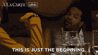
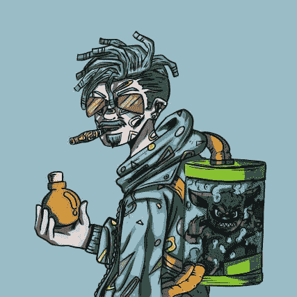

# 蒙斯塔科学家 NFTs &他们提供什么

> 原文：<https://medium.com/coinmonks/monsta-scientist-nfts-what-they-offer-919c198d5079?source=collection_archive---------0----------------------->

Monsta Scientist

你见过围绕 Monsta Scientist 的炒作吗？
惊艳！我们俩都是。你有没有想过是什么让他们与众不同，或者他们到底在建造什么？

当我们深入研究他们的路线图时，我们会找到这些问题的答案

Monsta Scientist 是一个以社区为中心的项目，通过工具、staking generate $labs、marketplace、批准来自社区的定制请求和实用程序来提供价值，最棒的部分是他们的主要实用程序 accelerator。

现在你可能想知道所有这些是如何工作的，以及它们是如何脱颖而出的。
为什么不牵着我的手，让我们进入他们的详细分析

# 工具

该团队创造了一些超级工具(我喜欢这样称呼它们)，持有者可以在 discord 和网站上使用。

## 除了看到:

**狙击工具**

想象一下，因为卖家的无知，花 60 ETH 买了一只无聊的猿，天啊！我错了，这是件大事！！

**稀有度工具**
这款工具可以帮助你使用特征、平均价格、销量、所有者数量等指标来了解 NFT 的稀有程度...

很神奇吧？它可以阻止你成为上面例子中的卖家。

**项目分析(Anti Rug Tools)** 旨在提供有关 NFT 项目的团队、路线图、社区、薄荷价格、产品价值的信息&，让您永远不会变得粗糙。

**预铸工具**
这种工具只适用于蒙斯塔科学家 NFT 的钻石手。

它们是工具，只需在网站上注册你的钱包就可以获得免费白名单，然后数据会根据地板来看你持有 nft 多长时间&多少钱。

**Web Jobs**
这和 Fiverr 类似，你可以建立一个描述你提供什么服务的档案，然后在你的直接信息中获得 web3 客户。

你还可以看到基于你专业领域的招聘信息，这多酷啊？

*   **底价，代币，新款 Cm &钱包追踪器预警。根据您的喜好，您可以在网站上和 Gmail 邮箱中收到这些提醒。将会添加更多的区域提醒，这样您就可以休息、放松，并获得实时更新**

> 交易新手？尝试[加密交易机器人](/coinmonks/crypto-trading-bot-c2ffce8acb2a)或[复制交易](/coinmonks/top-10-crypto-copy-trading-platforms-for-beginners-d0c37c7d698c)

# 市场

该团队在创建一个集成令牌的市场方面投入了很多，如$dust $labs $usdc $sol 等。

这背后的原因是让投资者可以灵活地出售除 SOL 之外的其他代币形式的 NFT，因为事实证明这种代币相当不稳定。

炸弹是将有多种选择出售你的 NFT 在蒙斯塔市场。

## 以下是蒙斯塔市场的一瞥:

你可以用几个代币交易你的 NFT，比如$索尔、$USDC、$实验室，随着时间的推移，更多的代币会被添加进来。

想象一个点对点的市场，交易发生在交易者之间，就像在币安，但这次是在 NFT 收藏家之间，所以你可以和其他收藏家交换 NFT，找到有价值的交易。

**蒙斯塔·莱佛士**
该功能可让您访问白名单& NFTs 莱佛士

你也可以拍卖:
-特殊 Monsta 和其他 NFT
-白名单
-商品销售(merch)

这是创始人的一句话

> “此外，我们将不断向 Monsta 市场添加新功能，以确保外观和功能与 NFT 索拉纳领域的新发展保持同步。
> 这仅仅是一个开始，我们还有很多大计划，非常感谢您的耐心。”

# 加速器计划

Monsta 科学家团队将提供的加速器计划和主要工具专门针对 Monsta 和魔药持有者

它旨在促进由蒙斯塔社区的任何成员在各个领域创建的 NFT 项目。让我们来探索它们。

## 以下是他们开发持有者项目的计划:

**社区发展** 他们利用各种社区建设技术和庞大的社区，帮助一个持有人建立任何项目的社区。

**营销**
monsta 团队将指导来自他们社区的项目创始人如何进行有效的营销，他们还将&帮助他们实施最佳营销策略。

**开发人员支持**
你会同意我的观点，这是项目的基础，他们有合适的开发人员工具和网络开发人员来帮助他们的项目创始人建立坚实的基础

此外，Monsta dev 员工将提供免费的开发人员服务(前提是他们注册了加速器计划)

**项目合作**
大型社区在这个领域的优势是人脉，对吗？

嗯，Monsta scientist 打算利用所有这些关系来帮助他们的项目创始人获得与其他项目的宝贵合作

**辅助一些 Twitter 帖子、先睹为快、公告艺术。**
增加炒作的一个因素是当项目运行 twitter collab 或发布重大公告时，它们发布的图形质量。

作为 Monsta scientist，我还没有见过任何带有疯狂创意插图的项目，他们准备用这种天赋支持他们的项目创始人。如果你问我，我会说这是相当便宜的

**launch pad&doxed 产品**

他们可以使用 Monsta Scientist doxxing 和 launchpad 服务，并利用 Monsta Scientist 在 NFT 索拉纳空间建立的信誉。

有几种方法可以帮助和开发由 Monsta Scientist 成员创建的项目，所有这些方法的目标都是指导、开发这些项目，并将其整合到 Monsta Scientist 的广泛影响范围内。

Monsta 科学家的额外福利&药剂持有者

Monsta Scientist 和 Monsta 魔药的所有持有者都被授予所有社区项目的专属白名单机会。

我可以听到你在问，“那么一个项目到底是如何加入这个加速器计划的呢？”

**工作方式如下:** 所有希望加入加速器计划的项目都需要支付由 Monsta Scientist 或 Monsta 魔药生成的$LABS token。

就这样！您可以加入并获得加速器计划的所有好处。如果你持有大量蒙斯塔 NFT，你也会有优势。

> 我想我遗漏了什么

哦，是的，
**赌注产生$Labs**
你也可以吞下你的馅饼，只需锁定你的 monsta 资产，获得被动收入和其他奖励。

该项目旨在将热量带到 NFT 索拉纳空间，我们正在谈论他们的工具频繁更新，以适应新的趋势。

在你的日历上钉上造币日期——世界协调时 7 月 5 日下午 6 点——在评论中让我知道你最喜欢的路线图分析部分。

哦，你看到了这个拍手图标，是的，就是下面这个，请点击它多次，关注更多 NFT 的更新。