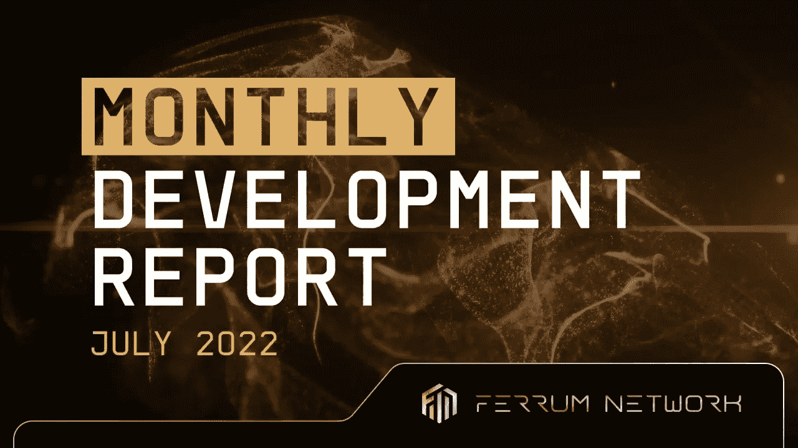

# 月度发展报告| 2022 年 7 月

> 原文：<https://medium.com/coinmonks/monthly-development-report-july-2022-5a556243dbd9?source=collection_archive---------36----------------------->

## 7 月份，铁姆公司启动了第 3 季度，重点关注三个不同的领域——网关、集成和 Mainnet 团队。

亲爱的铁社区:

自去年以来，铁姆公司已经将工程团队从 2 人扩大到 13 人，并正在招聘新员工。可能要跟踪很多东西，所以我们想开始提供每月开发报告，让每个人都了解幕后发生的事情。我们将从 2022 年 7 月开始这个系列。我们希望你喜欢！

# 门户团队

Gateway 团队专注于开源计划和一些白色标签产品的开发，我们认为这些产品将成为 mainnet 的优秀用例，并将为我们的客户增加巨大的效用。这包括我们的授权门户等产品。

为了完成第 3 季度的工作，网关团队现在正在过渡到多 wap 闪电战。我们正在努力使这款产品成为我们迄今为止推出的最精美的产品。我们将在一篇关于我们的“第三推动者优势”的文章中分享更多细节，以及我们如何利用它来构建将为行业带来持久价值的世界级解决方案。

**名称:**Zikriya mush Taq
团队:开发，网关
七月更新:

*   从 JS 到 TS 的代码迁移**完成**
*   存储库安全**完成**(开源倡议)
*   超级管理 API(删除特性)**正在进行**(管理部署，减少技术债务以专注于新产品)

**八月焦点:**

*   在网关中集成多 WAP**计划**

**名称:**费赞阿里
**团队:**开发，网关
七月更新:

*   开发授权白标版本的用户门户**完成**
*   管理门户**授权白标版本的开发完成**
*   正在开发授权铁品牌版本的用户门户网站
*   **管理门户**授权铁品牌版本的开发正在进行****
*   **调试以前制作的功能**

****八月焦点:****

*   **管理门户**授权铁品牌版本的开发计划****
*   **为移动屏幕开发钱包连接选项**计划****
*   **坩埚更新 UI/UX 设计的开发**计划****

****名称:**日照海德尔
团队:开发，
网关**七月更新:****

*   **多令牌赌注排行榜的后端 API 开发**完成****
*   **DeFi Liama 的代币上市进展**完成****
*   **跨网络令牌供应 API 的开发**正在进行****

****八月焦点:****

*   **跨网络令牌供应 API 的开发**正在进行****
*   **量子门户**计划****

# **集成团队**

**集成团队有三大重点，包括 Pocket Network、Algorand 和 Casper。这些团队中的每一个都有分配给集成的专用资源。我很高兴地告诉大家，在过去的一个季度里，我们在所有的集成方面都取得了重大进展。我们现在希望在本季度将这些网络中的每一个都发布到 Alpha 中。**

****姓名:** Salman Haider
**团队:**开发、集成— Algorand
**本月(7 月)工作的项目:****

*   **开发 Algorand 区块链和 BSC 区块链之间的跨链令牌桥。**
*   **为 BridgePool(令牌桥)和 TaxDistributor(桥梁税费分配)开发智能合同。**
*   **将跨链桥智能合同与功能性用户界面相集成，以测试 Algorand <> BSC 之间的互换/撤销**

****我下个月要做的项目:****

*   **最终确定 Algorand 跨链令牌桥，以备随时发货。**

****姓名:**阿卜杜勒·阿哈德
**团队:**开发、集成—艾格朗
**本月工作项目:****

*   **阿尔格兰德合同脚本集成**
*   **EVM 与非 EVM 互换&反之亦然**
*   **撤回 EVM 链(非 EVM 到 EVM 互换)**
*   **撤出非 EVM (EVM 至非 EVM 互换)**
*   **非 EVM 至 EVM 互换 tx 的签名**
*   **evm 到非 EVM(阿尔格兰德)互换的签名**
*   **使用 Algo 网络定位的令牌映射**
*   **单连接钱包按钮**
*   **从事钱包单连接的铸造工作**

**下个月我要做的项目**

*   **Algorand 交叉链令牌桥 QA 测试。**
*   **多 wap 前端设计和智能合同集成**

****姓名:**军凯
**团队:**开发、集成—口袋
**本月(7 月)工作项目:****

*   **实施过渡费用模块并通过费用模块测试税收分配**
*   **为桥接费用模块添加 CLI 命令并执行演示**
*   **为桥费模块增加门将测试**
*   **正在为桥池模块功能添加集成测试**
*   **支持 Algorand side bridgepool 和税收分配器**

**我下个月要做的项目**

*   **完成桥池和桥费的集成测试**
*   **支持口袋芯铁节点集成**
*   **支持口袋核心的钱包集成**
*   **确定需要进一步研究的特性**

****姓名:**罗斯蒂斯拉夫·提什科
**团队:**开发、集成—卡斯珀
**本月(7 月)工作项目:****

*   **修正了卡斯珀网络上的铁 ERC-20 令牌**
*   **为卡斯珀网络开发智能合同**

****我下个月要做的项目:****

*   **最终确定现成产品的 staking smart 合同。**

****姓名:** Ibraheem Kabir
**团队:**开发、集成— Velas — Harmony
**本月(7 月)工作项目:****

*   **铁桥和铁节点上的整体和谐与石登。**
*   **将 velas 集成到传统的定位配置中，并使 velas 定位为生产做好准备**
*   **开始在 iron bridge UI 上进行 Pocket 集成**

****我下个月要做的项目:****

*   **在 bridge UI 上完成 Pocket 集成实施计划和架构。**
*   **按照商定的架构计划，在 Pocket 网络上实施铁桥集成的工作原型。**

# **Mainnet 团队**

**Mainnet 开发进展顺利，我们也将增加一倍的团队规模，增加资深的防锈和基板工程师。我们的目标是在第三季度推出针对铁 X 网络的 PoC 测试网，并提供功能使用案例。**

****名称:** Naiem Yeganeh **团队:**开发，Mainnet
**7 月更新:****

*   **更新和重构桥与 EVM 兼容链的交互**完成****
*   **在试点 EVM 兼容网络上部署量子门户智能合同 **QA****
*   **更新铁运行时和量子门户，以与多链基础设施互动 **QA****
*   **使用运行时**部署多链令牌用例正在进行****

****八月焦点:****

*   **FerrumX 网络官方测试网**

# **最后**

**我们希望您喜欢了解铁姆的所有最新*进展*！这将是令人兴奋的一个月，因为我们已经开始了与 Substrate devs 一起扩展 mainnet 团队的过程。敬请期待下个月的另一次更新！**

# **关于铁网**

**铁是开创互操作性 2.0 时代的先锋。由 Quantum Portal 提供支持，铁网络的 mainnet 节点和相关基础设施将为行业中的每个链带来价值、数据和功能互操作性。利用铁网络，任何人都可以在一个网络上构建和部署解决方案，并立即启用多链功能，而没有为其 dApps 和项目管理多链基础设施带来的负担或技术债务。**

# **铁网络重要环节**

**[网站](https://ferrum.network/) | [电报](http://telegram.ferrum.network/) | [推特](http://twitter.ferrum.network/) | [YouTube](https://www.youtube.com/channel/UCN658dMRTaH4C4dP32VHi6Q) | [不和](https://discord.gg/HEfKq57asd)**

> **交易新手？尝试[加密交易机器人](/coinmonks/crypto-trading-bot-c2ffce8acb2a)或[复制交易](/coinmonks/top-10-crypto-copy-trading-platforms-for-beginners-d0c37c7d698c)**