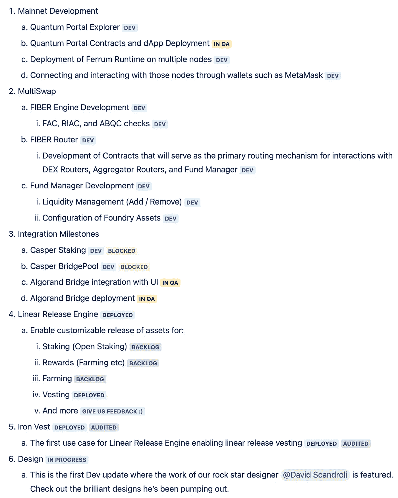
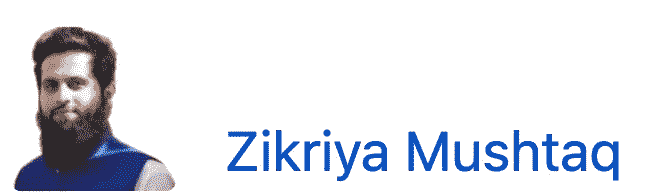
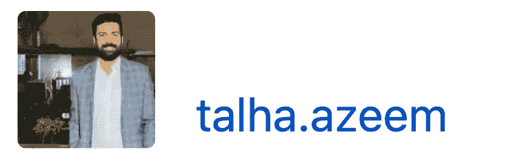
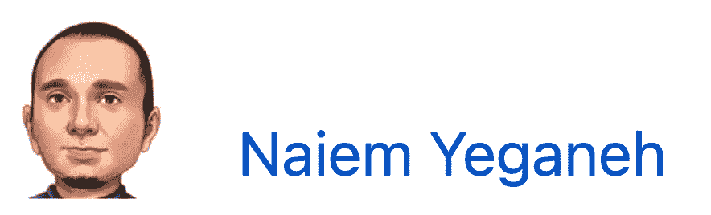
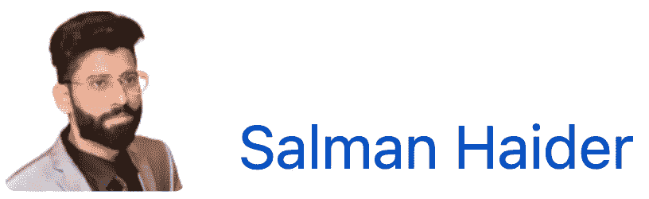
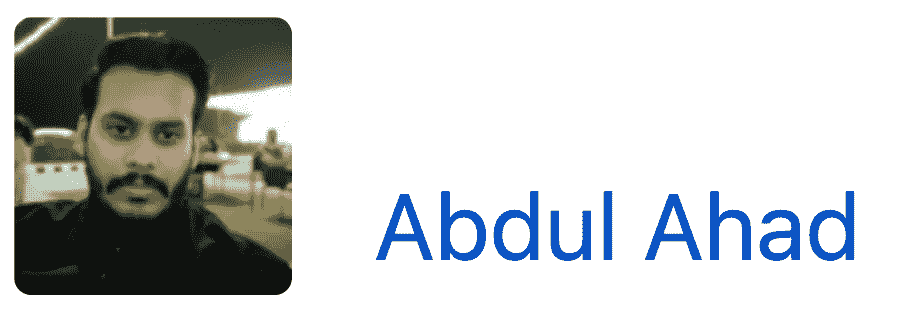
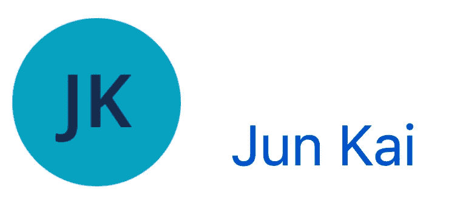
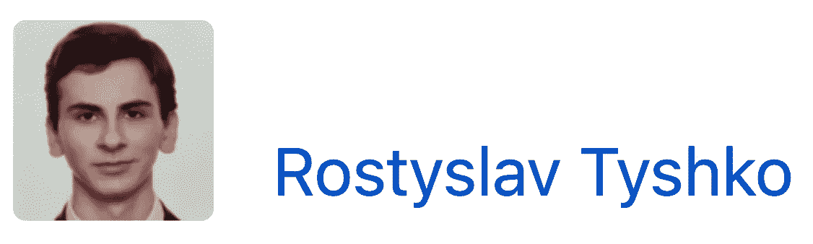
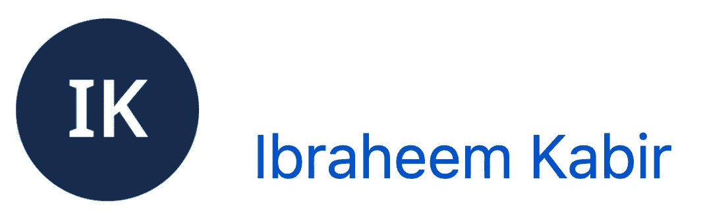
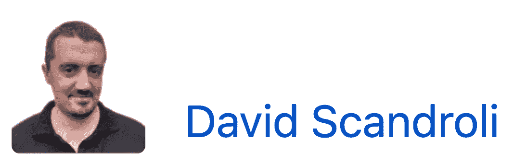

# 月度发展报告| 2022 年 10 月

> 原文：<https://medium.com/coinmonks/monthly-development-report-october-2022-869aa6f503b?source=collection_archive---------17----------------------->

# 摘要

2022 年最后一个季度，我们有了一个不可思议的开局。除了第三季度的关键优先事项，我们已经在第四季度的第一个月发布了一些产品，更多产品将在 2022 年强势上市。当你回顾我们的每月更新时，你会很高兴地看到，诞生于 2018 年熊市的铁网络，无论市场状况如何，都继续蓬勃发展。

请务必在本次更新中查看我们的提交可视化和 PRs。这些是我们每月开发更新的新内容。重点关注的关键领域包括:

WIP report by [Taha Abbasi](https://medium.com/u/a33b495f575a?source=post_page-----869aa6f503b--------------------------------) for October 2022 WIP at [Ferrum Network](https://medium.com/u/f0644f6212cb?source=post_page-----869aa6f503b--------------------------------)

# 铁网络—2022 年 10 月开发提交可视化

WIP Report by [Taha Abbasi](https://medium.com/u/a33b495f575a?source=post_page-----869aa6f503b--------------------------------) — [Ferrum Network](https://medium.com/u/f0644f6212cb?source=post_page-----869aa6f503b--------------------------------)’s October 2022 Dev Commit Visualization

# Mainnet

上个月，我们提到我们正在启动我们的 POC testnet。我们很高兴地告诉大家，这项工作进展顺利。

## 量子门户浏览器→多链浏览器

我们在波哥大 DevCon 上会见了一些优秀的基础设施合作伙伴，并将与他们合作部署必要的基础设施解决方案，以支持 Quantum Portal explorer，并在未来推出成熟的多链 explorer。一个可互操作的网络需要一个可互操作的浏览器。⚡️

## 量子门户——第一个用例

我们已经部署了一个多链令牌，它利用量子门户基础设施来跟踪每个链上资产的原始状态，然后平衡网络间的供应。许多人没有意识到 CMC 和 CoinGecko 没有处理多链供应的默认机制。我们的多链令牌解决方案与[多链令牌供应开源 API](https://github.com/ferrumnet/multi-chain-token-supply)相结合，为透明、准确和最新的令牌供应信息提供了完美的解决方案。我们将在 2022 年第四季度公开这些工具，因为我们启动了一项计划来提高我们自己供应的透明度和准确性。

此外，Naiem Yeganeh 和 mainnet 团队一直在努力工作，并在 2022 年 11 月的第一周向铁产品团队展示了多链桩的内部演示。在功能演示之后，将有一个反馈整合期，然后我们将与社区共享演示。 [naiem yeganeh](https://medium.com/u/68b4f7ec527a?source=post_page-----869aa6f503b--------------------------------) 也在为开发人员准备文档，以指导他们与由铁网络驱动的量子门户进行交互并在其上进行构建。这将使开发人员能够构建他们自己的定制解决方案，这些解决方案由铁姆量子门户的互操作性基础设施提供支持。

## 提交可视化:铁网络运行时、量子门户、多链堆栈等等

WIP by [Taha Abbasi](https://medium.com/u/a33b495f575a?source=post_page-----869aa6f503b--------------------------------) — October 2022 — [Ferrum Network](https://medium.com/u/f0644f6212cb?source=post_page-----869aa6f503b--------------------------------) Runtime, Quantum Portal, MultiChain Staking and more

# 多重 wap

上个月，我们与 FORGE、FIBER 和 MultiSwap 的相关组件分享了我们的工作。在今天的团队演示中，我们成功完成了多链交换。向 Salman Haidar 大声喊出来，感谢他迄今为止在光纤引擎、光纤路由器和支持基础设施方面所做的出色工作。

# 这是什么意思？

从高层次来看，这意味着我们已经完成了 MultiSwap 的核心功能要求，即进行多链交换。如果您对更详细的潜水感兴趣，请查看下列项目的状态:

1.  [FAC 检查](https://docs.ferrumnetwork.io/ferrum-network-ecosystem/v/multiswap-and-multichain-liquidity-pool-bridge/architecture-and-tech-stack/general-architecture-overview/core-components-of-multiswap/fiber-ferrum-inter-blockchain-express-routing-engine/asset-categorization-and-route-optimization/example-of-asset-categorization#foundry-asset-check-fac)——**准备 QA**
2.  [RIAC 检查](https://docs.ferrumnetwork.io/ferrum-network-ecosystem/v/multiswap-and-multichain-liquidity-pool-bridge/architecture-and-tech-stack/general-architecture-overview/core-components-of-multiswap/fiber-ferrum-inter-blockchain-express-routing-engine/asset-categorization-and-route-optimization/example-of-asset-categorization#refinery-or-ionic-asset-check-riac) — **准备好质量保证**
3.  [ABQC 检查](https://docs.ferrumnetwork.io/ferrum-network-ecosystem/v/multiswap-and-multichain-liquidity-pool-bridge/architecture-and-tech-stack/general-architecture-overview/core-components-of-multiswap/fiber-ferrum-inter-blockchain-express-routing-engine/asset-categorization-and-route-optimization/example-of-asset-categorization#aggregated-best-quote-check-abqc) — **准备 QA**

## 纤维发动机

光纤引擎是 MultiSwap 背后的大脑🧠。它是任何希望利用 MultiSwap 进行多筹码互换的人的主要联系来源。纤程引擎负责检查、请求和节点交互。我们一直致力于光纤引擎开发的检查和请求部分。点击此处了解更多关于光纤引擎的信息:

 [## 纤维发动机

### 光纤-铁内部区块链快速路由引擎

docs.ferrumnetwork.io](https://docs.ferrumnetwork.io/ferrum-network-ecosystem/v/multiswap-and-multichain-liquidity-pool-bridge/architecture-and-tech-stack/general-architecture-overview/core-components-of-multiswap/fiber-ferrum-inter-blockchain-express-routing-engine/fiber-engine) 

## 光纤路由器

光纤路由器是与 MultiSwap [基金经理](https://docs.ferrumnetwork.io/ferrum-network-ecosystem/v/multiswap-and-multichain-liquidity-pool-bridge/architecture-and-tech-stack/general-architecture-overview/core-components-of-multiswap/fiber-ferrum-inter-blockchain-express-routing-engine/fund-manager)的单一联系点，负责将资产从用户钱包转移到 Dex 路由器和/或基金经理，反之亦然。

由于光纤路由器，没有钱包或智能合约直接与[基金经理](https://docs.ferrumnetwork.io/ferrum-network-ecosystem/v/multiswap-and-multichain-liquidity-pool-bridge/architecture-and-tech-stack/general-architecture-overview/core-components-of-multiswap/fiber-ferrum-inter-blockchain-express-routing-engine/fund-manager)交互，为任何针对存储在[基金经理](https://docs.ferrumnetwork.io/ferrum-network-ecosystem/v/multiswap-and-multichain-liquidity-pool-bridge/architecture-and-tech-stack/general-architecture-overview/core-components-of-multiswap/fiber-ferrum-inter-blockchain-express-routing-engine/fund-manager)中的流动性的攻击载体提供了额外的隔离层。

利用光纤路由器和光纤引擎，我们今天进行了第一次多链交换。我们将继续努力优化 MultiSwap 的初始版本及其支持组件。在下面的链接中阅读有关光纤路由器的更多信息，并确保查看我们的提交可视化。

 [## 光纤路由器

### 编辑描述

docs.ferrumnetwork.io](https://docs.ferrumnetwork.io/ferrum-network-ecosystem/v/multiswap-and-multichain-liquidity-pool-bridge/architecture-and-tech-stack/general-architecture-overview/core-components-of-multiswap/fiber-ferrum-inter-blockchain-express-routing-engine/fiber-router) 

**基金经理**

基金经理是负责流动性管理、代工资产配置和过渡性结算的智能合约。得益于[光纤路由器](https://docs.ferrumnetwork.io/ferrum-network-ecosystem/v/multiswap-and-multichain-liquidity-pool-bridge/architecture-and-tech-stack/general-architecture-overview/core-components-of-multiswap/fiber-ferrum-inter-blockchain-express-routing-engine/fiber-router)，基金经理无需与任何外部钱包或 DEX 路由器合同直接互动，为 MultiSwap 架构增加了额外的安全层。

我们今天演示中进行的多链互换利用了基金经理的流动性管理以及桥接和结算功能。这些需要在 alpha 发布之前进一步开发。在整个 11 月，我们将与 MultiSwap 基础设施的其余部分一起致力于基金管理器。

**COSMWASM 多 wap 集成**

我们与 COSMWASM 签订 MultiSwap 合同的工作进展顺利。Jun Kai 一直在努力整合 EVM 的基础设施，如光纤引擎、光纤路由器和 COSMWASM 上的基金经理。在今天的演示中，我们学习了流动性管理和签名者配置。我们的下一个目标将集中在利用 COSMWASM 从 EVM 网络到基于 Cosmos 的网络的多链交换上。

# 集成里程碑

## 阿尔格兰德打桩——完成

阿尔格兰德打桩工程之前已经完成，并部署在阿尔格兰德主网上。如果有人在寻找 Algorand 打桩解决方案，请联系铁产品顾问。

## 阿尔格兰德大桥—质量保证反馈

我们在 QA 期间发现了一些错误，现在正在努力解决它们，然后提交阿尔格兰德大桥里程碑以供审查。

## Velas 标桩——待审查

之前我们分享了我们在 Velas 上开源了我们的 staking 解决方案，并为开发人员提供了文档和演示工具来扩展它。Velas 团队目前正在审查它。我们在几周前提交了所有必要的信息，并正在与团队一起完成审查，以便我们可以将这一里程碑标记为完成。

## 卡斯帕打桩—受阻

我们之前提到过 Casper Staking 已经完成并在 QA 中。然而，当试图在 testnet 上部署用于 UI 集成的 staking 契约时，提供给我们的 RPC 端点停止了响应。我们已经与其他构建者和 Casper 合作来获得一个新的端点，但是，部署一个 staking 契约的尝试一直失败，出现了一个其他构建者或我们的工程师无法解释的模糊错误。由于该问题与 Casper network 对请求本身的处理有关，我们正在与 Casper 工程师协调，以在进行下一部分集成之前删除该阻止程序。

## 卡斯珀大桥—已封锁

我们在赌注方面遇到的相同阻碍也影响了桥梁合同。

## 提交可视化:铁网络多 wap —光纤引擎、光纤路由器、基金经理

# 线性释放引擎和铁背心

我们一起研究这些产品。首先，我们构建了一个能够支持线性发布产品的模块化引擎，然后我们构建了 Iron Vest，作为由 Iron Network 的线性发布引擎支持的第一个用例。我们刚刚完成了对 Iron Vest 和线性发布引擎的审计，Vidma Security 给了我们 100 分。

 [## 线性释放发动机

### 一个强大的引擎，能够以每秒的速度发布用于授权、奖励、赌注、农业等等的令牌…

docs.ferrumnetwork.io](https://docs.ferrumnetwork.io/ferrum-network-ecosystem/v/linear-release-engine/)  [## 欢迎来到铁背心

### 编辑描述

docs.ferrumnetwork.io](https://docs.ferrumnetwork.io/ferrum-network-ecosystem/v/iron-vest/)  [## 铁背心——由 Vidma 审核

### 白皮书 MultiSwap 线性发布引擎网站

docs.ferrumnetwork.io](https://docs.ferrumnetwork.io/ferrum-network-ecosystem/v/iron-vest/iron-vest-audited-by-vidma) 

## 提交可视化:铁网络的线性发布引擎和铁背心

# 设计

来见见大卫·斯坎多里，他是铁网络设计背后的大🧠。大卫一直致力于为铁姆品牌带来美学和功能美。随着我们品牌的最终确定，他现在正致力于让所有的铁的 dApps 和界面，以反映我们新的复杂设计。在下面的[亮点](https://ferrumnetwork.atlassian.net/wiki/spaces/FN/pages/356712449/Development+Report+October+2022#David-Scandroli)部分查看他的一些作品。

[David Scandroli](https://twitter.com/davidscandroli) — Designer at [Ferrum Network](https://medium.com/u/f0644f6212cb?source=post_page-----869aa6f503b--------------------------------)

# 我们几个团队成员的亮点

## Zikriya Mushtaq

Zikriya Mushtaq — Engineer at [Ferrum Network](https://medium.com/u/f0644f6212cb?source=post_page-----869aa6f503b--------------------------------)

**团队:**开发、网关、多 wap

**本月工作项目:**

*   已删除组织成员登录/注册的电子邮件/密码
*   组织成员可以使用钱包地址登录/注册
*   组织成员可以执行 organizationAdmin 和 communityMember 角色的功能
*   为 Multiswap 的应用程序用户角色添加了 ApiKey 加密/解密
*   组织成员和超级管理员的批准注册请求流

**我下个月要做的项目:**

*   关注 Quantum Portal Explorer 和 Multiswap 增强功能

**本月 PRs:**

[gateway-back end:approvecontractlocation 的响应，getSwap 和 getWithdrawSignedha…**CLOSED**](https://github.com/ferrumnet/gateway-backend/pull/187)
[gateway-back end:响应密钥契约现在是 source cabn . tokencontractdaddress at appro…**CLOSED**](https://github.com/ferrumnet/gateway-backend/pull/188)
[gateway-back end:在 swapAndWithdrawTransactions 的模型上，重命名那些具有…**CLOSED**](https://github.com/ferrumnet/gateway-backend/pull/189)
[gateway-back end:在 swapTransactionSummary **修复了 Bug 是相关的 en…**CLOSED****](https://github.com/ferrumnet/gateway-backend/pull/190)
[gateway-back end:Develop**CLOSED**](https://github.com/ferrumnet/gateway-backend/pull/193)
[iron-vest-vesting-portal-back end:smarttokencontractdaddress 键添加在池模型上**CLOSED**](https://github.com/ferrumnet/iron-vest-vesting-portal-backend/pull/13)
[iron-vest-vesting-portal-back 后端:filter ferrumNetworkIdentifier 添加在 getallworksallowdonvesting…**CLOSED【**](https://github.com/ferrumnet/iron-vest-vesting-portal-backend/pull/14)

## 塔尔哈·阿齐姆

Talha Azeem — Engineer at [Ferrum Network](https://medium.com/u/f0644f6212cb?source=post_page-----869aa6f503b--------------------------------)

**团队:**开发，网关，赤壁恐龙

**本月工作项目:**

*   赤壁上的钱包连接实现
*   赤壁的设计更新和实施
*   赤壁手机设计实施

**我下个月要做的项目:**

*   铁背心的移动设计实现
*   铁背心的增强和修复

**本月 PRs:**

[chiby-dinos-frontend:Develop**CLOSED**](https://github.com/ferrumnet/chiby-dinos-frontend/pull/7)
[chiby-dinos-frontend:Develop**CLOSED**](https://github.com/ferrumnet/chiby-dinos-frontend/pull/8)
[chiby-dinos-frontend:Develop**CLOSED**](https://github.com/ferrumnet/chiby-dinos-frontend/pull/9)
[chiby-dinos-frontend:Develop**CLOSED**](https://github.com/ferrumnet/chiby-dinos-frontend/pull/10)
[chiby-dinos-frontend:Develop**CLOSED** 移除更改**关闭**](https://github.com/ferrumnet/chiby-dinos-frontend/pull/11)
[chiby-dinos-frontend:开发**关闭**](https://github.com/ferrumnet/chiby-dinos-frontend/pull/17)
[chiby-dinos-frontend:发布固定用户无效地址**关闭**](https://github.com/ferrumnet/chiby-dinos-frontend/pull/18)
[chiby-dinos-frontend:开发**关闭**](https://github.com/ferrumnet/chiby-dinos-frontend/pull/19)[铁背心](https://github.com/ferrumnet/iron-vest-vesting-portal-frontend-temp/pull/1)

## 穆罕默德·哈里斯

Muhammad Haris — Engineer at [Ferrum Network](https://medium.com/u/f0644f6212cb?source=post_page-----869aa6f503b--------------------------------)

**团队:**开发、网关、多 wap

**本月工作项目:**

*   为组织管理员实施连接到 wallet API
*   对社区成员连接到 wallet API 的修改
*   在 FDS 创建网络和令牌选择对话框(铁设计系统)
*   创建了交换页脚卡来显示 FDS 的网络信息

**我下个月要做的项目:**

*   多 wap 设计实现

**本月 PRs:**

[网关-前端://github 组织管理授权修复](https://github.com/ferrumnet/gateway-frontend/pull/112/commits/bc09d8a36cfc2e840cfdf7f1547dbe6964f453c1)
[网关-前端://github ispromoorganizationadminpath 条件已添加](https://github.com/ferrumnet/gateway-frontend/pull/112/commits/e53e608f6ea669fcc7d447a02118c2cbfde3c358)
[网关-前端://github 归属路由修复](https://github.com/ferrumnet/gateway-frontend/pull/112/commits/ca7a142eb6d6501cc0a69db7eceb9bb6a65ad5c5)
[网关-前端://github 合并来自 MH aris-iron/Feature/org-admin Feature/org-admin admin 特性/org admin admin](https://github.com/ferrumnet/gateway-frontend/pull/112/commits/7b54723577bd16c5956f3d88c917047442d6f054)
[网关-前端://github 移除安全变量【T21](https://github.com/ferrumnet/gateway-frontend/pull/112/commits/db43df2931ea130550733bc73840bdffe183ab09)

## 纳伊姆·叶加内

[naiem yeganeh](https://medium.com/u/68b4f7ec527a?source=post_page-----869aa6f503b--------------------------------) — Founder at [Ferrum Network](https://medium.com/u/f0644f6212cb?source=post_page-----869aa6f503b--------------------------------)

**团队:**开发，Mainnet

**本月工作项目:**

*   开始在内部开发 testnet 的封闭版本
*   我们开发了一些跨链应用程序用于演示，并开始为开发人员编写 quantum portal SDK 文档

**我下个月要做的项目:**

*   读完封闭版的 is testnet，准备好文档，让开发人员开始构建测试应用程序

**本月 PRs:**

[铁-x-网-elio:运行时添加授权**关闭**](https://github.com/naiemk/ferrum-x-network/pull/2)

## 萨尔曼·海德尔

[Salman Haider](https://twitter.com/salmanvivan) — Engineer at [Ferrum Network](https://medium.com/u/f0644f6212cb?source=post_page-----869aa6f503b--------------------------------)

**团队:**开发、集成— Algorand、Multiswap

**本月工作项目:**

*   Algorand Mainnet 重新部署和修复
*   Multiswap 铸造和精炼资产
*   多 wap 光纤路由器和基金经理
*   多 wap 纤维引擎

**我下个月要做的项目:**

*   多重扫描测试
*   多交换离子交换

**本月 PRs:**

[MultiSwap: FACCheck **关闭**](https://github.com/ferrumnet/MultiSwap/pull/1)

## 阿卜杜勒·阿哈德

Abdul Ahad — Engineer at [Ferrum Network](https://medium.com/u/f0644f6212cb?source=post_page-----869aa6f503b--------------------------------)

**团队:**开发、集成、门户——algrand

**本月工作项目:**

*   为阿尔格兰德桥创建了 RPC 调用
*   为 Testnet 部署了 Algorand 桥前端
*   连接了新的 Algorand Bridge Staging 后端和前端
*   在前端添加了 Algorand Bridge Mainnet 脚本
*   在 algrand Bridge 后端和 algrand Bridge 前端配置新的 Mainnet 合同地址

**我下个月要做的项目:**

*   多 wap 设计更新和集成

**本月主席声明:**

[Cross-Chain-Token-Bridge://github Algorand Bridge with mono repo](https://github.com/ferrumnet/Cross-Chain-Token-Bridge/commit/1a6a09e0833c5940d70e86cf13d33fea92cdb5c2)

[Cross-Chain-Token-Bridge://github 来自 AbdulAhadArain/Feature/algorand-SDK Feature/algorand SDK 的合并请求# 27](https://github.com/ferrumnet/Cross-Chain-Token-Bridge/commit/a0417e0e18c8a2a3f07853acffdc8f4f27818f4c)

[iron-gateway://github 为 algorand 创建命令](https://github.com/AbdulAhadArain/ferrum-gateway/commit/d793956ab8edb55d805c7eafa6e9c67a74f5747e)

[iron-gateway://github 来自 AbdulAhadArain/Feature/algrand-integrate Feature/algrand integrate 的合并请求# 1](https://github.com/AbdulAhadArain/ferrum-gateway/commit/da49c6f0d7c0b5cb9877d8bde910d9e132d842b4)

[铁-网关://github 添加脚本 URL](https://github.com/AbdulAhadArain/ferrum-gateway/commit/f8d92df19cb5882c298e07062f1c416e37674971)

[iron-gateway://github fix 解析器配置](https://github.com/AbdulAhadArain/ferrum-gateway/commit/b8fcc532ac0ce298ca4593f7515d705ee423004f)

[铁-网关://github 替换合同地址](https://github.com/AbdulAhadArain/ferrum-gateway/commit/e9496b98ed208c79f3cc6477b89ac8995a1d9a20)

[铁闸://github 合同版本号更新](https://github.com/AbdulAhadArain/ferrum-gateway/commit/cf151159ab094eca2d8efe6afa407d7808887b35)

## 俊凯

Jun Kai — Engineer at [Ferrum Network](https://medium.com/u/f0644f6212cb?source=post_page-----869aa6f503b--------------------------------)

**团队:**开发、集成— Multiswap、Cudos

**本月工作项目:**

*   cosmwasm 存储管理和令牌管理的研究
*   使用 bridgepool 功能和铸造资产在 cosmwasm 上构建多 wap 原型合同
*   通过 CLI 测试 multiswap 功能(包括可升级性)
*   查看 zk 网桥和光纤引擎文档
*   研究 cosmjs 包并为 multiswap cosmwasm side helper 构建原型代码库

**我下个月要做的项目:**

*   关于 multiswap cosmwasm 合同和用于光纤引擎的 cosmjs 助手的进一步工作

**本月 PRs:**

[MultiSwap:添加 cosmwasm 交互工具和测试脚本**关闭**](https://github.com/ferrumnet/MultiSwap/pull/2)

## 罗斯蒂斯拉夫·季什科

Rostyslav Tyshko — Engineer at [Ferrum Network](https://medium.com/u/f0644f6212cb?source=post_page-----869aa6f503b--------------------------------)

**团队:**开发、集成— Casper

**本月工作项目:**

*   修正了 Casper 网络中的撤销和增加奖励调用
*   参与了 Mainnet 的部署

我下个月要做的项目:

*   继续在卡斯珀大桥上工作

**当月 PRs:**

## 易卜拉欣·卡比尔

Ibraheem Kabir — Engineer at [Ferrum Network](https://medium.com/u/f0644f6212cb?source=post_page-----869aa6f503b--------------------------------)

**团队:**开发、集成、网关— Casper

**本月工作项目:**

*   实施了 Casper 客户端集成以实现锁定功能
*   在铁背心上实现了 gnosis 安全交易流程
*   审查铁安全智能合同和架构方法

下个月我要做的事情

*   铁保险箱建筑方法的回顾与 R&D
*   实现铁安服务器和客户端的 v1

**本月 PRs:**

## 大卫·斯坎多罗里

David Scandroli — Designer at [Ferrum Network](https://medium.com/u/f0644f6212cb?source=post_page-----869aa6f503b--------------------------------)

**团队:**设计

**本月工作项目:**

*   更新了多 wap 设计
*   铁背心的移动设计

**设计网址:**

[MultiSwap V1.3 外部](https://www.figma.com/proto/2rRgoPcwnwXK3RvFt4MC44/MultiSwap-V1.3-External?page-id=840%3A28414&node-id=848%3A31834&viewport=6757%2C3071%2C0.14&scaling=contain&starting-point-node-id=848%3A31834)

# 关于铁网

铁正在引领区块链互操作性 2.0 时代。由称为量子门户的多链消息引擎提供动力，铁网络的 mainnet 将为行业中的每个链带来价值、数据和功能互操作性。

利用铁网络在一个网络上构建和部署解决方案，并立即启用多链功能，而没有管理多链基础架构带来的负担或技术债务。

# 铁网络重要环节

[网站](https://ferrum.network/) | [电报](http://telegram.ferrum.network/) | [推特](https://twitter.com/FerrumNetwork) | [YouTube](https://www.youtube.com/channel/UCN658dMRTaH4C4dP32VHi6Q) | [不和](https://discord.gg/HEfKq57asd)

> 交易新手？尝试[加密交易机器人](/coinmonks/crypto-trading-bot-c2ffce8acb2a)或[复制交易](/coinmonks/top-10-crypto-copy-trading-platforms-for-beginners-d0c37c7d698c)