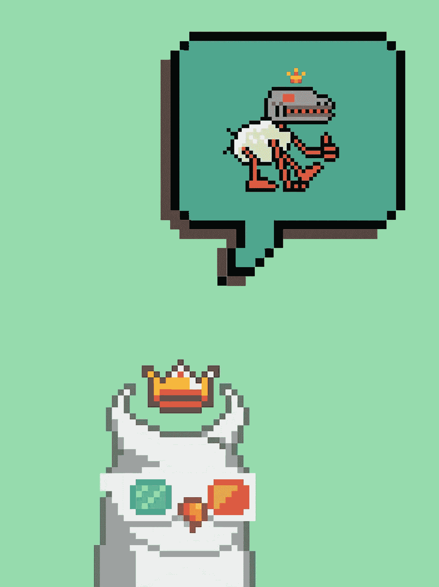

# 月鸟搬到 CC0，为什么人们会生气

> 原文：<https://medium.com/coinmonks/moonbirds-move-to-cc0-and-why-people-are-pissed-b9eb9982a37d?source=collection_archive---------1----------------------->

在一个非常有争议的举动中，凯文·罗斯昨天宣布《月鸟》和《古怪》将被转移到 CC0 公共许可证。

“我们相信这一举措是对互联网和 web3 价值的尊重和尊重，并开启了该项目的一个新的重要阶段。”

不保留任何权利

CC0 允许受版权保护的内容的创作者和所有者放弃这些权利，从而将作品置于公共领域。这将允许任何人出于任何目的自由使用作品，而不受版权法的限制。

简单来说，这意味着任何人都可以以他们认为合适的任何方式自由使用 Moonbirds + Oddities 艺术和品牌。这有效地合法化了所有衍生的 NFT 系列，包括人工智能和 3D 月鸟。

“Web3 是一个重新启动和重新审视一切回到基本原则的机会。一个说别人不必为了我们的胜利而失败的机会。一个对所有人更加包容和开放的机会。”

争议:

虽然向 CC0 的转变似乎尊重了 Web 3 的基本原则，但这一重大转变并没有得到所有人的积极响应。

许多持有这些昂贵的 JPEGs 文件的人对 CC0 的声明感到措手不及，并认为有必要对如此巨大的变化进行讨论。

此外，许多购买了该项目的 NFT 持有者认为，他们对自己的 JPEGs 图片拥有知识产权，有些人甚至计划在未来使用他们特定的鸟或古怪的东西来推出品牌。使用这些 JPEGs 图片作为品牌建立一个企业现在变得复杂，因为艺术实际上是在公共领域，任何人都可以使用和再利用。

优点:

在 Web 3 的精神中，真正的所有权将不再由一个中心实体决定。如上帝所愿，出处将来自区块链本身。

一旦某样东西进入公共领域，这种权利是不可撤销的。这里没有收回，即使证据将被出售并由不同的组织管理。

搬到 CC0 对月鸟和古怪 IP 有巨大的影响。

我理解人们为什么感到不安。如果我计划利用月鸟的知识产权推出一个品牌，我也会感到沮丧。然而，我一直将这些流动性差的 JPEGs 图片视为收藏品，它们的真正用途来自于社交信号。为此，来自区块链的出处应该是唯一重要的事情。虽然人们可以复制和重新利用你的 JPEG 文件，但真正重要的是你拥有原始文件。

“那么，这对你意味着什么？

你现在可以自由地以任何你认为合适的方式使用任何月鸟和古怪的艺术品——永远。

我们不能改变主意。我们支持你，并迫不及待地帮助促进和支持你所有的创造性努力。”——凯文·罗斯

感谢您的阅读。

看看我在推特上未经过滤的想法:

[https://twitter.com/wasifmrahman](https://twitter.com/wasifmrahman)

在 LinkedIn 上关注我的职业生涯:

https://www.linkedin.com/in/wasifmrahman/

我对媒体的另一个想法是:

 [## 瓦西夫·拉赫曼-中等

### 阅读瓦西夫·M·拉赫曼在媒介上的作品。拉面鉴赏家 Gala Games 的 Web 3 营销高级经理。每…

medium.com](/@wasifmrahman) 

> 加入 Coinmonks [电报频道](https://t.me/coincodecap)和 [Youtube 频道](https://www.youtube.com/c/coinmonks/videos)了解加密交易和投资

# 另外，阅读

*   [Bookmap 评论](https://coincodecap.com/bookmap-review-2021-best-trading-software) | [美国 5 大最佳加密交易所](https://coincodecap.com/crypto-exchange-usa)
*   [如何在 FTX 交易所交易期货](https://coincodecap.com/ftx-futures-trading) | [OKEx vs 币安](https://coincodecap.com/okex-vs-binance)
*   [CoinLoan 评论](https://coincodecap.com/coinloan-review) | [YouHodler 评论](/coinmonks/youhodler-4-easy-ways-to-make-money-98969b9689f2) | [BlockFi 评论](https://coincodecap.com/blockfi-review)
*   《XT.COM 评论》的[《币安评论》的](https://coincodecap.com/profittradingapp-for-binance)|