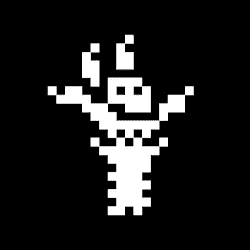
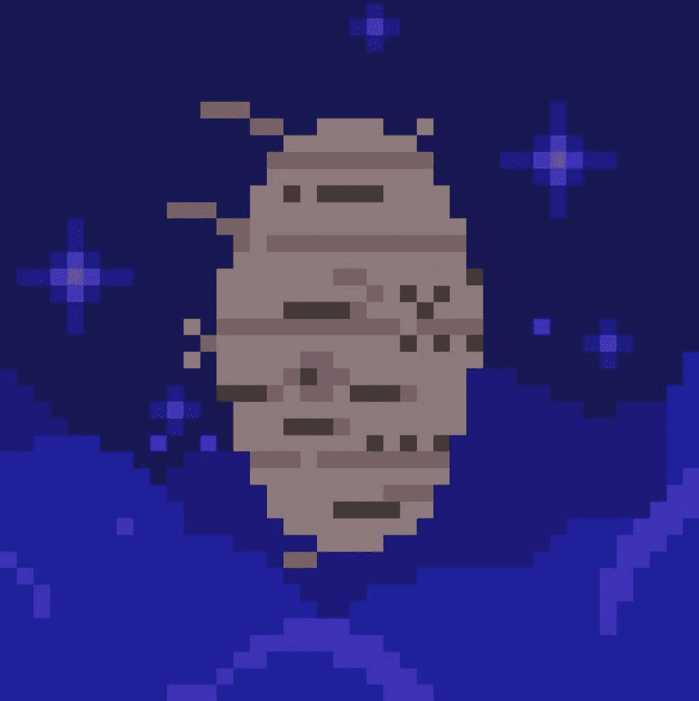
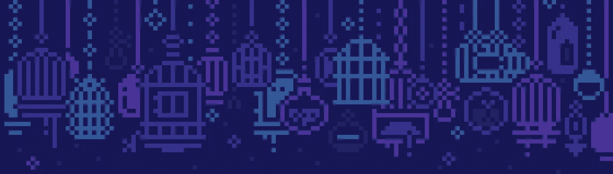
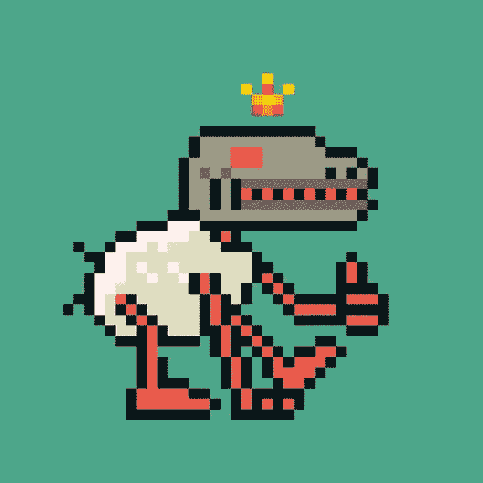
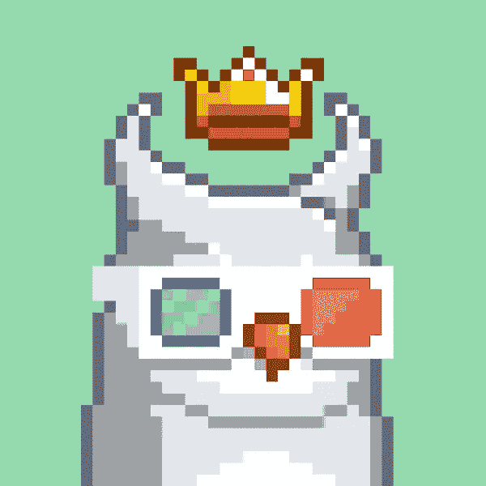

# 月鸟——奇怪的发现

> 原文：<https://medium.com/coinmonks/moonbirds-the-oddities-reveal-1d5a13cd8eb0?source=collection_archive---------10----------------------->

对于月鸟社区来说，这是一个重要的日子，因为期待已久的怪事发生了。奇怪的是，我们是第一批空投给月鸟持有者的，他们在把鸟栓住 30 天后获得了青铜鸟巢的地位。虽然社区预计蛋是第一个筑巢奖励，但许多人在到达青铜巢里程碑时惊讶地发现小球在他们的钱包里。

如果你在高中从未解剖过猫头鹰肉丸，让我告诉你吧。猫头鹰颗粒是由猫头鹰无法消化的食物组成的浓缩小球。这些颗粒是猫头鹰吐出来的，通常由老鼠的皮毛和骨骼组成。你通常可以通过解剖一个猫头鹰颗粒来重建一个完整的啮齿动物骨骼。对于喜欢冷酷和怪诞的人来说很有趣。

在 Cryptoadz 和名词背后输入艺术家 Gremplin 的古怪想法。顾名思义，古怪是健康的月鸟的奇怪分支。本周早些时候，持有古怪物品的人注意到他们的小球开始破裂。一些人的眼睛、腿甚至是瘦骨嶙峋的手都露了出来。随着炒作的增长，人们开始猜测这些东西在展示时会是什么样子。随着炒作周期达到白热化，古怪物品的价格出现了一些波动。自由空投在 7 月 17 日达到了 3.6 ETH 的高点，并在 3 ETH 左右稳定下来。

奇怪的事情终于在美国东部时间 7 月 20 日中午 12 点孵化出来，正好赶上凯文·罗斯、史蒂夫和贾斯汀·梅泽尔主持的 Youtube 直播。对于整个社区来说，这感觉像是一个庆祝的时刻，因为每个人都看到了 Gremplin 在幕后所做的一切。正如预期的那样，猫头鹰颗粒以格雷普林的经典像素艺术风格展示了啮齿动物的骨骼。这些有趣的小啮齿动物骨骼有不同的姿势，较暗的调色板，和与月鸟形成鲜明对比的冷酷美学。

> 交易新手？试试[加密交易机器人](/coinmonks/crypto-trading-bot-c2ffce8acb2a)或者[复制交易](/coinmonks/top-10-crypto-copy-trading-platforms-for-beginners-d0c37c7d698c)

一些坚持最初空投的人甚至注意到这些奇怪的东西和他们最初的月鸟有着共同的特征。我最初猜测会是这样，因为空投下来的怪鸟和它们的父母鸟有相同的数量。该社区开始在社交媒体上分享他们的古怪行为以及他们的月鸟，以便进行并排比较。

每个人看起来都很兴奋，许多人开始将他们的怪异之处 Ps 到他们的 Moonbird PFPs 中，以获得全新的外观。正如 NFT 收藏品展的情况一样，古怪物品的底价受到了重创，跌至 1.7 ETH 的低点。虽然这对任何想摆脱古怪的人来说都不理想，但对那些想以拥有一只月鸟的一小部分成本进入证明生态系统的人来说，这是个好消息。虽然奇怪的东西不会有很大的效用，但 sub 2 ETH 是最便宜的，因为它可以获得证据不和谐。

虽然这是一个相当繁忙的一周，怪事不断，但这还没有结束。月鸟的银层筑巢奖励将于明天解锁，因此也有很多被压抑的兴奋。社区成员猜测，它要么将是与项目高层或项目乌鸦有关的东西。希望本周能有更多的月鸟报道，因为我们将继续从 Prood 团队获得更新。

感谢您的阅读。

看看我在推特上未经过滤的想法:

[https://twitter.com/wasifmrahman](https://twitter.com/wasifmrahman)

在 LinkedIn 上关注我的职业生涯:

【https://www.linkedin.com/in/wasifmrahman/ 号

我对媒体的另一个想法是:

【https://medium.com/@wasifmrahman 