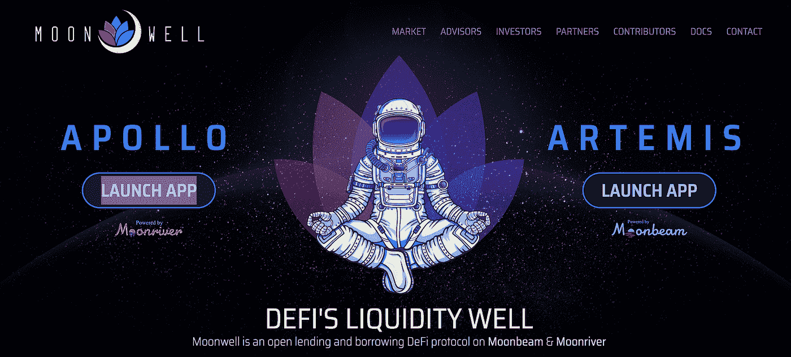
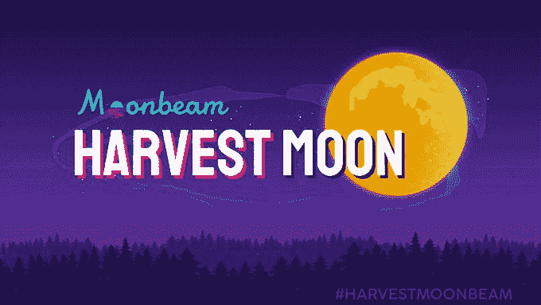
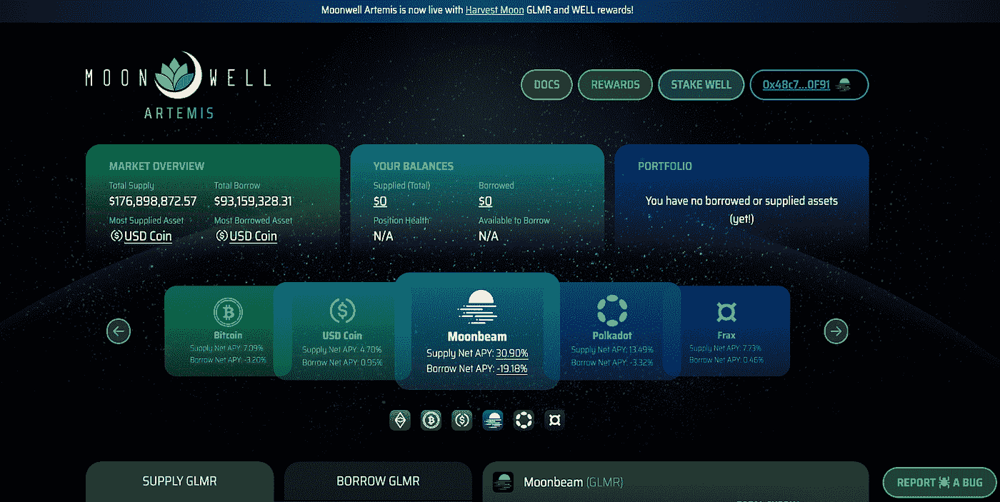

# 月亮井阿耳忒弥斯——月亮上的借贷协议

> 原文：<https://medium.com/coinmonks/moonwell-artemis-a-lending-borrowing-protocol-on-moonbeam-69405a736917?source=collection_archive---------10----------------------->

**Primer** — Moonwell Artemis 是一个建立在 Moonriver 区块链之上的分散贷款&借款协议。它在 TVL 以 1.5 亿美元启动，使 Moonbeam network 的 TVL 增长了 250%以上。凭借这一点，Moonbeam 在 TVL 的前 30 家连锁店中赢得了一席之地。此外，它还成功地将月光和波尔卡多特聚焦。

# 月光和收获月活动

月光是 2022 年 1 月在波尔卡多特上推出的 EVM(以太坊虚拟机)兼容副链。它通过分散的解决方案优先考虑安全的跨链互操作性，从而允许开发人员构建原生的多链 DApps，并轻松地跨链移植他们现有的智能合约。要了解 EVM，请阅读这篇文章。

Polkadot 的生态系统由一个中继链(系统的主链)组成，它连接并支持几个辅助的、特定于应用的区块链，称为副链。副链与中继链平行运行，并依赖于中继链达成共识。该架构使副链能够继承中继链的共享安全性。此外，跨链通信网络(XCM)允许在副链和智能合同之间安全传输数据和资产。

月光已经进入了下一阶段的发射，称为收获之月。“收获月亮”是一个由 Moonbeam 独特的跨链连接智能合同驱动的活动。目标是通过跨链连接的应用程序将互操作性引入 Moonbeam，并扩展 DeFi 提供的不同可能性。Moonbeam 基金会已经为收获月的流动性项目分配了高达[GLMR genesis 供应](https://moonbeam.foundation/glimmer-token/)1.5%的资金。

> 交易新手？试试[密码交易机器人](/coinmonks/crypto-trading-bot-c2ffce8acb2a)或[复制交易](/coinmonks/top-10-crypto-copy-trading-platforms-for-beginners-d0c37c7d698c)

# 月亮井阿尔忒弥斯

## 历史

[月井阿波罗](https://moonwell.fi/apollo/MOVR)部署在[月河](https://moonbeam.network/networks/moonriver/)上之前。月亮河是月光在草间岛的金丝雀链。它允许对代码和平台进行实时测试。阿波罗继续拥有月亮河上最多的 TVL。让这一切成为可能的团队是由前比特币基地工程师卢克·扬布拉德领导的月球技术基金会。

## 投资

Moonwell 从一些著名的投资者那里获得了 1000 万美元的战略基金，用于开发该平台，这些投资者包括 Hypersphere Ventures、Arrington Capital、Polkadot 生态系统基金和比特币基地风险投资公司。它还通过公开销售 5 亿美元的油井代币筹集了 1300 万美元。

## 安全性

随着猖獗的黑客攻击和利用破坏 DeFi，Moonwell 的目标是提供一个用户友好的用户界面，具有快速的交易速度，同时又是健壮和安全的。Halborn Security 目前已经对其进行了多次审计。它还提供安全咨询服务，并在预聘的基础上监控智能合同和 web 属性。该团队还与 ImmuneFi 合作，为发现任何潜在的安全漏洞提供奖励计划。

## 协议特征

Moonwell 是一个可扩展的、EVM 兼容的、非托管的借贷协议。

用户可以存放资产，提供流动性，通过借款人支付的利息赚取回报。作为 Moonbeam 的收获月亮运动的一部分，它目前奖励贷款人和借款人美元 GLMR 和美元 WELL。该平台支持$GLMR，$xcDOT，$wETH.mad，$wBTC.mad，$USDC.mad 和$FRAX。疯狂资产是通过游牧者之桥连接到月光的资产。

用户还可以通过不同的交易策略来下注$WELL 代币或利用他们的头寸。

用户还可以在$WELL/ $GLMR 池中提供流动性，并将 LP 押在 [StellaSwap](https://app.stellaswap.com/) 上，以赚取$STELLA 和$WELL。截至本文撰写时，$WELL 已在 CEXes 上市，包括 [Kucoin](https://www.kucoin.com/news/en-moonwell-gets-Listed-on-kucoin-world-premiere) 、[火币](https://www.huobi.com/support/en-us/detail/94910225629327)和 Gate。

## $油井令牌和打桩安全模块

$WELL 是 Moonwell Artemis 的本地治理令牌。用户可以在安全模块中以 1:1 的比例为 stkWELL 代币下注$ 1。[安全模块](https://docs.moonwell.fi/moonwell-finance/getting-started/safety-module)是一个基于智能合约的系统，激励用户投入$ WELL tokens 以获得更多奖励。它还可以在发生短缺事件(智能合同风险、清算风险、Oracle 故障风险)时作为一种缓解工具。

堆叠的$井代币至少有 10 天的冷却时间来取消堆叠。在 **10 天**的冷却期之后，用户有 **2 天的窗口**来取消令牌。安全模块将使用多达 **30%** 的押记资产来弥补任何短缺事件的不足。

## 游牧桥

用户可以通过 [Nomad](https://app.nomad.xyz/) 跨链桥在以太坊和 Moonbeam 网络之间转移资产。Nomad 的目标是在提供最高安全水平的同时，将其他桥梁的燃气费减少 90%。

## 价格馈送

Moonwell 使用 Chainlink 作为价格源。Chainlink 是一个分散的 oracle 网络。这有助于确保 Moonwell 上所有资产的抵押价值得到准确的市场价格数据的支持。

# 结论

互操作性对于区块链技术的发展至关重要。目前，该行业由孤立的区块链组成，将用户限制在独立的网络中。Moonwell 打算连接跨链应用程序，同时提供高安全性、更好的用户体验和更好的社区参与。

**一切区块链—** 为了简化元宇宙链的不同区块。

请考虑通过捐赠、推荐或在社交平台上关注来支持。

**下线**

[智囊团](https://app.usebraintrust.com/r/everything1/)，[预研](https://www.presearch.org/signup?rid=2491437)，[奥德赛](https://odysee.com/$/invite/@Cyekmyster:3)，[币安](https://accounts.binance.com/en/register?ref=12626399)，[库科恩](https://www.kucoin.com/ucenter/signup?rcode=rJCLFS2)

**社交**

[Substack](https://everythingblockchain.substack.com/account?utm_source=menu-dropdown) ， [Twitter](https://twitter.com/cyekmyster) ， [Youtube](https://www.youtube.com/channel/UCkcc6EceEAu1sMoi2dKczCQ) ， [Medium](/@everythingblockchain) ， [Reddit](https://www.reddit.com/user/cyekmyster)

本文提供的任何或所有信息仅用于教育目的，不得视为投资建议。在正确呈现任何信息方面的任何失误都是我们的责任。我们否认与使用此内容相关的任何责任。