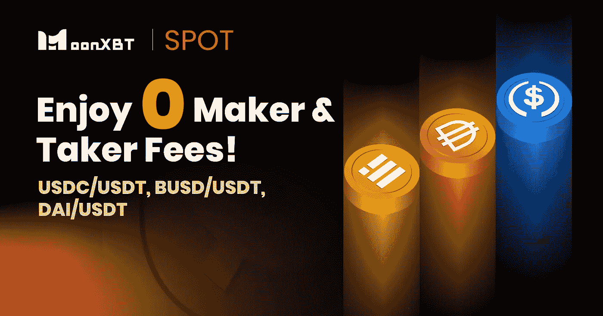

# MoonXBT 针对用户需求和平台流动性，将零手续费政策延伸至稳定币

> 原文：<https://medium.com/coinmonks/moonxbt-extends-zero-fee-policy-to-stable-coins-for-user-demand-and-platform-liquidity-1e8c6d3ad7e7?source=collection_archive---------59----------------------->

对于所有的密码迷来说，这是熊市的另一个亮点:

为了进一步提供更好的交易体验并提高平台的流动性，创新的加密社交交易平台 MoonXBT 最近将零费用政策扩展到以下稳定的硬币交易对:

、戴、、等。时间段:2022 年 8 月 8 日上午 00:00 至 2022 年 8 月 31 日上午 00:00(世界协调时)

## 请注意以下几点:

1.推广期间，MoonXBT 点数折扣、推荐回扣和其他费用调整将不会应用于 stablecoin 对的交易量。

2.促销活动结束后，将收取标准交易费。

3.MoonXBT 保留取消被视为不正当交易或非法批量注册账户的交易，以及显示自我交易或市场操纵属性的交易的权利。

上个月，MoonXBT 还取消了包括 BTC/USDT、ETH/USDT、BNB/USDT、ADA/USDT 和 XRP/USDT 在内的加密交易对的交易费。该政策也仍然有效，直到另行通知。

在这样的市场情况下，将零费用政策扩展到稳定的交易对似乎是一种更迎合用户以及平台需求的政策。在所有的硬币和代币中，稳定的硬币总是被认为是对冲市场波动的替代品。在这样一个不稳定的市场下，许多用户将他们的加密资产交易成稳定的硬币，以度过熊市阶段。此外，鉴于宏观经济形势，加密行业的稳定硬币也是对冲经济通胀的良好投资选择。

从交易所的角度来看，为了提高流动性，鼓励用户交易稳定的硬币也是一个双赢的政策。根据 coinchange 的数据，stablecoins 现在的总市值为 1540 亿美元，占整个加密货币市场的 7%以上。然而，稳定的硬币平均占交易所总交易量的 80%以上。这表明稳定硬币在交易所流动性中发挥的主导作用，而流动性是影响交易所服务质量和用户体验的重要因素。因此，将稳定的硬币交易对纳入零费用区可以帮助交易所提高平台流动性，并保证为用户持续提供良好的交易服务。

更多信息，请访问:
https://support.moonxbt.com/hc/en-us/articles/5277213513871

> 加入 Coinmonks [电报频道](https://t.me/coincodecap)和 [Youtube 频道](https://www.youtube.com/c/coinmonks/videos)了解加密交易和投资

# 另外，阅读

*   [加密货币储蓄账户](/coinmonks/cryptocurrency-savings-accounts-be3bc0feffbf) | [YoBit 审核](/coinmonks/yobit-review-175464162c62)
*   [Botsfolio vs nap bots vs Mudrex](/coinmonks/botsfolio-vs-napbots-vs-mudrex-c81344970c02)|[gate . io 交流回顾](/coinmonks/gate-io-exchange-review-61bf87b7078f)
*   [CoinFLEX 评论](https://coincodecap.com/coinflex-review) | [AEX 交易所评论](https://coincodecap.com/aex-exchange-review) | [UPbit 评论](https://coincodecap.com/upbit-review)
*   [AscendEx 保证金交易](https://coincodecap.com/ascendex-margin-trading) | [Bitfinex 赌注](https://coincodecap.com/bitfinex-staking) | [bitFlyer 审核](https://coincodecap.com/bitflyer-review)
*   [Bitget 评论](https://coincodecap.com/bitget-review) | [双子星 vs BlockFi](https://coincodecap.com/gemini-vs-blockfi) cmd| [OKEx 期货交易](https://coincodecap.com/okex-futures-trading)