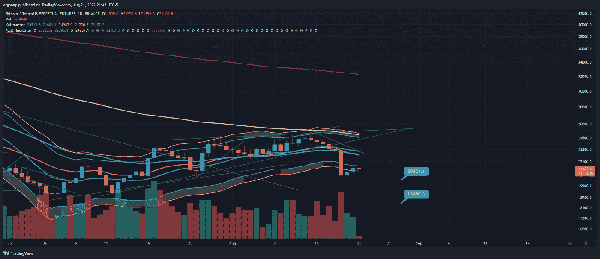
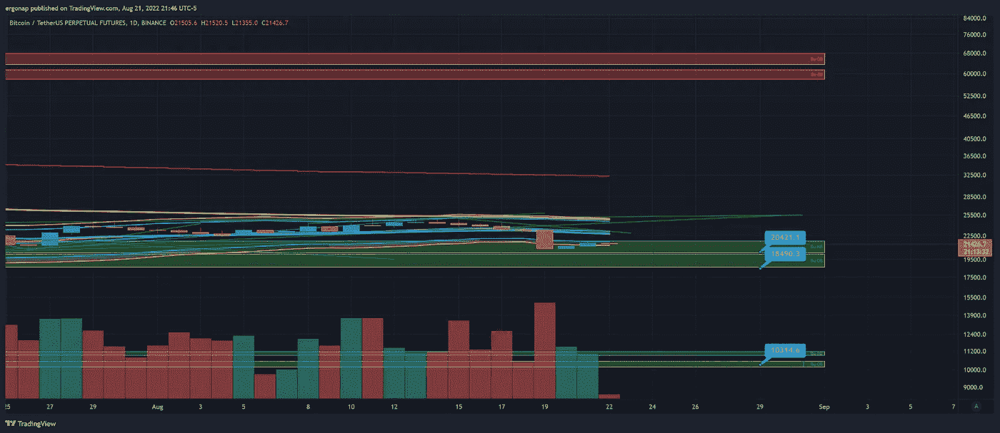

# 前方还有更多，重要时刻

> 原文：<https://medium.com/coinmonks/more-down-ahead-bigtime-7c6c61fef36b?source=collection_archive---------39----------------------->

## 比特币/加密货币市场分析 8/21

我认为我们将会看到持续快速的下跌。我听到人们声称底部/市场修正，这是熊市。熊市中不会出现积极的反弹。从反弹中获得的任何利润都需要谨慎持有，并相应退出。我在全现金模式，只是等着看我们去哪里。

nothing about this is bullish. [https://www.tradingview.com/x/pHsOTIcD/](https://www.tradingview.com/x/pHsOTIcD/)

我没有向任何人道歉，TA 就是它，我们变得更加看跌，因为即使是最小的时间框架 MA 也在向下移动。

最接近的预期需求相对来说是 18.4k 或 10k。

bottom range is not only possible, but we can go lower. [https://www.tradingview.com/x/3WCWVe80/](https://www.tradingview.com/x/3WCWVe80/)

我开始从“[的角度看到愚蠢的新闻，crypto 将对市场](https://www.zerohedge.com/crypto/what-would-crypto-crash-mean-markets-and-economy)做些什么？”答案是:没有。正如他们正在着手做的那样，零售可以而且将会重新盈利。控制权将从大声疾呼去中心化、隐私、自由意志主义、自由的零售商手中夺走，而他们并没有意识到加密并没有提供这些。都只是纸上谈兵。

如果你想要真正的隐私，真正的自由，为之努力。这才是真正的答案。要做到这一点并不容易，这需要运气和金钱+赚更多的钱。这意味着富人出生时就有一条腿，而穷人的腿甚至在出子宫前就被砍掉了。比特币在这里并不是伟大的均衡器，它扩大了富人而不是穷人。想象一下，有多少人对比特币保持沉默，他们能够以 12 美元的价格投入 1 万美元，或以 12 美元的价格投入 10 万美元。想象一下，到目前为止，他们已经卖出了多少次，正如他们告诉你的，更大的傻瓜理论的傻瓜:

> [**购买比特币**](https://entrepreneurshandbook.co/eth-flexive-7e1921123f64?source=user_profile---------0----------------------------&gi=41b24ff0f440) **。**

Arthur Hayes 像往常一样在上面谈到这个问题，他在一个空房间里假设了一堆错误的二分法来让人们购买更多的密码。很明显，他会保持沉默，或者保持中立，声称自己是正确的，因为他开始做空那些正在买入的人。

机构短。前方是 8 月 29 日的[期权结算，这将是一个星期一。准备好。无论之后发生什么，都将在 9 月 16 日的](https://www.cmegroup.com/markets/cryptocurrencies/bitcoin/bitcoin.calendar.html)[上演，下一场四重魔法](https://www.tradestation.com/insights/2022/02/03/quadruple-witching-dates-2022-trading/)。因此，在标准加密期货收盘后两周，也就是 2 周后的周五，是本季度预期的最高波动率。

简而言之，真正的行动很快就会到来。不会涨的。

> 交易新手？试试[密码交易机器人](/coinmonks/crypto-trading-bot-c2ffce8acb2a)或[复制交易](/coinmonks/top-10-crypto-copy-trading-platforms-for-beginners-d0c37c7d698c)