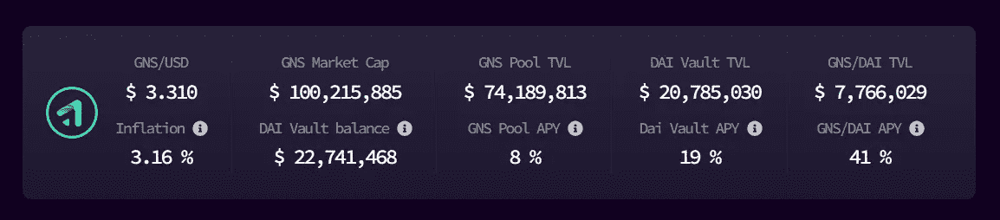
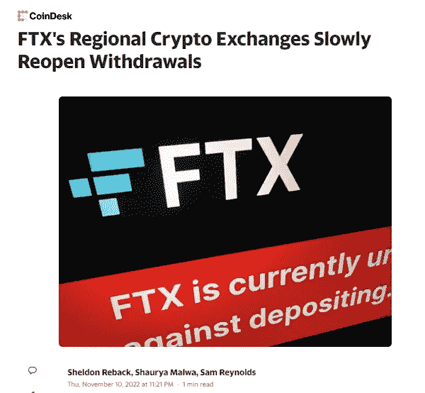

# 对 FTX 崩溃的更多观察

> 原文：<https://medium.com/coinmonks/more-observations-from-the-collapse-of-ftx-8849a64c9b68?source=collection_archive---------6----------------------->

嘿，伙计们，如果你一直在关注我的其他[文章](/coinmonks/observations-from-the-collapse-of-ftx-8d1d79d90e0)，你会注意到这是我自 FTX 崩溃以来的第二份观察清单，以 twitter 上发布消息的速度，我怀疑这不会是我的最后一份。围绕 FTX 的新闻几乎每时每刻都在发生变化，所以如果从现在到周末这段时间，整个叙事发生几次变化，我也不会感到惊讶。不管怎样，鉴于目前的状况，以下是我在过去几天里的一些观察。

然而，在深入了解大量关于 CeFi 的黑暗和令人不安的消息之前，我想我应该从一个关于 DeFi 的积极消息开始。：

# 增益网络是绝对杀死它

在之前，我已经写过关于 [Gains Network 的文章，但简单来说，它是一个类似于 GMX 的平台，因为用户能够从平台交易者费用/清算中获利，同时为交易者提供廉价的 150 倍杠杆。我知道](/coinmonks/gmx-competitors-3-places-where-you-can-own-part-of-the-casino-and-earn-realyield-7dacaf11a472)最近也做了，但我更喜欢 Gains Network，因为他们的$DAI 跳马:

由于市场目前的疯狂波动，很明显有很多交易者被清算，因为戴的金库(实际上是所有其他的金库)一直在 19-20%左右的 APY 下火热运行。除了它是基于马厩的事实之外，关于$DAI 金库的令人敬畏之处在于它是#realyield，并且收益本身是以$DAI 支付的——因此，没有暴露于任何替代硬币。

好了，现在让我们来看看 CeFi 的镜头…

# 日本是一个“好”监管如何保护消费者的好例子

今天早些时候，有报道称 [FTX 开始允许用户提款](https://news.yahoo.com/ftxs-regional-crypto-exchanges-slowly-072134422.html)，尽管速度很慢:

你可能会想——“wtf？为什么是日本？”，尤其是如果你的资金目前仍被冻结在你自己的账户上。

日本用户可能能够做到这一点的原因是因为监管——日本法律要求用户的资金与交易所自己的资金分开管理，这意味着你不能动用亚历克斯·马辛基(Alex Mashinky)，开始将用户的密码借给其他人。这种类型的监管在美国并不存在，因此你看不到像 SBF 这样的行为者似乎在利用客户资产为所欲为。日本之所以有这些规定，大概是因为他们从 [Mt. Gox](https://www.investopedia.com/terms/m/mt-gox.asp) 中学到了什么。希望美国监管机构也能从 FTX 身上吸取教训。

我知道围绕到底应该有多少政府监管存在很多争议，但从简单的角度来看，建立基本的消费者保护是有意义的——在我看来，这将增加消费者的信心，并为加密领域带来更多资本。说到密码规则…

# [比特男孩](https://www.youtube.com/channel/UCjemQfjaXAzA-95RKoy9n_g/videos)是对的。

我已经在 crypto 工作多年了，我对 BitBoy 的唯一接触通常是因为一些负面的事情(例如，泵和 dumbs，起诉三流影响者，[Zach xbt](https://medium.com/u/abc63bd6b00f?source=post_page-----8849a64c9b68--------------------------------)的调查)。直到我看到无银行的家伙亲自在他们的[播客](https://www.youtube.com/watch?v=yIxWvO3cgNg)上主持他，我才终于明白他从何而来，但更重要的是，他为什么感到如此愤怒和被 SBF 背叛。恨他也好，爱他也罢，但在我看来，比特男孩几个月前就已经尽了最大努力给 SBF 敲响了警钟，最近，他发布了一个关于有影响力的人需要展现诚信的视频。我同意，这是我们所有人都必须遵守的东西，尽管我讨厌这么说，但我现在追随并支持比特男孩国家。

对于那些没有关注比特男孩/无银行/SBF 戏剧的人来说，简而言之，比特男孩通过第三方发现 SBF 正试图通过 DCCPA，这是一项类似于纽约州比特许可证的立法，可能会阻碍 DeFi 创新，只会让少数人受益(即 SBF)。更糟糕的是，SBF 并没有对自己的所作所为保持透明和公开，据称他试图破坏比特男孩正在制定的替代立法，而是试图在背后操纵他的支持。听起来像肥皂剧吗？完全是。如果你是这类事情的爱好者，我强烈建议你看看[他的 youtube 频道](https://www.youtube.com/channel/UCjemQfjaXAzA-95RKoy9n_g/videos)——你会看到整个故事是如何展开的。

# 传染已经发生，而且可能会持续一段时间

如果你不确定你的个人交换/平台/协议/项目是否受到传染的威胁，那么 [CryptoCondom](https://twitter.com/crypto_condom) 有一个很好的线索，它概述了许多参与其中的大玩家:

FTX/阿拉米达到处都有很多触角，去年春天，当其他交易所开始下跌时，随着 FTX 收购/救助它们，它们的触角伸得更远了。因此，当我今天早些时候看到 BlockFi 宣布这一点时，我并不感到惊讶:

我不确定去年春天 FTX 救助 BlockFi 时，他们得到了什么/如何提供的资金，但很明显，麻烦就在眼前。鉴于现在密码市场上有如此多的恐惧，我认为如果你现在在任何 CeFi 平台或 CEX 上有任何资产，问问你自己如果“不是你的钥匙”你会有多舒服/不舒服是个好主意

关于这种传染病的阴谋和潜在伤亡，我可能还有很多可以深究的，但在它让我的头脑爆炸之前，我只想把这个留给你:

# 结论

我真的很同情那些因为这个而受到伤害的人们，我不会责怪那些想一起退出 Crypto 的人。正如我之前提到的，我不认为我们已经看到了它的最后一面，因为可能会有更多的多米诺骨牌倒下，但我*希望最大的那些已经倒下。希望你们中没有人在 FTX 身上有钱，但如果你有，我希望你能在他们开始冻结提款之前把钱取出来。如果你是其中一个不幸的人，我强烈建议你开始关注秘密新闻渠道，当不祥之兆降临时，它们会提醒你。*

感谢你花时间阅读这篇文章，一定要在推特([https://twitter.com/CryptosWith](https://twitter.com/CryptosWith))上关注我，获取我所有的最新消息。

免责声明:最后提醒一下，这不是财务建议，仅用于教育和娱乐目的。请一如既往地做自己的研究，找到最适合你的投资。大家注意安全！

> 交易新手？试试[加密交易机器人](/coinmonks/crypto-trading-bot-c2ffce8acb2a)或者[复制交易](/coinmonks/top-10-crypto-copy-trading-platforms-for-beginners-d0c37c7d698c)