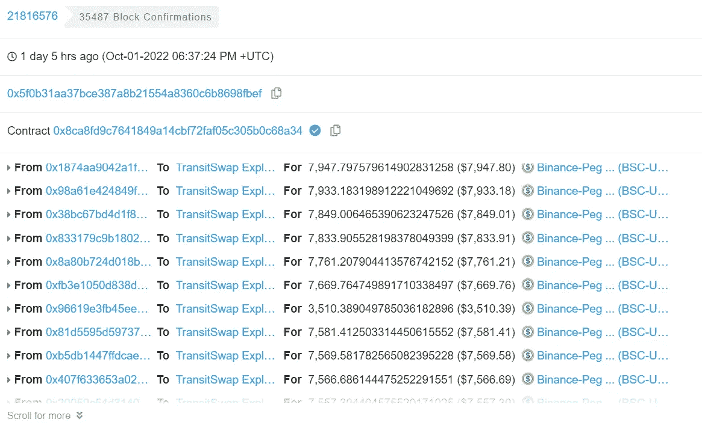
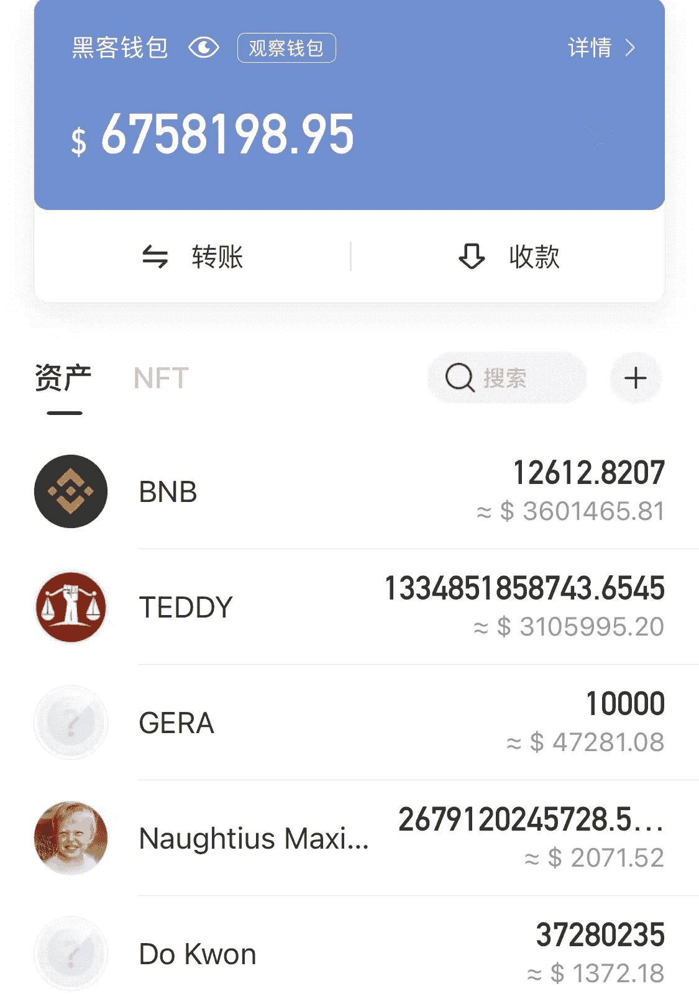
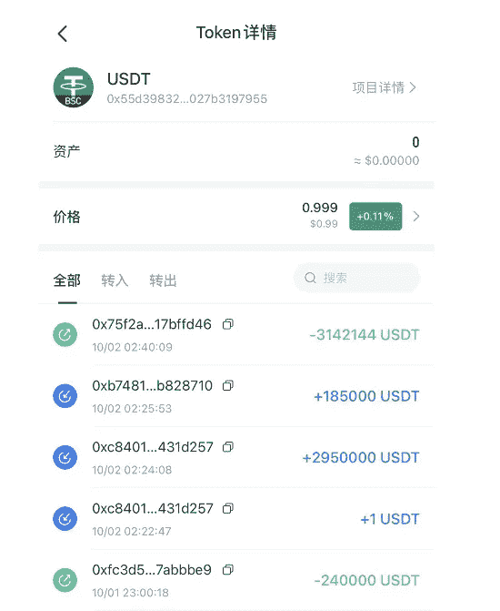
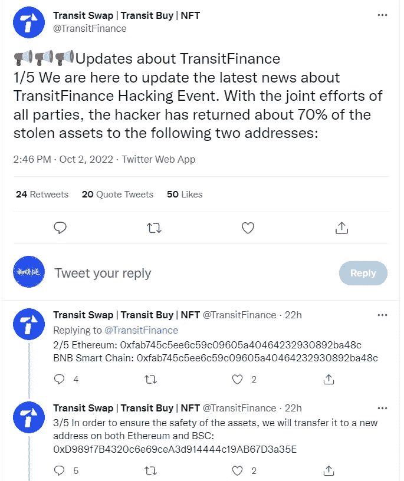
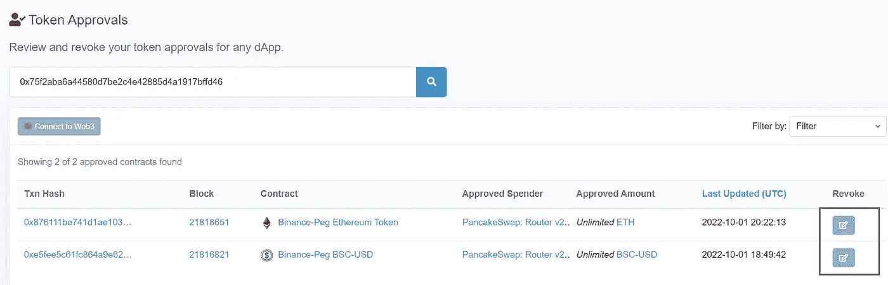

# 15 分钟内超过 310 万美元被盗，数字钱包的使用让人防不胜防

> 原文：<https://medium.com/coinmonks/more-than-3-1-million-was-stolen-in-15-minutes-the-use-of-digital-wallets-is-hard-to-prevent-6b041595dd99?source=collection_archive---------4----------------------->

一个朋友说他偷了 5000 美元，也许他只是授权了一份合同。小组里的人帮助寻找他的钱包记录。

这不是刚刚授权的合约问题，是币圈的又一次黑！

从链上的信息查询得知，中天闪汇平台的合约被攻击，目前合约已经关闭。

与中转平台有过互动的账号有被盗的风险。黑客在 10 月 2 日通过一个合同漏洞窃取了互动钱包的资产，资产从几百到上百万不等。截至目前，盗窃涉及的资金已超过 1690 万美元。

Some of the assets transferred to the hacker’s wallet

通过上线操作得知，黑客用偷来的 stablecoins 换了 BNB，一次是 700 多万美元，一次是 850 多万美元，折合成 4.9 万多 BNB，一度抬高了 BNB 的价格。
通过观察钱包，我们了解到目前黑客的钱包地址存有 12600 多 BNB，钱包余额为 670 多万美元。

Hacker’s wallet balance

其中一名玩家被盗走了超过 310 万美元。

这位朋友在 10 月 2 日陆续将资产转入钱包。没想到，15 分钟后，钱包里的资产全部被转移！

它真的想哭却没有眼泪，这可能就是他的全部身家了。

3142144 USDT stolen

黑客入侵后，Transit Swap 项目跟踪了黑客的信息，找到了黑客的 IP 地址。

经过多次沟通，黑客将被盗资产的 70%返还给了项目方，但这些资产一直没有返还到被盗的个人钱包地址，事件仍在跟进中。

Hackers return 70% of stolen assets

币圈钱包被盗的事情时有发生，尤其是熊市，行情低迷，盗号更加猖獗。

有时候甚至不清楚到底是项目方在守着偷着，还是黑客一直在看着各种项目 bug。所有玩家都防不胜防，新老用户都在所难免。

当使用数字钱包存储和保存数字货币时，您必须格外小心。一不留神就全归零了，你用各种方法赚，但转眼就没了。

比如 5000usdt 以上的玩家，300 万 usdt 以上的，不管是不是都是净值，都特别尴尬。

不仅钱包被偷，交易所跑路在熊市也很常见。在密码圈里，你必须格外小心，你的资产不仅仅是一组代码，而是你所有的资金。

Be careful! wallet hack

使用数字钱包需要注意哪些问题？

**1。保留助记符。**

使用数字钱包时，最重要的是助记短语的安全性。泄露助记符，钱包就不再是你的了。将助记短语保存在在线邮箱、收藏夹或相册中的截图有被窃取的风险。

比如手动复制多份，放在线下安全的地方。如果你的记忆术丢失了，资产也会丢失。

**2。及时取消授权。**

这次钱包被盗是因为黑客通过闪汇平台 Transit Swap 的合约漏洞盗取了用户的钱包余额。

玩家在与钱包互动时，一个 freemint 或者一个新项目在当前合同中可能没有异常，但合同背后是什么授权是未知的。这些都是安全隐患。

及时查看钱包授权信息，定期取消不再互动的合同授权，降低安全风险。

How to cancel the contract on the BSC chain

**3。最重要的是，大资产的钱包不做任何互动。**

对于一些新项目，可能有十倍的机会，或者在登录接收空投的时候，尽量使用新的钱包进行操作。

重新创建一个新的钱包，记录助记短语，麻烦当时的自己，避免主钱包和陌生站点的交互，也保护了钱包的安全。毕竟资产一旦流失，几乎是 100%无法挽回的。

在币圈，风险和机会一样大。赚钱越快，亏钱越快。提高意识和技巧，用心对待每一次尝试，小心翼翼。

以上只是我个人的看法和总结，不含投资建议，读者的任何投资行为与作者无关。

我是褚小莲，我在学习区块链，关注元宇宙和 NFT，关注 web3。

> 交易新手？试试[密码交易机器人](/coinmonks/crypto-trading-bot-c2ffce8acb2a)或[复制交易](/coinmonks/top-10-crypto-copy-trading-platforms-for-beginners-d0c37c7d698c)