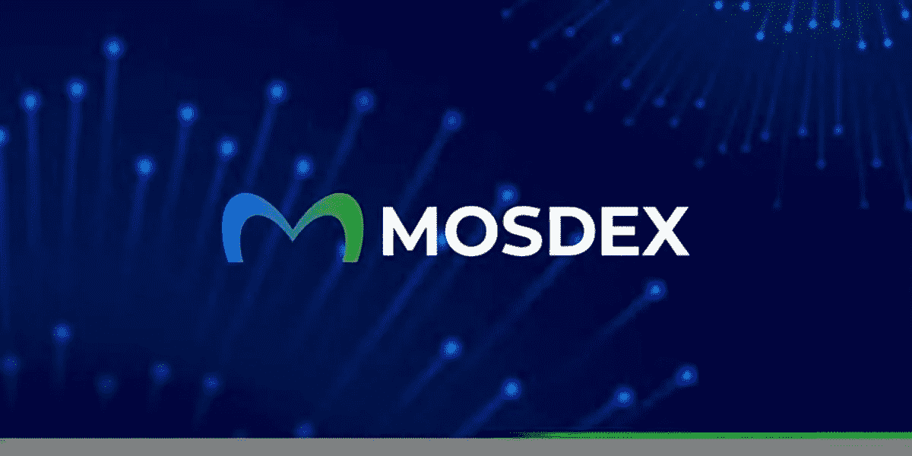
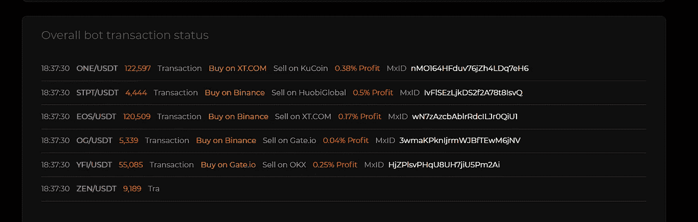

# MosDEX 正在引领分散套利交易浪潮

> 原文：<https://medium.com/coinmonks/mosdex-is-leading-the-decentralized-arbitrage-trading-wave-e108a9744382?source=collection_archive---------9----------------------->

“加密货币套利交易是一个十亿美元的机会”，这是毫无疑问的。利用不同交易平台上资产价格的周期性变化，是产生有形利润的一个绝妙方法。虽然这种策略对一些人非常有效，但大多数加密货币投资者已经放弃了套利交易的想法。少数仍然坚持这一观点的人反对套利交易的诸多限制。

有趣的事实；套利交易相对来说是风险最小的交易策略，但只有少数交易者尝试过。如果你想知道这种现象是否有解决方法，答案是肯定的，答案是 MOSDEX

## 介绍 MOSDEX:加密货币的首个聚合套利交易解决方案

[MOSDEX](https://mosdex.com/?code=QSD883) 是一个套利交易平台，它将战术套利交易策略与金边技术相结合，开发了一个弹性套利交易系统，该系统可以筛选多个加密货币交易所的资产价格变化，并无缝地在这些交易所之间进行交易。

MOSDEX 由在加密货币交易、外汇管理和分散金融领域拥有丰富经验的核心交易员团队开发和管理。MOSDEX 的创新套利交易协议减轻了加密货币交易者的套利负担，并代表他们进行经常性交易。
利用这个工具就像将你的资金投入到协议中并实时观察交易利润的增长一样简单。MOSDEX 的交易记录是透明的，因为用户可以跟踪交易事件并评估协议的活动。

MOSDEX 的套利协议整合了流动性和交易活动各不相同的多个交易所。该协议继续对每个综合交易所上的资产价格进行分类，以检测和评估当时的买卖价格之间的差距。尽管这种差距在大多数情况下很小，但协议利用了低风险交易系统和利润管理策略。

## 套利困境以及 MOSDEX 如何操纵套利交易

套利交易中的大多数损失是由于套利交易者无法在目标交易所的价值正常化之前结束套利交易而造成的。套利是短暂的，你可能在第一次尝试套利交易的时候就明白了这一点。套利交易的成功取决于你是否有能力战胜时间，将你的资产转移到交易价格更高的交易所，并完成交易。

不仅仅是波动性、流动性和价差容易被误算，这也导致了套利的短暂性。套利交易者面临的挑战是评估波动性和价差，并努力在这些方面几乎“零”出错。如果做不到这一点，最终会导致交易失败

此外，套利交易者将需要额外的资本来抵消经常性提款和交易产生的费用，因为大多数交易所对每项交易都收取有形费用。根据交易所和相关资产的不同，取款费可能高达两位数美元。即使套利交易成功，净利润也会减少，在某些情况下，还会被交易员支付的额外费用耗尽。

由于不同地理位置的监管规定，加密货币交易所需要额外的用户验证才能使用其交易平台。套利交易者将需要创建多个交易账户，每个账户都在不同的交易所，并通过验证才能进行取款和存款。即使做到了这一点，管理不同交易所的账户也不是一件容易的事情。

根据这些枢纽，套利交易者决定在选定的交易所进行交易，并在极少数情况下跨交易所交易，交易差距足够大，可以超过转让滞后时间，并且预期利润足够高，可以抵消额外费用。

## MOSDEX 如何操纵套利交易？

MOSDEX 是在敏锐地考虑了所有这些问题的情况下构建的。MOSDEX 完整地解决了这些问题，只给投资者留下了很少的角色，却获得了最大的利润。MOSDEX 的套利交易协议配备了高效耐磨的 oracle 技术，为协议提供价格数据。这确保了协议对任何资产使用正确的价格，并且随着价格的变化而频繁更新。

套利协议正在使用机器学习工具和人工智能(AI)算法进行开发，使其能够检测价格变化，并将这些变化与任何其他可用参数进行比较。

人工智能算法研究交易模式和价格发展数据，以开发交易请求的最佳路线和以最低风险水平回报最大利润的最佳策略。交易协议被设计为在一秒钟内提交多个交易请求，并尽可能多地重复这些请求，直到套利被消耗，交易的盈利能力达到最低。

为了减轻通过交易所转移资金、为每次取款支付费用甚至额外费用的压力，MOSDEX 的套利协议集成了多个交易所，并同时在它们之间进行交易。这是通过利用交易所的 API 来获得对其订单簿的访问，并从单一角度在其上集体交易来实现的。

使用这种协议的投资者还可以避免在执行 KYC 的过程中创建多个帐户和向多个管理员提供个人数据的压力。

## 套利交易浪潮

加密空间经历了不同盈利能力的波动期。加密冬天伴随着一些最严酷的价格发展事件。牛市通常是有利可图的，但即使在这个时候，价格的快速变化仍然可能导致许多交易者亏损。无论哪个季节，正常加密货币交易策略的盈利能力都受到质疑。

加密货币投资者会喜欢更稳定的交易策略，一种风险更小的策略。套利交易是最接近这种愿望的交易策略。

随着大多数其他交易文化的分崩离析，套利交易正在逐渐与永久合约交易等现有交易文化一起占据一席之地。

浪潮正在形成，一波套利交易意识。与加密货币相关的套利交易几乎一直处于人们的关注之下，它正寻求爆发出相关性。这一浪潮将由一些出色的套利交易工具引领，MOSDEX 的套利协议就是其中之一，可能是最先进的。下面是 MOSDEX 项目如何迎接这一挑战

## 套利是如何定位自己来引领套利交易浪潮的

在创建之初，MOSDEX 主要是为交易机构服务的。为了向交易机构提供便捷的套利交易服务，MOSDEX 的协议针对由一个实体管理的集合交易进行了优化。这很有效，使用这个工具的机构证明了 MOSDEX 交易解决方案的效率和可靠性。

然而，这个使用实例简化了仲裁协议的应用。为了解决这一问题，MOSDEX 正从机构领域向外扩张，将其服务扩展到最需要的人群——个人交易员。MOSDEX 向个人和散户交易者开放，这些人在整个投资生涯中都无法驾驭套利交易的力量。

此外，随着采用的继续，它正在扩展其交易解决方案，以满足预期的需求。随着开发者继续提供套利协议以适应普通交易者，套利协议正在经历持续的强度测试。

MOSDEX 还为用户引入了一篮子被动收入机会。我们将在关于 MOSDEX 的后续出版物中详细讨论这一点，请关注此空间。

# 如何参与。

浪潮来了，作为加密货币投资者，做一个出头鸟的重要性怎么强调都不为过。[创建一个 MOSDEX](https://mosdex.com/?code=QSD883) 账户，体验套利协议的强大功能，同时准备迎接更多精彩！

[在 Twitter 上关注 MOSDEX](https://twitter.com/MOSDEX_Official)

[访问官方页面](https://mosdex.com/?code=QSD883)

> *交易新手？试试* [*密码交易机器人*](/coinmonks/crypto-trading-bot-c2ffce8acb2a) *或* [*复制交易*](/coinmonks/top-10-crypto-copy-trading-platforms-for-beginners-d0c37c7d698c)
> 
> *分散加密持股，了解* [*币安的替代方案*](https://coincodecap.com/binance-alternatives)
> 
> *加入 Coinmonks* [*电报频道*](https://t.me/coincodecap) *和* [*Youtube 频道*](https://www.youtube.com/c/coinmonks/videos) *获取每日* [*加密新闻*](http://coincodecap.com/)

# 另外，阅读

*   [复制交易](/coinmonks/top-10-crypto-copy-trading-platforms-for-beginners-d0c37c7d698c) | [加密税务软件](/coinmonks/crypto-tax-software-ed4b4810e338)
*   [网格交易](https://coincodecap.com/grid-trading) | [加密硬件钱包](/coinmonks/the-best-cryptocurrency-hardware-wallets-of-2020-e28b1c124069)
*   [密码电报信号](/coinmonks/top-3-telegram-channels-for-crypto-traders-in-2021-8385f4411ff4) | [密码交易机器人](/coinmonks/crypto-trading-bot-c2ffce8acb2a)
*   [最佳加密交易所](/coinmonks/crypto-exchange-dd2f9d6f3769) | [印度最佳加密交易所](/coinmonks/bitcoin-exchange-in-india-7f1fe79715c9)
*   开发人员的最佳加密 API
*   最佳[密码借贷平台](/coinmonks/top-5-crypto-lending-platforms-in-2020-that-you-need-to-know-a1b675cec3fa)
*   [免费加密信号](/coinmonks/free-crypto-signals-48b25e61a8da) | [加密交易机器人](/coinmonks/crypto-trading-bot-c2ffce8acb2a)
*   [杠杆代币的终极指南](/coinmonks/leveraged-token-3f5257808b22)