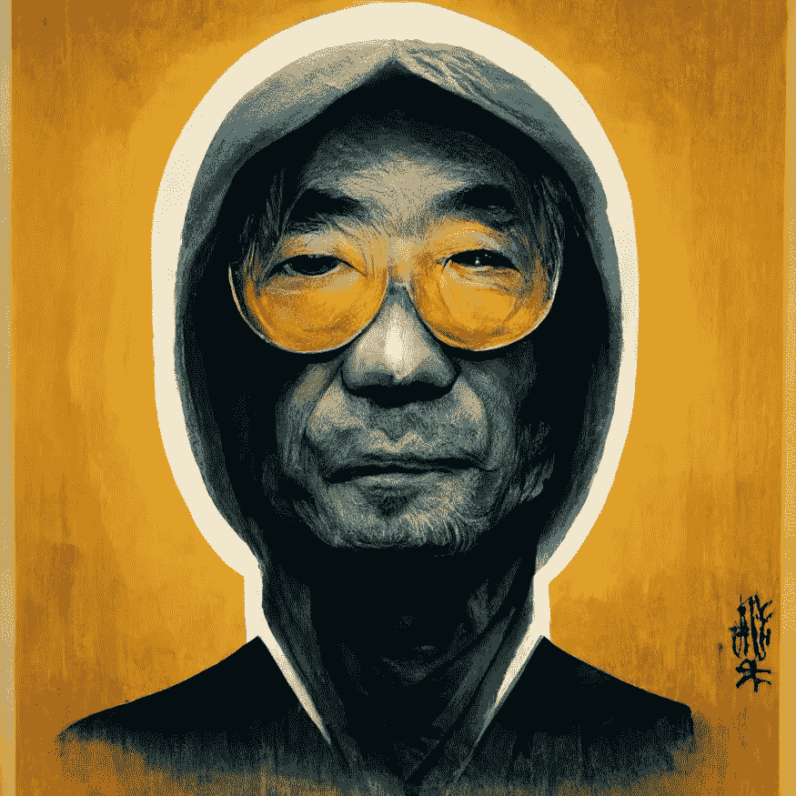
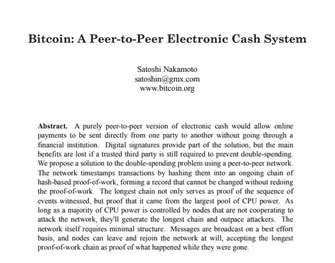

# 这个人很可能是中本聪

> 原文：<https://medium.com/coinmonks/most-likely-this-person-is-satoshi-nakamoto-97eca95b43f3?source=collection_archive---------6----------------------->

Picture made by www.cryptotactic.io

**如今科技宇宙中最大的谜团不是比特币是如何运作的，而是比特币的创始人是谁**

2008 年 10 月 31 日，一个名叫中本聪的人在一个加密邮件列表上发布了一份白皮书。我们仍然对改变货币体系历史的主谋感到困惑。

多年来，无数记者和博客作者试图驱散围绕比特币创造者的神秘，但没有成功。有很多候选人，其中一些人甚至提名了自己。我们仍在寻找幕后黑手，因为他们都没有提供真正的证据来支持他们的指控。

但是有一个人。如果要我推测的话，我会认为他很有把握地发明了比特币。在我宣布我选择了谁之前，让我们先评估一下我们对中本聪的了解。或者，更好的是，他想让我们理解什么。

在他的 P2P 基金会传记中，Satoshi 表示他是一名日本男性，出生于 1975 年 4 月 5 日。问题是他看起来或听起来都不像日本人。首先，他用完美的英语写了白皮书和接下来的文章。第二，对于一个生活在日本的人来说，他的睡眠模式很不寻常。

比特币论坛的成员斯特凡·托马斯(Stefan Thomas)展示了 Satoshi 500 多篇帖子的时间戳。他发现中本聪在日本时间晚上 2 点到 8 点之间没有发表任何东西。因此，有可能——甚至很有可能 Satoshi 的整个身份都不是真实的。

**然而，他为什么要冒充别人呢？**

**这个**有一个合理的解释

与 Pretty Good Privacy 类似，PGP 是由活动家 Phil Zimmermann 建立的，他希望为持不同政见者提供一个开放的沟通渠道。但在意识到这项技术的潜力后，美国政府抓住了它。PGP 和 Zimmermann 随后成为警方调查的对象。

这项技术只允许两个人私下交谈而不被听到。想想政府会如何惩罚这项技术的创造者，这项技术使得不需要银行或其他中介就可以免费汇款成为可能，比特币技术让钱脱离了政府的控制。

**我们对发明比特币的人了解多少？**

所以现在我已经掩盖了我对他的人格和隐藏它的目的的怀疑，这是我们对中本聪的了解。

在加密电子邮件小组 metzdowd.com，中本聪首先发表了白皮书，正如我已经提到的。2008 年万圣节，他在一篇九页的论文中提出了“一个完全点对点的新电子货币系统，没有可信的第三方。”

然后，他建立了 bitcointalk 论坛，并使用昵称 satoshi 来制作初始消息。他继续开发比特币程序，并创建了一个域名为 bitcoin.org 的网站。“创世纪区块”是第一个比特币区块，由 Satoshi 于 2009 年 1 月 3 日开采。

为了改变比特币协议，中本聪在 2010 年和其他程序员一起工作。他活跃在比特币社区，并定期与他们交谈。然后，突然之间，他给了加文·安德森钥匙和密码，并把域名转给了社区成员。到 2010 年底，他已经放弃了这个项目。

然后，在 2011 年 4 月 23 日星期六，这位比特币创造者回来发表了他的临别赠言。当程序员迈克·赫恩(Mike Hearn)问及他是否打算重新加入这个团队时，Satoshi 回答道:

“我已经转移到其他事情上了。加文和所有人都很好。”

# 中本聪

那个永远损害了银行系统的人就这样消失了。那为什么呢？

Picture made by www.cryptotactic.io

Satoshi 的比特币地址包含大约 100 万 BTC。2017 年 12 月，当价格达到最高点时，他拥有超过 190 亿美元。中本聪当时暂时拥有世界第 44 高的净资产。而且他到现在一个比特币都没兑现过。

所有这些数据表明，比特币的创始人可能出事了。我认为哈尔·芬尼是中本聪。

哈尔·芬尼不幸在 2009 年被诊断出患有渐冻人症，并一直与疾病抗争，直到 2014 年去世。我想他创造了货币的未来，然后他去世了，除了关于发明比特币的人的真实身份的谣言，什么也没留给我们。

**哈尔·芬尼，他是谁？**

计算机科学家哈尔·芬尼于 1979 年获得加州理工学院的学位。他在学生时代获得了同龄人颁发的“最有头脑”奖。他在大学一年级时注册了一门为博士生开设的引力场理论课程。芬尼似乎有很高的智力水平，这符合成为中本聪的第一个要求。

据报道，学生们记得看到芬尼拿着一本安·兰德的《耸耸肩的阿特拉斯》。如果他读过这种类型的文学作品，他可能很容易就形成了自由主义的人生观。

他的信仰把他带到了一个鲜为人知的自由思想者和程序员的社区。他在 20 世纪 90 年代初加入了 Cypherpunks。这一行动致力于“强大的加密技术和隐私增强技术的广泛使用，作为社会和政治变革的途径。”他们自称是隐私的捍卫者，芬尼把他的理解交给他们处理，以实现秘密无政府主义者的观点。

**齐默尔曼和芬尼彼此非常熟悉。**

Hal 在 Cypherpunk 的邮件列表上回复了一条关于前面提到的 Phil Zimmermann 和他的 PGP 概念的消息。他与 Phil 取得了联系，并作为第一名成员加入了 PGP Corporation，在那里一直服务到 2011 年退休。同年，中本聪停止了比特币的研发。

芬尼显著地改进了新的 PGP 协议，但是他不得不在当局的阴影下保持他的工作。因此，他很清楚 Phil 的 PGP 相关问题。我能理解他在建立比特币的同时隐藏身份的愿望。

他选择成为一个来自遥远日本的人，但他为什么要这样做？

他想象中的角色确实比预期的要准确得多。他住在离科学家多里安·普伦蒂斯·中本聪不到两公里的地方。芬尼可能会假扮中本聪来隐藏自己的身份。事实上，坦普尔城只有 36000 名居民，那么他们两人都居住在那里的可能性有多大呢？一位密码学大师与比特币的发明者同名，这太巧合了吗？

**我相信事情发生的有点不同**

我相信哈尔·芬尼用聪的账号给自己发了信息。我知道这听起来很奇怪。然而，如果你有意识地试图隐瞒你在项目中的参与，这就是如何做的。为了测试交易机制，他伪造了那些信息，把第一批比特币转移给了自己这就是为什么他从来没有归还他们的钱。

根据维基百科，哈尔·芬尼开发了第一个可重复使用的工作证明系统。如你所知，这是支持比特币的协议。此外，芬尼在 20 世纪 90 年代迷上了数字货币的概念。1993 年，他甚至发明了自己的货币——加密现金。

# 遗产

尽管哈尔·芬尼已经去世，但他对人类的贡献不应被遗忘。我们永远不应该忘记他对比特币的贡献，即使我错了，他不是真正的中本聪。他对我们争取更光明未来的斗争帮助很大。

========================================

 [## 威廉·布鲁斯-培养基

### 阅读威廉·布鲁斯在媒介上的作品。老师|法兰克福学派区块链中心|投资人|区块链|…

medium.com](/@williambrucee1987) 

**你可以在这里获得更多信息**

 [## 秘密战术

### 比特币是通过智慧把自己从货币束缚中解放出来的机会。

cryptotactic.io](https://cryptotactic.io) 

> 交易新手？尝试[加密交易机器人](/coinmonks/crypto-trading-bot-c2ffce8acb2a)或[复制交易](/coinmonks/top-10-crypto-copy-trading-platforms-for-beginners-d0c37c7d698c)