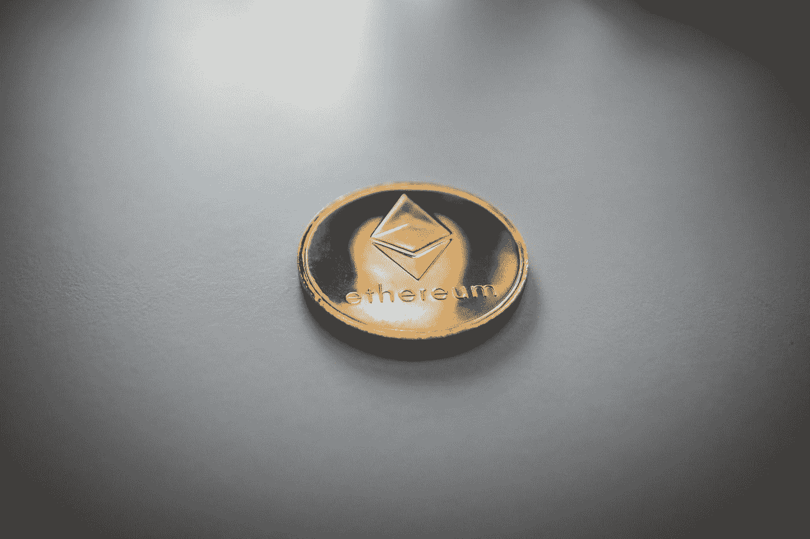

# 大多数人都不知道 2023 年以太坊会有多大。

> 原文：<https://medium.com/coinmonks/most-people-have-no-idea-how-big-ethereum-will-be-in-2023-6a28ac025267?source=collection_archive---------16----------------------->

很多人还不知道 2023 年以太坊会有多大。

Photo by [Nick Chong](https://unsplash.com/@nick604?utm_source=medium&utm_medium=referral) on [Unsplash](https://unsplash.com?utm_source=medium&utm_medium=referral)

正在以太坊的区块链上构建的智能合约、去中心化应用(dApps)和初始硬币发行(ico)将改变我们所知的世界。

> 到 2023 年，估计会有 2500 万个区块链钱包。其中，500 万将是以太坊钱包。

目前在以太坊的区块链上大约有 50，000 个分散的应用程序正在构建中。2023 年，预计将有 50 万个分散式应用。

> 迄今为止，ico 已经筹集了超过 40 亿美元。2023 年，预计 ICOs 将筹集超过 1000 亿美元。所有加密货币的总价值目前约为 3000 亿美元。2023 年，预计所有加密货币的总价值将超过**1 万亿美元。**

以太坊的区块链由世界上一些最大的公司建造，如微软、摩根大通和亚马逊。以太坊也得到日本和韩国政府的支持。2023 年，以太坊将成为世界上使用最多的区块链。

## 2023 年以太坊价格预测

我首先声明我不是财务顾问，这也不是财务建议。我的预测不能保证未来的事件。这只是我的看法。所以，话虽如此，让我们进入我对 2022 年以太坊价格的预测。我认为以太坊将在 2023 年底达到 5000 美元。

## 合并后以太坊的未来如何？

以太坊的未来是成为世界上使用最广泛的区块链。合并后，它将拥有以太坊和 ETH 2.0 的联合力量，使其成为最强大和最通用的区块链。它将能够处理比任何其他区块链更多的交易，并将能够扩展以满足不断增长的全球经济的需求。

你可以通过多种方式在[币安](https://accounts.binance.com/en/register?ref=133457645)买到以太坊。最常见的方式是使用[币安](https://accounts.binance.com/en/register?ref=133457645)现货交易所与 BTC 或 USDT 购买 ETH。你也可以使用币安期货交易所交易 ETHUSD 期货合约。

> 交易新手？尝试[加密交易机器人](/coinmonks/crypto-trading-bot-c2ffce8acb2a)或[复制交易](/coinmonks/top-10-crypto-copy-trading-platforms-for-beginners-d0c37c7d698c)