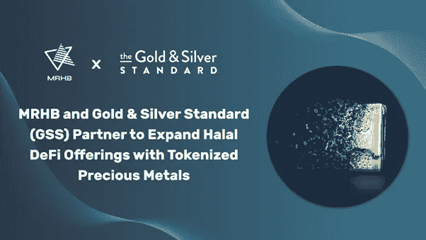
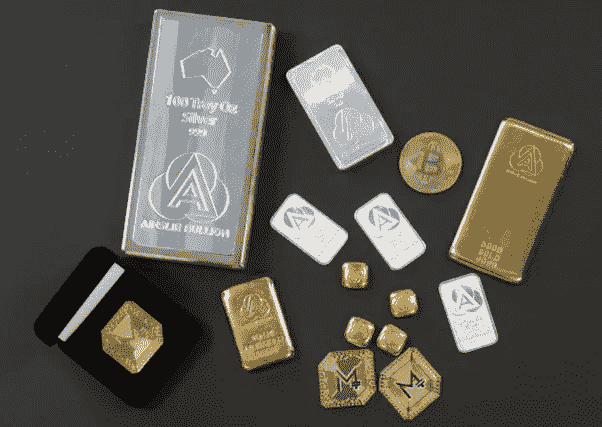

# MRHB 和金银标准(GSS)合作，利用象征性贵金属扩展清真 DeFi 产品

> 原文：<https://medium.com/coinmonks/mrhb-and-gold-silver-standard-gss-partner-to-expand-halal-defi-offerings-with-tokenized-a7e45a30545?source=collection_archive---------47----------------------->

***澳洲墨尔本 2022 年 9 月 20 日***——[MRHB。halal 分散金融生态系统 Network](https://mrhb.network/) 与 Ainslie Bullion Group(自 1974 年以来一直是澳大利亚领先的金条交易商)的一部分[Gold&Silver Standard](https://goldsilverstandard.com)(GSS)合作，并将在 MRHB 的 Sahal wallet 中列出 GSS 金本位制($AUS)和银本位制($AGS) 100%金条支持的代币。

与 Gold & Silver Standard 的合作将为 MRHB 的道德社区提供一种新的清真产品——在 **TijarX** 上提供的$AUS 和$AGS 到$USDC/USDT 配对的金银代币，即将在 9 月下旬推出的 MRHB 的 Sahal 钱包中集成的商品指数。

> *“MRHB 非常荣幸能够与安斯利金银业集团的 Gold & Silver Standard 合作，”MRHB 首席执行官*[*Naquib Mohammed*](https://au.linkedin.com/in/mohammednaquib)*说道。“金银条支持的 stablecoins 将是我们 DeFi 产品的一大补充。在这个“隐秘的冬天”和全球经济衰退的时代，当人们想方设法保护他们的财富免受动荡的市场和通货膨胀的影响时，黄金和白银被认为是最安全的避险工具，自公元前 1500 年***以来，黄金和白银一直是储存财富的稳定形式。”**
> 
> **Naquib 补充道，* ***“我们非常有信心，这一合作伙伴关系将受到我们的投资者和道德关注社区的欢迎，因为密码市场的波动性是将潜在新进入者排除在生态系统之外的主要原因之一*** *。* ***由于 TijarX DEX 上可能出现的令牌化和无边界交易的好处，投资者将能够买到世界上最便宜的黄金和白银，即使是少量的*** *。”**

**

*对于黄金和白银标准，这意味着他们的黄金和白银支持的代币，在澳大利亚最大的销售，现在将更容易获得，不仅是伊斯兰金融投资社区，而且更广泛的全球加密和 Web3 社区。*

> **"* ***我们很高兴通过与 MRHB*** *"的合作，将我们的黄金和白银标准稳定地带给以前被排斥的社区，评论*[*Paul enge man*](https://au.linkedin.com/in/paul-engeman-206b1a4)*，黄金总监&Silver Standard and ains lie bullions，澳大利亚布里斯班。“我们相信，Gold & Silver Standard 位于澳大利亚的金库是世界上储存金条和保护代币价值最安全的地方之一。* ***金条支持的加密货币在全球范围内越来越受欢迎，我们期待巩固我们成为元宇宙的#金条标准的目标*** *。”**

*在加密货币市场普遍动荡的背景下，稳定的货币被认为是安全的投资。社会科学研究网络的一份研究报告发现，黄金支持的稳定货币比比特币更不稳定。事实上，来自 [Arcane Research](https://arcane.no/research/market-cap-of-gold-backed-tokens-surpasses-usd1bn) 的数据显示，黄金支持的代币在 2022 年大幅增长，市值超过 10 亿美元。*

*黄金和白银标准代币将在澳大利亚-USDC/USDT 和 AGS-USDC/USDT 配对中提供，允许所有 MRHB 用户使用美元支持的稳定币安全地进行黄金和白银投资。**每个澳大利亚和 AGS 代币恰好拥有一克金条或银条，实物存在布里斯班的储备金库中，由全球保险公司 PKF 每季度审计一次，并由世界领先的保险公司承保。***

*今年 9 月初，MRHB 团队访问了安斯利公司在布里斯班的总部，以亲自确保 GSS 的技术和物理基础设施。*

**

*MRHB 首席执行官 Naquib Mohammed 与 GSS 董事 Paul Engeman 签署协议。*

> **"黄金&银标优于竞争对手，是投资真金白银的理想选择。它们是* ***完全可兑换金属*** *，独立验证，完全分配直接合法所有权，全天候交易，由一位近 50 年的黄金交易商带给你，独立于政府和金融机构，位于地缘政治安全的澳大利亚，”恩格曼说。**

*作为合作伙伴关系的一部分，MRHB 和 GSS 将在 3 年的路线图中创建多个黄金和白银支持的加密产品。*

***关于 MRHB。网络***

*[MRHB。Network](https://mrhb.network) 是一个清真、去中心化的金融平台，通过遵循基于信仰的金融和商业原则来体现“道德和包容性 DeFi”的真正精神，所有被排斥的群体都可以从 DeFi 的全部赋权潜力中受益。*

*这个多元化的团队由研究人员、技术专家、有影响力的人、伊斯兰金融科技专家和商业企业家组成，他们聚集在一起，确保 MRHB DeFi 以一种将影响整个社会的方式盛行，从根本上弥合信仰意识社区和区块链世界之间的差距。*

***关于黄金&银本位***

*[安斯利金条](https://www.ainsliebullion.com.au/)成立于 1974 年，是[黄金&银条](https://goldsilverstandard.com)的母公司，是澳洲历史最悠久、规模最大的金条交易商之一。2019 年，他们推出了金本位和银本位加密货币代币，允许投资者全天候购买金条和银条支持的代币，因为他们知道他们的投资被安全地锁定在一个地缘政治安全的国家由一位知名金条专家管理的安全金库中。*

***MRHB。网络官方渠道***

*网址: [https://mrhb.network](https://www.globenewswire.com/Tracker?data=ktcDIyLoMeeAj8w9kb_BjBeEAH-JExygsJIumgqxo_fCnVQy31OKg63mpCR13t-7SU1btFr7NcQpw9e7GP8eoKWQ3fVlbmzxO--3DoAFIrI=)*

*推特:[https://twitter.com/marhabadefi](https://www.globenewswire.com/Tracker?data=ktcDIyLoMeeAj8w9kb_BjO8Ti3Ks1pt6fTjEEJ1ju_Zrl1fkP7gkkqN-dmPh76RTJ6mrxvCvcBkqmwEan2X2jP_76TQ8jb4lLsaWY3pOBPp3Q1j_BshIlv5toYbtVGvm)*

*电报:*

*电报通知:[https://t.me/marhabadefi_ANN](https://www.globenewswire.com/Tracker?data=ktcDIyLoMeeAj8w9kb_BjPRtIahtLF4iULGHDAYSjN-MbrleMVaKSw4yzBK6x0BLXEsVJgP90lfH33KiKRbn4Hn5R2eIIyKS-U0XvuezeQI=)*

*YouTube:[https://www.youtube.com/c/MarhabaDeFi](https://www.globenewswire.com/Tracker?data=ktcDIyLoMeeAj8w9kb_BjKtd2Ued3DK6UM8xDiW-7xUwxBmID3ZU94tT038uYyB6tqLMeQq-b9aGoWujHojB5u442WFbpf6rG9rbRuOjdSLn2rj4HLJuzb_QD2waH7rlQEO6xATG578kSIvvC7B-ZQ==)*

*中:[https://medium.com/@mrhbdefi](https://www.globenewswire.com/Tracker?data=ktcDIyLoMeeAj8w9kb_BjIzfofqcCWN-4PDKAtyzYFkcYHJZISWAI_oFawriRHiB7F-aQj3GQHU69XdoBnLw5b_PdQNnfcc9OeGSsYzxfb0=)*

*领英:【https://www.linkedin.com/company/marhabadefi *

*不和:【https://discord.com/invite/DubSjKmkBX】T4*

*https://www.facebook.com/MRHBDeFi:[脸书](https://www.globenewswire.com/Tracker?data=ktcDIyLoMeeAj8w9kb_BjLdIVhlPqJ_zgr8eBBrQHhGDFdAFEgJCHqp_ohVVZqhX7D4ZCKSLpJVSM2MN78WKKaPohbFe7Q7dlIkFuM2cBlYnwVibsTXHrq-uW0VJcCOK)*

*电报(阿拉伯语):[https://t.me/mdf_arabic](https://www.globenewswire.com/Tracker?data=ktcDIyLoMeeAj8w9kb_BjC6L9hoZIvF0xLzMJIIl-viIkkh6ZX5EGyrTMjqEzS-uPmBgJIUJWfTP7zJNcLQvc5REAuNOi7dWfeQQkonWudI=)*

*电报(俄语):[https://t.me/marhabadefi_russia](https://www.globenewswire.com/Tracker?data=ktcDIyLoMeeAj8w9kb_BjPRtIahtLF4iULGHDAYSjN96Ikb_7T28pauYPhamaV46eVFFlaJ-kGv-RWqEd6YfjOOzZrvYHregCjFlqFKsPkwkCKH-OScVUkk6FEj7sd3e)*

*电报(土耳其语):[https://t.me/MarhabaDefiTR](https://www.globenewswire.com/Tracker?data=ktcDIyLoMeeAj8w9kb_BjLLEUWOzOAXimnZkyaBpQKxKx335-RQJXSbcn3m7Mjn-lwqjzq31k-oQ82PHurpP42YTjwkrpnQp3x5rLAs8h48=)*

*电报(波斯语):[https://t.me/mrhbdefi_persian](https://www.globenewswire.com/Tracker?data=ktcDIyLoMeeAj8w9kb_BjEfbYfV37YIlByTyH-kLcvWVWHeaMfkZvrPH18xlHDj7FUqBPZAYnSd4Y_ZPXlio2sOwQJFOaR2xuOjhfF40pYmLaCxzylCK_os6rFX-2gj0)*

*电报(乌尔都语/印地语):[https://t.me/MRHBDeFi_Urdu_Hindi](https://www.globenewswire.com/Tracker?data=ktcDIyLoMeeAj8w9kb_BjI8yd06OXF62rQUis2QGz23YV7_x49QaAwBn4YBbcOhqxAZugqfS4oYmWBI-ExbB1mH6-OlTAJdu1gufgRC0oQkMUVP-6_tkRH2Odn_VAvG1)*

*SouqNFT market place:[https://souq . mrhb . network](https://www.globenewswire.com/Tracker?data=ktcDIyLoMeeAj8w9kb_BjLF7nIFHrIrgDmbUQIR1wTwe3QXREHaonbqTAhi_QeJuuPfUGjF6dftlgizcxAXTeKtdoXbRPK0rq83WhfZ3ZHI=)*

> *交易新手？试试[加密交易机器人](/coinmonks/crypto-trading-bot-c2ffce8acb2a)或者[复制交易](/coinmonks/top-10-crypto-copy-trading-platforms-for-beginners-d0c37c7d698c)*