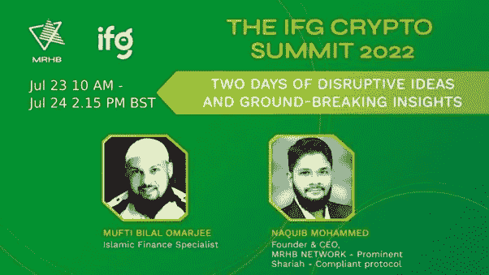
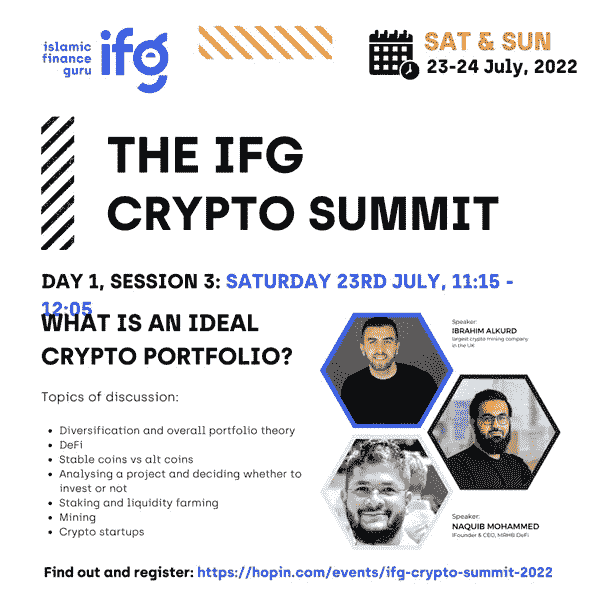

# MRHB 首席执行官在 IFG 加密峰会上阐述什么是理想的加密产品组合

> 原文：<https://medium.com/coinmonks/mrhb-ceo-to-address-what-is-an-ideal-crypto-portfolio-at-ifg-crypto-summit-1141642a1c08?source=collection_archive---------23----------------------->

**事件详情**

**日期和时间:英国夏令时 2022 年 7 月 23 日星期六上午 11 点 15 分**

【https://hopin.com/events/ifg-crypto-summit-2022】报名链接:

**准备好迎接为期两天的颠覆性想法和突破性见解，IFG 加密峰会汇集了最具革命性的思想，并思考加密将如何重塑我们所知的现代世界。**

****什么是理想的加密组合？****

**MRHB 首席执行官 [Naquib Mohammed](https://au.linkedin.com/in/mohammednaquib) 参加了小组讨论，其中还包括伊斯兰金融专家 [Mufti Bilal Omarjee](https://uk.linkedin.com/in/billal-omarjee) ，讨论了以下主题:**

*   **多样化和整体投资组合理论**
*   **挑战**
*   **稳定硬币 vs 另类硬币**
*   **分析一个项目并决定是否投资**
*   **赌注和流动性农业**
*   **采矿**
*   **秘密创业公司**

****

****关于 MRHB DeFi****

**MRHB(发音为“mar haba”)DeFi 是一个分散化的金融平台，旨在将道德引入 DeFi 空间，除了现有的加密本地人之外，还支持纳入基于信仰的社区和其他受排斥的社区，以便每个人都可以受益于 DeFi 的全部赋权潜力，帮助建立一个真正的点对点金融和经济价值体系。**

**基于区块链的信条，如信任、透明和安全，MRHB DeFi 将普遍适用的伊斯兰金融原则融入到区块链的信条中，以提供一套也符合 ESG 的产品。**

**该项目由一个多元化的强大团队提供支持，该团队的背景涵盖加密、技术、符合信仰的投资、金融和经验丰富的行业资深机构。**

****MRHB DeFi 官方渠道****

**[网站](https://mrhb.network/) | [推特](https://twitter.com/marhabadefi) | [电报聊天](https://t.me/mdf_official) | [电报公告](https://t.me/marhabadefi_ANN) | [媒体](/@mrhbdefi) | [文档](https://marhabadefi.com/info-centre.php) | [脸书](https://www.facebook.com/MRHB-DeFi-105893235209147/) | [LinkedIn](https://www.linkedin.com/company/marhabadefi/) | [电报阿拉伯语社区](https://t.me/mdf_arabic) | [俄语社区](https://t.me/mdf_russia) | [土耳其语社区](https://t.me/MarhabaDefiTR) | [波斯语社区](https://t.me/mrhbdefi_persian) | [乌尔都语/乌尔都语](https://t.me/MRHBDeFi_Urdu_Hindi)**

> **交易新手？尝试[加密交易机器人](/coinmonks/crypto-trading-bot-c2ffce8acb2a)或[复制交易](/coinmonks/top-10-crypto-copy-trading-platforms-for-beginners-d0c37c7d698c)**