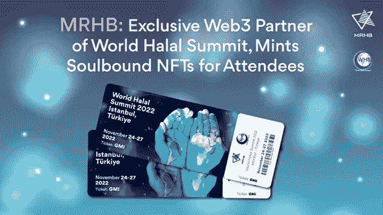

# MRHB:世界清真峰会的独家 Web3 合作伙伴，为与会者提供 Mints Soulbound NFTs

> 原文：<https://medium.com/coinmonks/mrhb-exclusive-web3-partner-of-world-halal-summit-mints-soulbound-nfts-for-attendees-cb0fcbcb7c72?source=collection_archive---------41----------------------->

***阿联酋迪拜，2022 年 11 月 22 日***——[MRHB。Network](https://mrhb.network/) 是世界上第一个致力于清真加密资产解决方案的分散式金融平台，它将作为 Web3 官方合作伙伴参加世界清真峰会，并将为数千名世博会与会者提供“灵魂绑定令牌”(SBT)。

今年将于 2022 年 11 月 24 日至 27 日举行的[世界清真峰会](https://worldhalalsummit.com.tr/en/)是世界上最大的清真会议——上届世界清真峰会吸引了来自 96 个不同国家的 31，000 多名与会者。该会议每年在土耳其伊斯坦布尔举行，重点关注清真行业的当代挑战和机遇。今年的主题是“*可持续贸易:探索清真行业的方方面面*”。峰会的主题演讲和小组讨论将涵盖清真行业的当前趋势和清真市场的新方向。

> *“我们一直是世界各地清真博览会的大力支持者，并很荣幸成为今年世界清真峰会的官方合作伙伴，”MRHB DeFi 首席执行官兼创始人*[*Naquib Mohammed*](https://www.linkedin.com/in/mohammednaquib/?originalSubdomain=au)*说道。* ***“近年来，穆斯林群体对加密和数字资产产生了极大的兴趣。MRHB 是世界上第一个提供分散金融服务的 Web3 平台，从一开始就是真正的清真，我们非常感谢有机会与世界清真峰会社区分享这些解决方案。”***

今年世界清真峰会的著名发言人包括土耳其政府参与金融部负责人、土耳其清真认证机构代理部门负责人和土耳其政府参与金融部主任。来自不同行业和国家的数十名其他演讲者也将出席。

**获得由 MRHB DeFi 铸造的灵魂绑定 NFT 门票**

作为世界清真峰会的独家 Web3 合作伙伴，MRHB(发音为“Marhaba”)是该活动 NFT 门票的唯一生产商。NFT 门票不仅仅是可收藏的图片——它们提供了真实的效用，证明与会者购买了世界清真峰会的门票。

MRHB 正在铸造 NFT 门票，这是一种灵魂绑定的令牌，不可转让，不能出售或与其他人交易。最初由以太坊的联合创始人 Vitalik Buterin 构想，灵魂绑定令牌在去中心化社会中充当身份和声誉令牌。

**在 TijarX 淘金热中赢得价值 1 万美元的黄金代币**

为了庆祝他们新推出的商品交易所 TijarX，MRHB DeFi 还向他们的“淘金热”活动的幸运获胜者颁发了总额为 1 万美元的[金本位(AUS)](https://www.ainsliewealth.com.au/Shop/View/Product/Name/Gold-Standard-AUS-/ID/148) 清真象征性黄金。要参与并有机会赢得实物黄金支持代币(股票代号“AUS”)，用户必须在 MRHB DeFi 的分散商品交易所(DEX)购买至少价值 100 美元的 AUS。黄金代币由 MRHB 监管的(自 1974 年以来)金条合作伙伴——ains lee Bullion 的金库中持有的实物金条支持。

TijarX 可以在 [Sahal Wallet](https://mrhb.network/ecosystem/sahal-wallet) 上访问，这是一个多链、多资产自我保管的 halal 加密钱包，可在 [iOS](https://apps.apple.com/ae/app/sahal-wallet/id1602366920) 和 [Android](https://play.google.com/store/apps/details?id=sahal.wallet.app&hl=en&gl=US&pli=1) 上使用。奖品将在澳大利亚分发，如下所示:

*   最高的澳大利亚净买家将获得 5000 美元奖金
*   澳大利亚第二大净买家获得 3K 奖
*   排名第三的澳大利亚净买家将获得 1000 美元奖金
*   10 名幸运抽奖获胜者将获得 10 X 100 美元的奖品

在 Twitter[上关注 MRHB](https://twitter.com/marhabadefi)获取交易竞赛的最新消息。

**MRHB 愿景:赋权、道德和简单**

MRHB DeFi 的 halal 分散式金融平台为全球 18 亿穆斯林和那些寻找更符合道德的途径来利用 web3 和数字资产机会的人提供了支持，伊斯兰金融市场的规模为 3 万亿美元，促进道德、透明和公平的商业实践。

> “加密货币领域是一个风险很高的地方，清真加密资产选项有限或没有，”Naquib 说。“我创立 MRHB DeFi 是为了给用户提供一站式解决方案，帮助他们寻找更道德、非利益导向的 DeFi 解决方案。我相信我们的 TijarX 淘金活动将吸引那些正在寻找通过手机投资实物黄金、白银和加密资产的简便方法的峰会与会者。”

Sahal Wallet 是 MRHB DeFi 所有清真金融服务的超级应用程序，包括 SouqNFT market market——世界清真峰会 NFT 在这里铸造，[清真合规 NFT 证书](https://beincrypto.com/defi-platform-marhaba-looks-to-taps-3-trillion-islamic-economy-with-halal-certified-nfts/)也在这里举办——以及 TijarX 商品交易所，那里有按照[金银标准](https://goldsilverstandard.com/)标记的贵金属。平台上的每个令牌和产品都经过严格的清真审查程序，以确保所有资产都符合 Shariah 标准。世界上第一个 halal 加密收入和赌注解决方案将在未来几个月内推出，计划在 2023 年再推出四个，包括无息融资、分散慈善(DePhi)、企业家启动平台和分散自主治理。

该公司去年 12 月在 IDO 发行了他们的 [$MRHB](https://coinmarketcap.com/currencies/marhabadefi/) 股票，获得了超额认购，筹集了超过 450 万美元。他们的大部分投资者来自他们的热情社区，超过 7 万名来自 106 个不同国家的有道德意识的支持者。自那以后，该公司赢得了 2022 年[全球品牌奖](https://www.globalbrandsmagazine.com/award-winners-2022/)作为“最佳新伊斯兰加密平台”。纳斯达克和 InvestorPlace 也将 MRHB 令牌作为投资的“杀手密码”。

MRHB DeFi 得到了众多合作伙伴和投资者的支持，包括 [Polygon Technology](https://polygon.technology/) 、 [Sheesha Finance](https://www.sheeshafinance.io/) 、[澳大利亚海湾资本](https://www.ausgulf.com/)、 [NewTribe Capital](https://www.newtribe.capital/) 、[区块链澳大利亚](https://blockchainaustralia.com.au/)、 [Mozaic](https://nwgp.com/#mosaic) 、 [Contango Digital Assets](https://www.contango.digital/) 、 [ZKSync](https://zksync.io/) 、 [Acreditus Partners](https://acreditus.com/) 、 [EMGS 集团](http://emgsconsulting.com/)、

**关于 MRHB。网络**

MRHB 的意思是“欢迎”,是世界上第一个 Web3 平台，它通过道德和清真的方法为社区提供分散化金融。通过遵循基于价值观的金融和商业原则，我们正在创建一个值得信赖的生态系统，在这个系统中，专家和新手都可以安全、轻松地使用 DeFi 的全部功能。

我们的多元化团队由研究人员、技术专家、有影响力的人士、伊斯兰金融科技专家、商业企业家和行业专业人士组成，他们共同确保 MRHB 履行其影响使命，通过 DeFi 造福整个社会，弥合信仰意识社区和区块链世界之间的差距。

**MRHB DeFi 网官方渠道**

网址: [https://mrhb.network](https://mrhb.network/)

推特:[https://twitter.com/marhabadefi](https://twitter.com/marhabadefi)

电报:[https://t.me/mdf_official](https://t.me/mdf_official)

电报通知:[https://t.me/marhabadefi_ANN](https://t.me/marhabadefi_ANN)

YouTube:[https://www.youtube.com/c/MarhabaDeFi](https://www.youtube.com/c/MarhabaDeFi)

中:[https://medium.com/@mrhbdefi](/@mrhbdefi)

领英:【https://www.linkedin.com/company/marhabadefi 

不和:【https://discord.com/invite/DubSjKmkBX】T4

https://www.facebook.com/MRHBDeFi:[脸书](https://www.facebook.com/MRHBDeFi)

电报(阿拉伯语):[https://t.me/mdf_arabic](https://t.me/mdf_arabic)

电报(俄语):[https://t.me/marhabadefi_russia](https://t.me/marhabadefi_russia)

电报(土耳其语):[https://t.me/MarhabaDefiTR](https://t.me/MarhabaDefiTR)

电报(波斯语):[https://t.me/mrhbdefi_persian](https://t.me/mrhbdefi_persian)

电报(乌尔都语/印地语):[https://t.me/MRHBDeFi_Urdu_Hindi](https://t.me/MRHBDeFi_Urdu_Hindi)

SouqNFT market place:[https://souq . mrhb . network](https://souq.mrhb.network/)

> 交易新手？试试[加密交易机器人](/coinmonks/crypto-trading-bot-c2ffce8acb2a)或者[复制交易](/coinmonks/top-10-crypto-copy-trading-platforms-for-beginners-d0c37c7d698c)