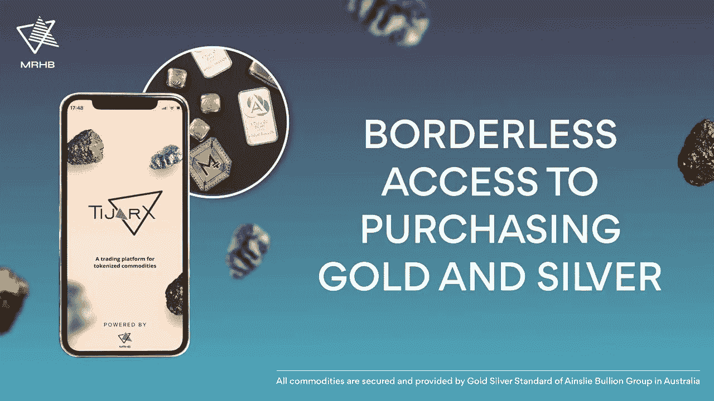
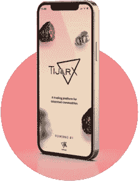

# 第一个清真 Web3 生态系统 MRHB 推出了 TijarX——符号化商品交易所

> 原文：<https://medium.com/coinmonks/mrhb-the-first-halal-web3-ecosystem-launches-tijarx-the-tokenized-commodity-exchange-27f0389e379a?source=collection_archive---------33----------------------->

*阿联酋迪拜，2022 年 10 月 4 日*——[**MRHB。专注于创造道德和清真加密解决方案的开创性分散式金融平台网络**](https://mrhb.network/) **，推出了第一个针对实物商品的清真分散式交易所**[**【TijarX】**](https://www.forbes.com/sites/mitchellmartin/2022/10/04/halal-gold-stablecoins-offer-gram-by-gram-hedge-against-finance-maelstrom/?sh=30636ee5dbbf)**。**实物金银支持代币率先上市。

TijarX 是一家区块链驱动的交易所，通过令牌化将贵金属和其他实物商品引入链上，并通过智能合约进行交易，允许这些资产完全融入更广泛的 Web3 和 DeFi 市场。*值得注意的是，所有在交易所上市的商品代币都是清真的。*

> MRHB 首席技术官 Deniz Dalkilic 表示:“我们非常自豪能够最终推出 TijarX，并向全球有道德意识的投资者提供令牌化商品。”**“我们的核心目标是通过将珍贵且缺乏流动性的商品(难以以实物形式运输和储存)引入区块链，为我们的 Web3 生态系统增加最大效用。通过将这些商品令牌化，它们可以被更大的市场所利用，这些市场可以交易或投资这些现实世界的资产。”**

> Dalkilic 补充说，“为了庆祝这一推出，我们还将在未来 6 个月内免除 TijarX 的任何交易费用，从而进一步降低投资和交易贵金属的成本。”

在交易所上市的第一批商品将被安斯利黄金集团的[黄金&白银标准(GSS)标记为](https://www.ainsliebullion.com.au/)[黄金和白银](https://www.benzinga.com/pressreleases/22/09/g28924615/mrhb-and-gold-silver-standard-gss-partner-to-expand-halal-defi-offerings-with-tokenized-precious-m)。**自 1974 年以来，TijarX 上市的每种金本位(AUS)和银本位(AUS)代币都由澳大利亚领先的金条交易商 Ainslie vaults 安全储存并可******验证的实物金条 100%支持和赎回。****

***MRHB 与 Ainslie 合作交付 TijarX 黄金和白银解决方案:***

**[https://www.youtube.com/watch?v=JF0hM3uCQkI](https://www.youtube.com/watch?v=JF0hM3uCQkI)**

**作为 MRHB 抱负路线图的一部分，未来合作伙伴可以在 TijarX 交易所上市的令牌化商品可能包括铜、小麦、饮用水、石油或天然气等。**

****TijarX 可通过**[**Sahal Wallet**](https://mrhb.network/ecosystem/sahal-wallet)**访问，这是一个由 MRHB** **构建的** [**自保管和多链加密钱包，充当整个 MRHB 道德金融服务生态系统的门户。**](https://finance.yahoo.com/news/mrhb-defi-launches-sahal-wallet-142600061.html)**

****为使商品交易可靠、方便而开发****

**该交换的设计和架构从一开始就是简单、直观和可扩展的。为了与 DeFi 的精神保持一致，该软件是开源的——这意味着任何开发人员或团队都可以在其上构建。**

**TijarX 的运作方式类似于其他分散式交易所(dex)的运作方式，通过外部供应商拥有的流动性池提供不同货币的交易对。例如，用户可以选择在 users 澳大利亚和 users 澳大利亚交易对中购买 GSS 的黄金代币。**

**然而，TijarX 上决定商品代币价格的模式，与 dex 上常见的自动做市商有很大不同。相反，对于黄金和白银等久经考验的资产，它依赖于甲骨文的价格馈送。这使得大宗商品可以在 TijarX 上交易，同时通过最大限度地减少可能导致流动性损失的套利机会，仍能满足非常严格的保证金限制。**

**“TijarX 交易所不是一个端到端的解决方案，而是旨在为那些已经拥有自己的令牌化资产的商品所有者提供一个入口，”MRHB 首席技术官 Deniz Dalkilic 说。“我们期待在未来将 TijarX 扩展为一个端到端的解决方案，但目前**它的重点是成为一个入口(OTC ),让令牌化商品所有者以无信任的方式接触新的社区**。”**

**只有拥有白名单钱包的批准合作伙伴才能在 TijarX 池上部署新令牌，并且需要完全透明来证明令牌真正由实物商品支持。MRHB DeFi 根本不能增加或提取流动性，但如果怀疑存在漏洞，可以根据合作伙伴的请求暂停交易。**

**前六个月零手续费交易后，MRHB 只会收取 0.03%的小额交易费。**这些费用被发送到 MRHB DAO 国库，并出售用于 MRHB 回购，这些回购又被重新分配给** [**M.I.R.O. staking 平台**](https://mrhbdefi.medium.com/mrhbs-halal-staking-solution-miro-aces-hacken-audit-d1ca307e63b9) 上的 MRHB 令牌持有者。**

**【MRHB 即将推出更多产品**

**MRHB 于 2021 年 12 月在 IDO 中推出了他们的生态系统令牌 [$MRHB](https://coinmarketcap.com/currencies/marhabadefi/) ，获得了超过 550 万美元的超额认购，其中大部分来自他们的支持社区中的首次投资者，这些社区由来自 106 个不同国家的 6 万多名有道德意识的人组成。**

**DeFi 平台的主要目标是价值 3 万亿美元的伊斯兰金融市场，但他们所倡导的理念也是任何关心在生活中做出道德金融决策的人感兴趣的。**

**“我们正在建立一个具有普遍吸引力的平台，”MRHB 咨询主席 Khalid Howladar 说。"**清真企业必须遵循非常严格的道德财务原则，包括透明度和可持续性，同时避免社会剥削或高利贷。这些标准对全世界的人都有普遍的吸引力。****

**除了 TijarX，还有 MRHB。网络还推出了 Sahal 钱包和 SouqNFT 市场。世界上第一个 halal staking 解决方案 M.I.R.O .和一个被动财富产生器 Liquidity Harvester 也将于今年晚些时候推出，承诺被动投资回报率在 5%至 15%之间。**

**明年还将推出四个新产品，包括无息融资平台、企业家发射台、分散慈善(DePhi)以及许多其他 Web3 基础设施产品和解决方案。**

**MRHB。Network 获得了本年度[全球品牌奖](https://www.globalbrandsmagazine.com/award-winners-2022/)的“最佳新伊斯兰加密平台”。MRHB 代币也被纳斯达克和投资者列为投资的“杀手密码”。**

**MRHB。网络得到了众多合作伙伴和投资者的支持，包括 [Polygon Technology](https://polygon.technology/) 、 [Sheesha Finance](https://www.sheeshafinance.io/) 、[澳洲海湾资本](https://www.ausgulf.com)、 [NewTribe Capital](https://www.newtribe.capital/) 、[区块链澳洲](https://blockchainaustralia.com.au/)、 [Mozaic](https://nwgp.com/#mosaic) 、 [Contango Digital Assets](https://www.contango.digital/) 、 [ZKSync](https://zksync.io/) 、 [Acreditus Partners](https://acreditus.com/) 、 [EMGS 集团](http://emgsconsulting.com/)、**

****关于 MRHB DeFi 网络****

**MRHB(发音为“Marhaba”)是一个道德和清真的 Web3 平台，旨在以最简单的方式向世界各地的受排斥群体提供“包容性 DeFi 和 NFT 财富和商业解决方案”。**

**多元化的团队由研究人员、技术专家、有影响力的人士、伊斯兰金融专家和商业企业家组成，他们聚集在一起，确保 MRHB 生态系统发挥区块链和加密的全部力量，对整个社会产生积极影响，从根本上弥合“道德意识”社区和 Web3 世界之间的差距。**

****MRHB DeFi 网官方渠道****

**网址: [https://mrhb.network](https://mrhb.network/)**

**推特:[https://twitter.com/marhabadefi](https://twitter.com/marhabadefi)**

**电报:[https://t.me/mdf_official](https://t.me/mdf_official)**

**电报通知:[https://t.me/marhabadefi_ANN](https://t.me/marhabadefi_ANN)**

**YouTube:[https://www.youtube.com/c/MarhabaDeFi](https://www.youtube.com/c/MarhabaDeFi)**

**中:[https://medium.com/@mrhbdefi](/@mrhbdefi)**

**领英:[https://www.linkedin.com/company/marhabadefi](https://www.linkedin.com/company/marhabadefi)**

**不和:【https://discord.com/invite/DubSjKmkBX】T2**

**https://www.facebook.com/MRHBDeFi[脸书](https://www.facebook.com/MRHBDeFi)**

**电报(阿拉伯语):[https://t.me/mdf_arabic](https://t.me/mdf_arabic)**

**电报(俄语):[https://t.me/marhabadefi_russia](https://t.me/marhabadefi_russia)**

**电报(土耳其语):[https://t.me/MarhabaDefiTR](https://t.me/MarhabaDefiTR)**

**电报(波斯语):[https://t.me/mrhbdefi_persian](https://t.me/mrhbdefi_persian)**

**电报(乌尔都语/印地语):[https://t.me/MRHBDeFi_Urdu_Hindi](https://t.me/MRHBDeFi_Urdu_Hindi)**

**SouqNFT market place:[https://souq . mrhb . network](https://souq.mrhb.network)**

> **交易新手？试试[加密交易机器人](/coinmonks/crypto-trading-bot-c2ffce8acb2a)或者[复制交易](/coinmonks/top-10-crypto-copy-trading-platforms-for-beginners-d0c37c7d698c)**