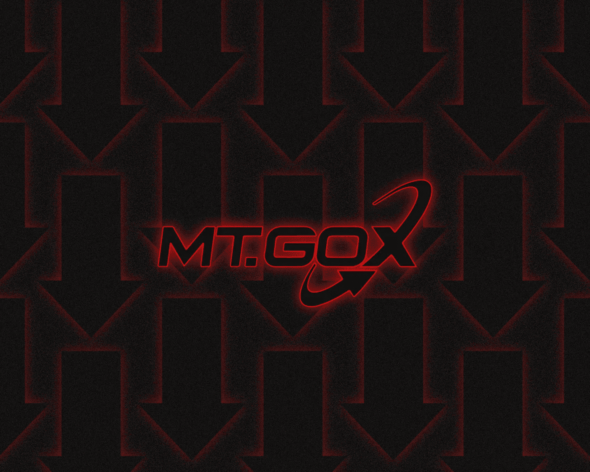
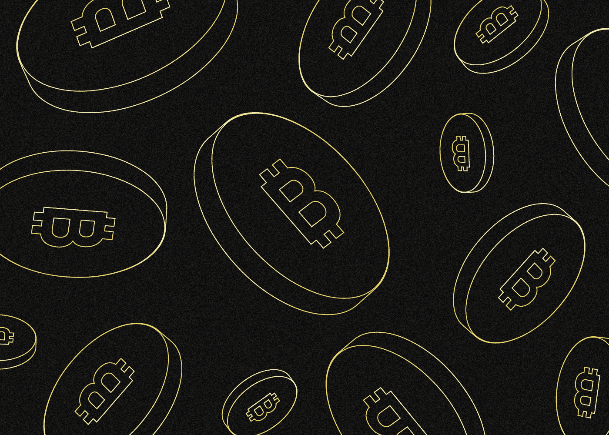
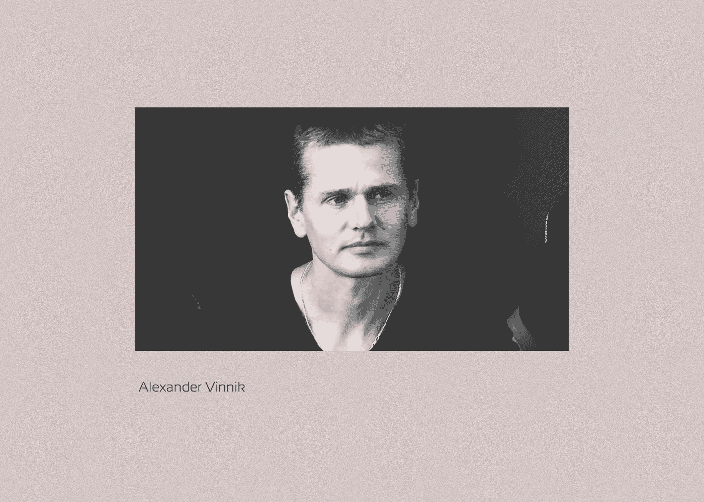

# Mt.Gox exchange:加密货币史上最大的黑客攻击

> 原文：<https://medium.com/coinmonks/mt-gox-exchange-the-largest-hack-in-the-history-of-cryptocurrencies-d953ad87e85e?source=collection_archive---------8----------------------->

***Mt.Gox 于 2010 年开始运营，是全球首批比特币交易所之一。截至 2014 年初，该平台占第一种加密货币总交易量的 70%。发生了什么事？让我们一起来看看吧！***

Mt.Gox 于 2014 年停止了**的运营，原因是发现了一个由黑客攻击导致的用户余额“漏洞”。**在 2011 年到 2013 年**之间，攻击者能够在不被发现的情况下从交易所提取 **65 万 BTC** 。这是历史上最大的加密货币黑客攻击。**

自 **2018** 以来，Mt.Gox 一直处于民事修复过程中，其中包括向受影响的客户支付交易所账户上剩余的加密货币。总共约有 25，000 名用户申请赔偿。

Mt.Gox 黑客攻击的组织者和实施者尚未查明。在美国，俄罗斯 BTC 交易所前管理员 Alexander Vinnik 面临洗钱指控，罪名是盗窃 Mt.Gox 的加密货币

# Mt.Gox 是谁在什么时候创立的？

Mt.Gox 的历史并不是从加密货币开始的。2007 年，**杰德·麦卡莱布**，[瑞波](/@SunflowerCorpAdmin/what-is-ripple-and-the-xrp-cryptocurrency-46cb743bcec2)和[恒星](/@SunflowerCorpAdmin/what-is-stellar-and-xlm-acb206563d3d)加密项目的未来联合创始人，注册了 mtgox.com 网站。他在那里推出了一个名为“**M**agic:**T**he**G**athering**O**nline E**X**change”的平台，用于交易一款流行奇幻游戏的卡片。在一个缩写版本中，服务的名字听起来像 Mt.Gox。

在 2010 年夏天了解到加密货币后，McCaleb 决定将 Mt.Gox 转型为比特币交易所。一年后，McCaleb 把它卖给了住在日本的法国开发商 Mark Karpeles。

根据[滚石](https://www.rollingstone.com/culture/culture-news/the-rise-and-fall-of-a-bitcoin-kingpin-43198/3/)的说法，卡普莱斯几乎免费获得了 Mt.Gox。作为交换，他有义务在所有权的前 6 个月向 McCaleb 支付 50%的利润，并在未来支付 12%。

与此同时，Mt.Gox 迅速走红。在 **2011** 年，该平台的用户群已经达到数万人。到 **2013** ，该网站的比特币交易量达到了[全球总量的大约 70%](https://www.coindesk.com/company/mt-gox/) 。

# 交易所的第一次黑客入侵

Mt.security Gox 的问题在平台出售之前就开始了。后来，据透露，在 2011 年 3 月**，卡普莱斯告知麦卡勒损失了大约 80，000 BTC 的用户资金。结果他们忽略了。卡普莱斯表示，被盗资金于 2020 年**转移至比特币 SV 创始人克雷格·赖特拥有的一个区块链地址。有人推测，他对后来的平台被黑负有责任。****

**首次公开记录的对 Mt.Gox 的攻击发生在 2011 年 6 月**。黑客们设法窃取了至少 25000 BTC，在当时约合 40 万美元。结果，Mt.Gox 上的比特币价格从 17 美元暴跌至几乎为零。****

****根据内部调查的结果，Karpeles 得出结论，攻击者已经侵入了 Jed McCaleb 的旧管理员帐户，该帐户允许访问该交易所客户的资金和个人数据。****

****Mt. Gox 在攻击后大约一周恢复，Karples 通过进行确认[交易](https://www.blockchain.com/btc/tx/3a1b9e330d32fef1ee42f8e86420d2be978bbe0dc5862f17da9027cf9e11f8c4)以及赔偿客户损失，证明了他控制着平台钱包上的比特币。****

# ****成功与新问题(2011 年至 2013 年)****

****在最初的攻击之后，Mt.Gox 逐渐恢复，到 2013 年，它已经成为世界上最大的比特币交易平台。该公司将总部迁至东京久负盛名的商业区，卡佩斯是比特币行业活跃的媒体发言人。****

****后来的事实证明，尽管 Mt.Gox 在外部取得了成功，但它面临着严重的内部困难。例如，它无法控制代码的质量或安全性。此外，该项目缺乏资产负债表和准备金的财务会计和控制系统。简单地说，没有人跟踪货币和加密货币的流动。****

****大多数 Mt.Gox 用户来自美国，但该交易所没有在美国运营的许可证。因此，在 2013 年 5 月**，美国当局扣押了存放在 Dwolla 处理服务中心的大约 500 万美元的项目资金。尽管如此，Mt. Gox 从 FinCEN 获得了现金操作员许可证。******

******然而，今年 6 月，在日本瑞穗银行(Mizuho)拒绝为其账户提供服务后，该加密交易所暂停了美元存款。用户也开始大声抱怨资金提取时间过长。******

# ******重新入侵并关闭 Mt.Gox******

******【2014 年 2 月，Mt.Gox 突然停止比特币提现。根据该平台的新闻稿，攻击者利用比特币代码中的一个漏洞，将比特币翻倍，并将其应用于该交易所的区块链地址。之后平台终于叫停了所有结论。******

******到月底，Mt.Gox 上的比特币价格只有市场平均价格的 20%，这表明投资者相信该项目将不再能够解决已经出现的问题。在**2 月 24 日**，该平台上的所有交易操作被停止，几小时后该平台的网站下线。******

****后来的事实证明，exchange 团队发现[从用户](https://www.nytimes.com/2014/02/25/business/apparent-theft-at-mt-gox-shakes-bitcoin-world.html)处窃取了大约 75 万 BTC，这件事几年都没人注意到。结果平台竟然资不抵债。**2 月 28 日**，Mt.Gox [宣布](https://www.reuters.com/article/us-bitcoin-mtgox-bankruptcy/mt-gox-files-for-bankruptcy-hit-with-lawsuit-idUSBREA1R0FX20140228)破产关闭。****

# ****Mt.Gox 有多少比特币被盗？****

****正如破产申请中所述，除了用户加密货币，犯罪分子还从证券交易所偷走了 10 万 BTC。****

********

****因此，盗窃总额达到了 850，000 BTC，约占当时整个加密货币发行的 7%。****

****盗窃总额估计为 4.4 亿至 4.8 亿美元。截至**2022 年 9 月，**比特币价格约为 2 万美元时，已经约为 170 亿美元。****

****除了比特币，2800 万美元的法定货币也从日本 Mt.Gox 银行账户中“消失”了。****

******2014 年 3 月**，Mt.Gox [报告](https://www.reuters.com/article/us-bitcoin-mtgox-wallet-idUSBREA2K05N20140321)在一个旧格式的地址中“突然”发现约 20 万 BTC，一直使用到**2011 年 6 月**。与此同时，就在“发现”的前几天，该地址还是活动的。这将加密货币的总损失减少到 650，000 BTC，尽管这并没有使 Mt.Gox 免于关闭。****

# ****黑 Mt.Gox 的细节****

****Mt.Gox 的第二次也是最大的一次黑客攻击是低级别的安全性和大量管理错误的结果。根据 WizSec 的研究结果，第二次也是最大的一次攻击始于 2011 年。以下是专家们的发现:****

*   ****【2011 年 9 月，黑客设法从 Mt.Gox 交易所火热的比特币钱包中窃取了私钥。多亏了他，攻击者获得了用户加密货币流向交易所的控制权；****
*   ****使用这个私钥，黑客已经悄悄地，但有规律地，清空交易所的账户一年多了；****
*   ******2013 年年中**，当交易所的存款量放缓时，黑客立即从 Mt.Gox 钱包中提取了 63 万 BTC。****

# ****亚历山大·威尼克的被捕和 Mt.Gox 有什么关系？****

****由于许多受影响的 Mt.Gox 用户来自美国，该国当局展开了调查。****

****【2017 年 7 月底，俄罗斯最大的 BTC-e 加密交易所的管理员**亚历山大·威尼克**在希腊被拘留。****

********

****他被指控清洗 Mt. Gox 的赃款。据美国司法部称，一个以威尼克为首的犯罪组织能够通过 BTC-e 从 Mt.Gox 窃取的 85 万 BTC 中洗钱近 30.7 万 BTC****

****包括美国、法国和俄罗斯在内的几个国家要求引渡维尼克到希腊接受审判。他于 2020 年被引渡到法国，并被判处 5 年监禁和 10 万欧元罚款。威尼克将于 2022 年夏天被引渡到美国**。他面临长达 55 年的监禁。******

# ****调查和审判****

******2016 年 5 月**，协助调查的加拿大密码交易所北海巨妖完成了对债权人债权的收集和分析过程。据北海巨妖称，有 24750 名用户申请付费。****

****根据东京地方法院(该法院成为审理 Mt.Gox 案的主要法庭)的裁决，偿还债权人的程序从破产程序转向民事恢复。在第一种情况下，债权人将获得相当于公司申请破产时资产的赔偿，在第二种情况下，将获得“实物”比特币或支付时同等金额的法定货币。****

******2021 年 2 月**法院批准了一项对比特币债权人进行偿付的计划，直到**2022 年 7 月**Mt . Gox 的受托人 Nobuaki Kobayashi 宣布开始准备偿付资金。在准备材料时，即**2022 年**9 月中旬，没有显示付款的确切数字和日期。****

# ****马克·卡佩斯的未来命运****

******2015 年 8 月 1 日**，日本警方逮捕了 Mt.Gox 前负责人马克·卡佩莱斯。他被控欺诈、挪用资金以及操纵交易所的计算机系统，人为增加账户余额。****

****然而，卡佩莱斯于 2016 年 7 月**以大约 9.5 万美元的保释金**出狱。在【2019 年 3 月，他被判犯有伪造证件罪，判处有期徒刑两年六个月，后来改为缓刑四年。****

******2022 年春天，** Karpeles 宣布打算开设一家加密评级机构，将 NFT 分发给以前的 Mt.Gox 客户。****

# ****Mt.Gox 地址上还剩下多少加密货币？****

****据了解，Mt.Gox 的受托人 Nobuaki Kobayashi 在 2018 年初**设法出售了 BTC 和 BCH 的部分资产，随后从破产转为民事修复。小林制药从 2018 年**4 月到 5 月**共卖出 24658 辆 BTC 和 25331 辆 BKM，总价 4.06 亿美元。******

****根据跟踪 Mt.Gox 钱包余额的 [Cryptoground](https://www.cryptoground.com/mtgox-cold-wallet-monitor/) 服务，该交易所的账户上共有 137，891 BTC 和 137，891 BCH，按照 2022 年 9 月 15 日**的汇率计算**超过 23 亿美元。****

# ****Mt.Gox 的客户会得到哪些赔偿？****

****公开文件中没有比特币支付给债权人的确切数据。然而，一名 CoinLab 代表[在 **2021** 中](https://www.bloomberg.com/news/articles/2021-01-15/coinlab-reaches-deal-with-mt-gox-trustee-over-bitcoin-claims)表示，他们将只能为 Mt.Gox 用户被盗的每个比特币报销 0.23 BTC。****

****过了一段时间，特殊公司开始出现，提出在交易所买断债权人的债权。例如，在 **2019** 年底，堡垒投资集团写信给破产的 Mt.Gox 交易所的债权人，提出以每比特币 5000 美元的价格赎回他们的债权。这一提议的好处是有可能获得付款，而不必等待漫长的审判结束。****

****以美元计算，按照 2022 年 9 月 15 日的**汇率，以每比特币 20000 美元的价格计算，0.23 BTC 约合 4600 美元。2014 年申请破产时，[比特币的价格为 489 美元](https://www.bloomberg.com/news/articles/2021-01-15/coinlab-reaches-deal-with-mt-gox-trustee-over-bitcoin-claims)。尽管比特币损失了逾四分之三的资产，但以美元计算，这相当于近 10 倍的利润。******

******2021 年秋天**公布了一份赔偿方案，得到了法院的批准。然而，到目前为止，对 Mt.Gox 前用户的支付还没有开始。****

> ****你有什么想法？如果您对 Mt.Gox 主题有任何补充，请在下面留下您的评论！****
> 
> ****在[媒体](/@SunflowerCorpAdmin)或[推特](https://mobile.twitter.com/sunflower_corp)上关注[向日葵公司](https://sunflowercorp.com/)定期更新关于趋势加密新闻。****

********

****[*向日葵公司*](https://sunflowercorp.com/) *—专注于最佳交易体验和卓越技术的新型加密货币衍生品交易所。*****

*****我们提供杠杆高达 x100 的 BTC/USDT 永久期货，以及最具趋势性的工具。当您与我们交易时，您将获得一个可定制的交易终端、各种图表、技术分析工具、各种订单类型，以及“止损”和“止盈”订单选项。*****

> ****交易新手？尝试[加密交易机器人](/coinmonks/crypto-trading-bot-c2ffce8acb2a)或[复制交易](/coinmonks/top-10-crypto-copy-trading-platforms-for-beginners-d0c37c7d698c)****