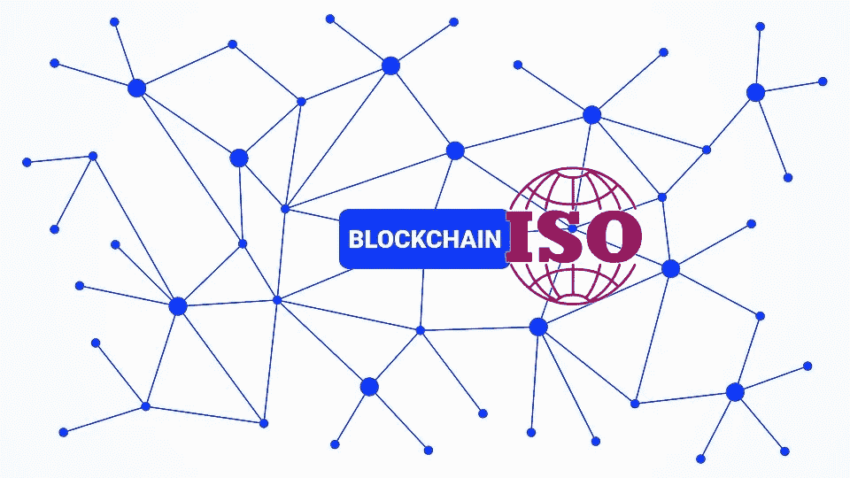

# 区块链大费周章——区块链标准:值得努力吗？—

> 原文：<https://medium.com/coinmonks/much-ado-about-blockchain-standards-for-blockchain-a-worthwhile-effort-f92ae3e62b4e?source=collection_archive---------47----------------------->

# 作者:JT

是的，这不是一篇关于如何用密码快速致富的文章。嗯，事实上也许是这样，但是我不会告诉你去月球必须买哪些备用硬币。

这篇短文是关于在加密热潮和破灭的背景下发生的对话，即:

我们能不能通过制定一套国际标准来规范区块链革命？

对于面临保护公众(越来越多地成为加密货币和区块链应用的用户和投资者)压力的投资基金、保险公司和政府监管机构来说，这种对话变得越来越重要。这一点在过去几个月里表现得非常明显，一系列蓝筹股公司如 terra(露娜和 UST)在几天内破产。

总的感觉是，我们很快需要一个路线图，这将有助于了解区块链技术的全景。

在这方面，国际标准化组织(ISO)的专家已经在努力解决这个问题，在过去的两年中，他们已经发布了首批 4 个关于区块链技术的 ISO 标准，还有更多标准正在制定中。

Blockchain ISO

# 但是为什么标准化很重要呢？

在我看来，为区块链技术制定 ISO 标准是至关重要的:

1.  通过提高公众对基础技术的理解，使区块链技术摆脱晦涩难懂的咒语；
2.  以确定是否符合政府和投资机构正在实施的监管框架。这是评估区块链技术提供隐私、访问、控制、保密性、安全性等能力的基础。
3.  通过建立最佳实践和通用框架，提高标准化区块链技术的实用性和采用率。这也将有助于来自不同文化体系的创新者更无缝地合作和共享技术。
4.  推动利益相关者和投资者信任支撑新金融工具的区块链技术(我们现在称之为 DEFI 革命)，同时缓解监管者的担忧。

# 到目前为止做了些什么？

国际标准化组织正在积极制定一个路线图，在 T2 的 ISO-TC 307 下为区块链制定国际标准。

ISO TC 307 (ISO)于 2016 年首次提出，其任务是制定以下方面的标准:参考架构、隐私和个人身份信息保护、具有法律约束力的智能合同、互操作性指南等。在过去的两年中，已经发布了关于词汇、智能合约、安全性和个人可识别信息的四个标准。还有 11 个标准正在制定中。

# 提醒一句

ISO TC 307 下的工作非常令人兴奋，它反映了公众最近对区块链理工大学的兴趣。然而，一些声音对这一努力持批评态度。他们认为，即使我们要艰难地在标准化区块链技术的混乱中前行，我们也有可能破坏这个系统或者彻底摧毁它。

区块链科技的精髓在于它为创新者提供了一个能够适应多种需求的系统。在这方面，标准化进程可能带来一套有限的标准，过分简化了技术的范围，同时导致有风险的创新者被贴上不合规的标签。

这是危险的，因为这意味着区块链的标准化可能会通过限制他们获得投资基金的机会以及减少他们吸引新用户的机会来惩罚那些不在标准范围内的急躁的开发者。

# 那么，我们该怎么办呢？

与许多其他事情一样，最好的方法应该是试图取得平衡。一方面，我们需要开发开放的标准，从而允许技术以新的、不可预测的方式发展。另一方面，我们必须促进通用词汇的发展，以减轻监管者的担忧，并促进不同文化中的区块链创造者之间的合作。

我们还需要提高新兴系统与遗留解决方案的互操作性，从这个意义上说，一套标准可能会非常有用。

很快，我将更详细地介绍一些已经发布的标准以及它们对技术发展的影响。敬请期待！

> 加入 Coinmonks [电报频道](https://t.me/coincodecap)和 [Youtube 频道](https://www.youtube.com/c/coinmonks/videos)获取每日[加密新闻](http://coincodecap.com/)

# 另外，阅读

*   [折叠 App 回顾](https://coincodecap.com/fold-app-review) | [Kucoin 交易机器人](/coinmonks/kucoin-trading-bot-automate-your-trades-8cf0ca2138e0)
*   [如何匿名购买比特币](https://coincodecap.com/buy-bitcoin-anonymously) | [比特币现金钱包](https://coincodecap.com/bitcoin-cash-wallets)
*   [币安 vs FTX](https://coincodecap.com/binance-vs-ftx) | [最佳(SOL)索拉纳钱包](https://coincodecap.com/solana-wallets)
*   [比诺莫评论](https://coincodecap.com/binomo-review) | [斯多葛派 vs 3Commas vs TradeSanta](https://coincodecap.com/stoic-vs-3commas-vs-tradesanta)
*   【Capital.com】|[港加密借贷平台](https://coincodecap.com/crypto-lending-hong-kong)