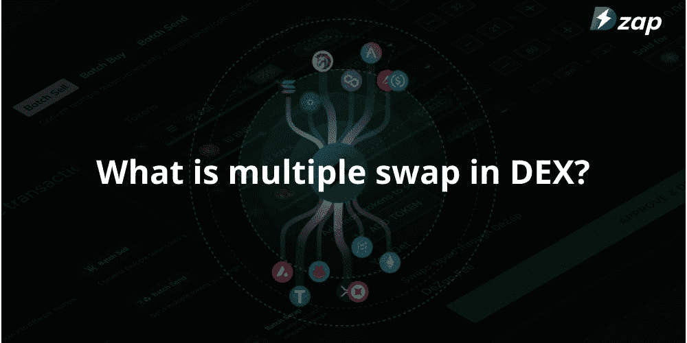
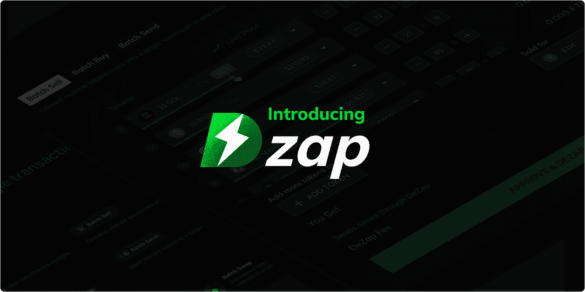
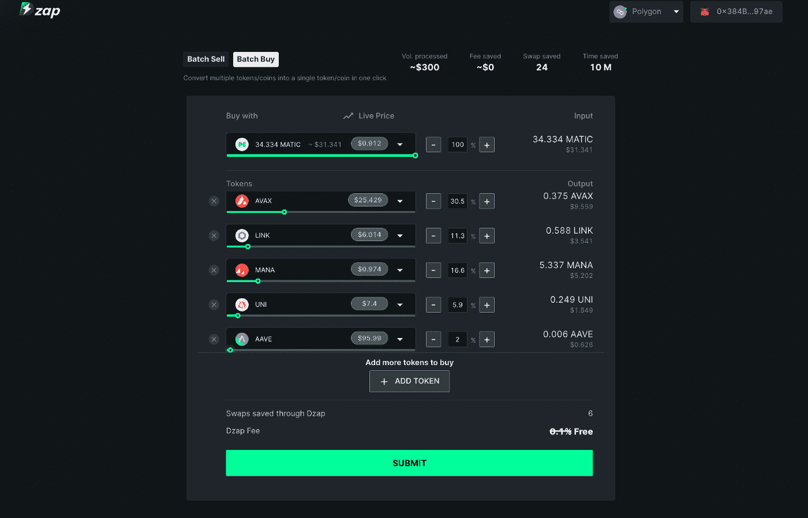

# 通过 DZap 在单笔交易中进行多次掉期交易

> 原文：<https://medium.com/coinmonks/multiple-swaps-in-a-single-transaction-through-dzap-fa09650d5531?source=collection_archive---------21----------------------->

在 DeFi 空间中，用一个代币交换另一个代币是最基本的交易。但是，有时用户的预期目的可能是进行多项交易。示例:使用分散式交易所(DEX)购买/出售多个代币。在这个模拟中，用户需要为每笔交易进行单独的掉期交易，并为每笔交易支付费用。油费、时间和精力随着交易次数的增加而增加。

> **在单笔交易中进行多次互换的过程称为批量互换**

批量交换允许任何人一次点击就可以交换多种加密货币。例如:如果你的钱包里有 5 个 ERC 20 元的代币，想把它们都兑换成 USDT，标准的程序是什么？5 不同的交换和连续的汽油费支付然而，通过批量交换功能，您可以在一次交易中交换所有五个代币，并且只需支付一次汽油费。

Uniswap、Sushiswap 等分散式交换不具备批量交换功能。但是，DZap 已经为 DeFi 用户购买了这项功能。

DZap——该产品旨在为所有 DeFi 用户简化交换过程。

# 什么是 DZap？

DZap 是一个进行批量交换的一站式平台。DZap 将 DeFi 中的多个步骤统一为一个步骤，以提供更强大的 DeFi 体验。DZap 为用户提供了一个直观的 UI 来进行批量交换，包括批量购买、批量出售和多对多。

**批量购买:**一个代币换多个代币。用户可以输入任何令牌，并将其批量交换成多达 50 个其他令牌的任意组合。这意味着您可以在一次交易中将一个令牌换成多个令牌。

**批量出售:**将多个代币换成一个代币。用户可以输入任意数量的令牌并将它们批量交换到一个令牌中。这意味着您可以在一次交易中将多个代币换成一个代币。

**多对多:**将多个代币兑换成其他多个代币。示例:如果您选择将钱包中的 3 个代币换成其他 8 个代币，现在可以使用 DZap。

> **通过 DZap 进行批量交换可节省高达 42%的燃料费和 80%的时间。**

DZap 将推出更高级的功能、仪表盘和更直观的用户体验。对 LP 令牌和美元成本平均(DCA)的支持将很快上线。

# 结论

交换代币可能是一个乏味且耗时的过程。DZap 使交换和交易更加容易和省时，简化了过程，只需点击一下鼠标。

> 时间是我们最想要的，但我们用得最差。但是现在，利用和节省您的时间，而交易密码。试试 [dzap.io](https://www.dzap.io/) ⚡️

重要提示:DZap 现在处于测试模式，但是该平台已经过全面审计。你在这里查看审计报告[。](https://docs.dzap.io/protocol/audit-reports)

您可以在 DZap [Canny](https://features.dzap.io/) 上提供您的反馈，或者加入 [Discord](https://discord.gg/aRHESJB9md) 。

# 在线查找 DZap:

[网站](https://www.dzap.io/) | [推特](https://twitter.com/dzap_io) | [镜像](https://mirror.xyz/0x3a28f13bA51235c895c1B080b108cDc45C9eA472) | [不和](https://discord.com/invite/aRHESJB9md) | [电报](https://t.me/+WjzEAsPZ_wJjN2Q9) | [Reddit](https://www.reddit.com/r/DZap/) | [媒体](/@dzap_io)

> 交易新手？试试[加密交易机器人](/coinmonks/crypto-trading-bot-c2ffce8acb2a)或者[复制交易](/coinmonks/top-10-crypto-copy-trading-platforms-for-beginners-d0c37c7d698c)