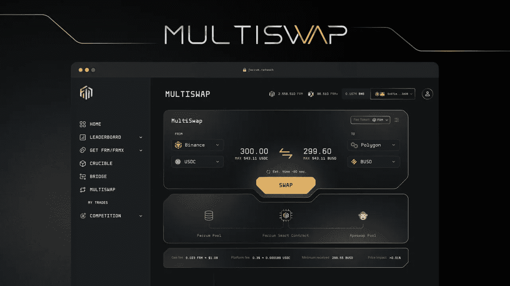

# 多 wap 架构评论

> 原文：<https://medium.com/coinmonks/multiswap-architecture-review-c40c883f9216?source=collection_archive---------21----------------------->

## 铁分解他们即将发布的智能路由多链聚合器 MultiSwap。

最近，铁姆公司发布了一个全面深入的架构，他们认为这将是一个改变 Web3 游戏规则的产品。虽然你可以在这里找到产品[的完整概述，但我认为以一种更容易理解的形式提供技术概述是个好主意。](https://docs.ferrumnetwork.io/ferrum-ecosystem/v/infinityswap-and-bridge-architecture-overview/)

# 什么是 MultiSwap？

MultiSwap 是一款智能路由多链聚合器，支持无缝跨链交换。通过 MultiSwap，用户可以将任何资产交换到任何网络(只要该网络上存在所需资产的流动性)和任何钱包。

# 为什么选择 MultiSwap？

众所周知，Web3 正变得越来越多链。对于投资者、最终用户和项目来说，在单一链条的封闭性之外运营的必要性从未像现在这样重要。让我们来分析一下'*为什么'*铁决定创建 MultiSwap 的主要原因。

# 将流动性移植到新的网络是困难的

目前，用户必须使用多个 dApps 才能在网络间转移资金。在大多数情况下，为了在网络之间移动他们的资产，用户将不得不经历以下过程。

*   1st dApp(原始网络 DEX) —使用原始网络上的 DEX 将资产清算为可桥接资产
*   第二个 dApp(桥接)—将资产桥接至所需网络。
*   第三 dApp(目的地网络 DEX) —使用另一个 DEX 将可桥接资产清算为目的地网络上的所需资产。

这种繁琐的路由充满了层层摩擦，为用户探索不同生态系统中的机会以及网络本身吸引 TVL 和使用创造了巨大的障碍。

借助 MultiSwap，用户可以通过单一界面享受参与新生态系统的乐趣。像这样的产品对于 EVM 和非 EVM 替代网络的采用是必不可少的，并且是朝着多链未来迈出的重要一步。

# MultiSwap 与竞争对手有何不同？

当分析是否有适合一项新技术的产品市场时，重要的是要了解竞争格局，以便创造一种人们可以证明比其他人更适合使用的产品。

那么是什么让铁的 MultiSwap 与众不同呢？你为什么要在乎？让我们来分解一下 MultiSwap 最令人兴奋的几个核心特性和组件。

# 光纤(铁内部区块链快速路由)

让我们从路由的角度来看看*如何做* MultiSwap 工作。当用户体验到无缝的东西时，有一系列组件在协议的后端并行工作，以便在选择阻力最小的路径时成功地执行交换。

从智能契约、模块和区块链交互的角度来看，有几个核心组件可以通过 MultiSwap 协议实现多链桥接和资产交换。纤维就是其中之一。

**资产类型** 

有三大类资产:

*铸造资产* —将[单一资产流动性](https://docs.ferrumnetwork.io/ferrum-ecosystem/v/infinityswap-and-bridge-architecture-overview/architecture-and-tech-stack/general-architecture-overview/core-components-of-bridging/bridge-pool/liquidity-management/liquidity-setup)添加到桥池中的资产被归类为铸造资产。这种流动性可以由铁或上市代币的代币管理员添加。

Foundry 资产的一个主要优势是，涉及 Foundry 资产的交换通常会跳过与 aggregator (1inch)或 DEX(uni WAP)的交互。相反，FIBER 将为 Foundry 资产准备一条与 bridgePool 直接交互的路径；为涉及代工厂资产的部分跨链互换节省流动性提供者费用。

值得注意的是，铸造资产是唯一可以跨链桥接的资产，因为它们的流动性由桥接池管理。所有其他资产必须转换为铸造资产，以促进跨链桥接。这在 [MCSF](https://docs.ferrumnetwork.io/ferrum-ecosystem/v/infinityswap-and-bridge-architecture-overview/architecture-and-tech-stack/general-architecture-overview/core-components-of-multiswap/fiber-ferrum-inter-blockchain-express-routing-engine/bridging-and-settlement/multichain-settlement-flow-mcsf) 和[桥接&结算](https://docs.ferrumnetwork.io/ferrum-ecosystem/v/infinityswap-and-bridge-architecture-overview/architecture-and-tech-stack/general-architecture-overview/core-components-of-multiswap/fiber-ferrum-inter-blockchain-express-routing-engine/bridging-and-settlement)中有进一步描述

*炼油厂资产* —在生态系统指数中添加了 USDC 的成对流动性的资产被归类为炼油厂资产。这种流动性可以由铁或上市代币的代币管理员添加。

*离子资产* —不属于铸造资产或精炼资产类别的资产被归类为离子资产。这包括生态系统指数中任何具有可用流动性的资产。

**资产&路线优化**

在高层次上，FIBER 负责寻找最佳路径来进行跨链交换，以及桥接和结算；这取决于资产类型。

在检查了纤程请求的参数之后，纤程引擎确定所涉及的资产的分类为以下类别之一。

1.  [铸造资产](https://medium.com/ferrum-ecosystem/v/infinityswap-and-bridge-architecture-overview/architecture-and-tech-stack/general-architecture-overview/core-components-of-multiswap/asset-types/foundry-assets)
2.  [炼油资产](https://medium.com/ferrum-ecosystem/v/infinityswap-and-bridge-architecture-overview/architecture-and-tech-stack/general-architecture-overview/core-components-of-multiswap/asset-types/refinery-assets)
3.  [离子资产](https://medium.com/ferrum-ecosystem/v/infinityswap-and-bridge-architecture-overview/architecture-and-tech-stack/general-architecture-overview/core-components-of-multiswap/asset-types/ionic-assets)

资产的分类定义了跨链交换和桥接资产的可用路径。Foundry 资产通常会跳过与 aggregator (1inch)或 DEX(uni WAP)的交互。相反，FIBER 将为代工资产准备一条直接与`bridgePool,`互动的路径，为涉及代工资产的部分跨链互换节省流动性提供商费用。

在每种情况下，FIBER 不仅会确定`bridgePool`与 DEX 交换之间的最佳路径，还会查询多个生态系统聚合器和 DEX，以确定跨链资产交换和桥接的最佳可能速率。

# FORGE(铁最佳路径气体估算)

FORGE 负责计算跨链资产交换和桥接的汽油和多 wap 费用。

FORGE 有两个主要职责:

***天然气估算*** — FORGE 计算来源链上的互换和过渡交易的天然气成本，以及目的链上任何必要的[炼油资产](https://medium.com/ferrum-ecosystem/v/infinityswap-and-bridge-architecture-overview/architecture-and-tech-stack/general-architecture-overview/core-components-of-multiswap/asset-types/refinery-assets)或[离子资产](https://medium.com/ferrum-ecosystem/v/infinityswap-and-bridge-architecture-overview/architecture-and-tech-stack/general-architecture-overview/core-components-of-multiswap/asset-types/ionic-assets)互换。

气体估计在 MultiSwap 界面中透明地显示给用户。**如果根据预测估算收集的气体大于实际气体成本，FORGE 将多余的气体储存在与启动交换的用户地址相关的储备中。**

***多 wap 费用估算—*** 每笔多 wap 交易都有少量相关费用。该费用可以由用户以他们选择的费用代币来支付。

*费用令牌:* FRM、cFRM、FRMx、cFRMx、网络费用货币(ETH、BNB、Matic 等)、USDC

费用目前设定为每笔 1 美元。FORGE 每 30 秒就会得到更新的报价，以表示相当于 1 美元的不稳定代币的价值。在 FRM 和 FRMx 支付的费用可享受 25%的折扣。而在 cFRM 和 cFRMx 中支付的费用可享受 50%的折扣。

# 安全性

MultiSwap 使用与[铁交叉链令牌桥](/ferrumnetwork/introducing-the-ferrum-network-cross-chain-token-bridge-56fbc48a09d7)相同的底层桥接架构。这种架构已经被证明是非常安全的，本文[的内容证明了这一点](/ferrumnetwork/a-lesson-in-security-ferrum-cross-chain-token-bridge-cd0fb78f6277)，并且已经促成了[近 2 亿美元的交易量](/ferrumnetwork/ferrums-highly-secured-multi-chain-token-bridge-hits-138-million-in-total-transacted-volume-b949cc244717?source=collection_home---4------16-----------------------)。

MultiSwap 安全性背后的主要因素与删除“*锁和薄荷”*和*“烧和薄荷”*机制有关，这违反了单一责任原则并引入了增加的风险。这些影响领域包括锁定在桥池中的资产的巨大价值，称为*“蜜罐”*以及利用协议本身创造无限量令牌的能力。

由于 MultiSwap 不需要锁定等量的令牌来维持目的网络上包装资产的钉住，因此所需的流动性远远小于大多数互操作性协议。此外，MultiSwap 通过使用 USDC 作为路由令牌，消除了桥接多个资产的需要。因此，只需要几十万美元，而不是数百万美元闲置在桥牌池中。

# 增强型 UX/用户界面

对许多人来说，跨网络转移资产是相当令人生畏的。协议的工作不仅是在网络间安全地传输资产，而且项目的责任是让用户在这样做时感到安全。许多多链产品相当复杂，使用起来甚至令人害怕。用户经常被蒙在鼓里，不知道在任何给定的时刻，事务在流程中处于什么位置。

在 MultiSwap 的情况下，UX/用户界面将比 Crucible 更上一层楼，Crucible 是迄今为止铁最直观的产品。MultiSwap 确保人们在整个过程中得到正确的指导，并且在任何时候都不会感到迷失。如果您过去从未使用过电桥或任何多链产品，您仍然可以使用本产品，无需文档或详细说明。按照屏幕上的提示就行了！对于 MultiSwap 的 UX/用户界面将会是什么样子，请查看下面的照片。

# 最后

这篇文章旨在对 MultiSwap 的*什么*、*为什么*和*如何*进行高度概述。然而，在这款突破性产品的背后还有更多值得深入探究的东西。请务必在此查看 MultiSwap 架构文档:

 [## 多交换和多链流动性池桥

### 了解铁网络 MultiSwap 和双向流动性池桥产品概述和背景。

docs.ferrumnetwork.io](https://docs.ferrumnetwork.io/ferrum-ecosystem/v/infinityswap-and-bridge-architecture-overview/) 

另外，请务必在此观看铁姆的*团队聊天——介绍&multi swap 概述*！

敬请期待！

# 关于铁网

铁正在引领区块链互操作性 2.0 时代。由称为量子门户的多链消息引擎提供动力，铁网络的 mainnet 将为行业中的每个链带来价值、数据和功能互操作性。

利用铁网络在一个网络上构建和部署解决方案，并立即启用多链功能，而没有管理多链基础架构带来的负担或技术债务。

# 铁网络重要环节

[网站](https://ferrum.network/) | [电报](http://telegram.ferrum.network/) | [推特](http://twitter.ferrum.network/) | [YouTube](https://www.youtube.com/channel/UCN658dMRTaH4C4dP32VHi6Q) | [不和](https://discord.gg/HEfKq57asd)

> 交易新手？试试[加密交易机器人](/coinmonks/crypto-trading-bot-c2ffce8acb2a)或者[复制交易](/coinmonks/top-10-crypto-copy-trading-platforms-for-beginners-d0c37c7d698c)